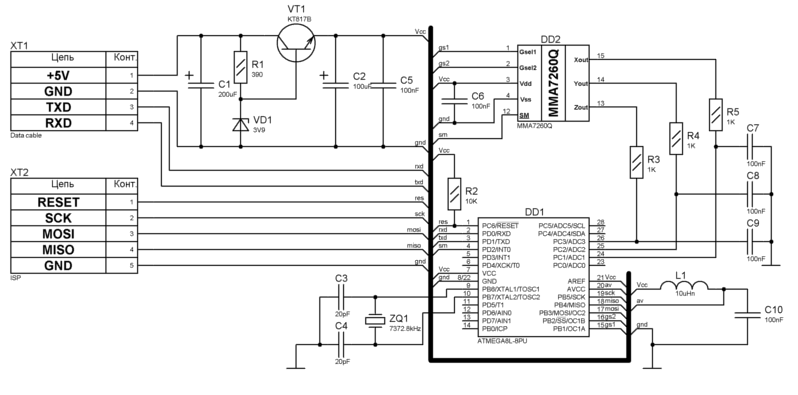
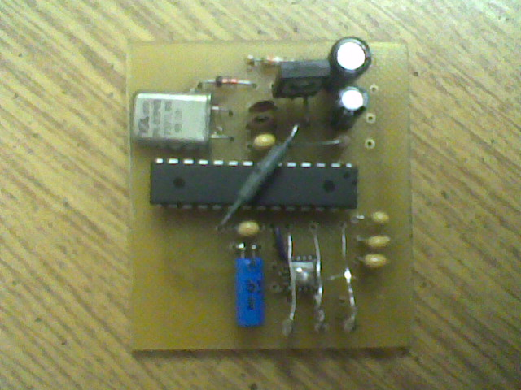

labels: Blog
        Projects
        Microcontrollers
created: 2011-11-20T00:00

# Маніпулятор для гри у тетріс на базі МЕМС-акселерометра


Моя курсова робота на 3-му курсі університету (at the end of 2009). Маніпулятор представляє собою пристрій що закріплюється на руці і дозволяє рухами руки керувати грою: рухами вправо і вліво можна пересунути фігуру у відповідному напрямку, вперед - перевернути фігуру, вниз - опустити.

Схема:



Плата під'єднується до комп'ютера за допомогою data cable від мобільного телефону.



Програма для мікроконтролера:

```c
#include "./avr/io.h"
#include "./avr/interrupt.h"
#define F_CPU 7372800UL
#define ubrr F_CPU/16/9600-1

unsigned char min[3]={255, 255, 255}, max[3]={0, 0, 0};

void init(void)
{
  DDRD=(1<<2);
  PORTD=4; // no sleepmode
  DDRB=(1<<1)|(1<<2);
  PORTB=0; //1.5 g
  ADMUX=0; 
  // external reference
  // port 1 - MUX3_0=0001
  // port 2 - MUX3_0=0010
  // port 3 - MUX3_0=0011
  ADCSRA=(1<<ADEN)|(1<<ADPS2)|(1<<ADPS0); 
  // ADC enabled
  // free running off
  // ADC frequency - 230.4 kHz
  UCSRB=(1<<RXCIE)|(1<<RXEN)|(1<<TXEN);
  UCSRC=(1<<UCSZ1)|(1<<UCSZ0);
  UBRRH=(unsigned char)(ubrr>>8);
  UBRRL=(unsigned char)(ubrr);
  TIMSK=(1<<TOIE0);
  // T0 overflow innterrupt enabled
  TCCR0=(1<<CS00)|(1<<CS02);
  TCNT0=219;
  // T=5ms
  sei();
}

void setmaxg(char g)
{
  PORTB=g<<1;
}

void conversion(void)
{ // voltage to code
  unsigned char res;
  // channel 1
  ADMUX=(1<<MUX0);
  ADCSRA|=(1<<ADSC); //start convesion
  while(ADCSRA & (1<<ADSC));
  res=(ADCL>>2)+(ADCH<<6);
  if(res>max[0])max[0]=res;
  if(res<min[0])min[0]=res;
  // channel 2
  ADMUX=(1<<MUX1);
  ADCSRA|=(1<<ADSC);//start convesion
  while(ADCSRA & (1<<ADSC));
  res=(ADCL>>2)+(ADCH<<6);
  if(res>max[1])max[1]=res;
  if(res<min[1])min[1]=res;
  // channel 3
  ADMUX=(1<<MUX0)|(1<<MUX1);
  ADCSRA|=(1<<ADSC);//start convesion
  while(ADCSRA & (1<<ADSC));
  res=(ADCL>>2)+(ADCH<<6);
  if(res>max[2])max[2]=res;
  if(res<min[2])min[2]=res;
  // maximums and minimums are saved
}

ISR(TIMER0_OVF_vect)
{ // T0 overflow
  TCNT0=219;
  conversion();
  sei(); // all interrupts enabled
}

void sendbyte(unsigned char data)
{// sending data to PC (1 byte)
  while(!(UCSRA & (1<<UDRE)));
  UDR=data;
}

void senddata(void)
{ //sending maximums and minimums to PC
  unsigned char i;
  for(i=0;i<=2;i++)
  {  
    sendbyte(min[i]);
    sendbyte(max[i]);
    min[i]=255;
    max[i]=0;
  }
}

ISR(USART_RXC_vect)
{ // USART: data catched
  switch(UDR)
  {
    case 0x31: senddata(); break;
    case 0x32: setmaxg(0); break;
    case 0x33: setmaxg(1); break;
    case 0x34: setmaxg(2); break;
    case 0x35: setmaxg(3);
  }
  sei(); // all interrupts enabled
}

int main(void)
{
  init(); 
  while(1);
  return 0;
}
```

Тетріс був написаний ще влітку на Delphi, just for fun, потрібно було лише додати підтримку маніпулятора.


Place: Starobilsk, Ukraine
