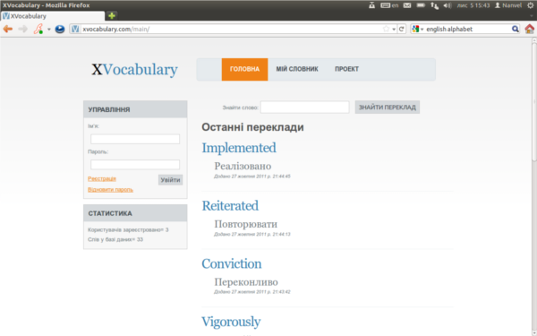
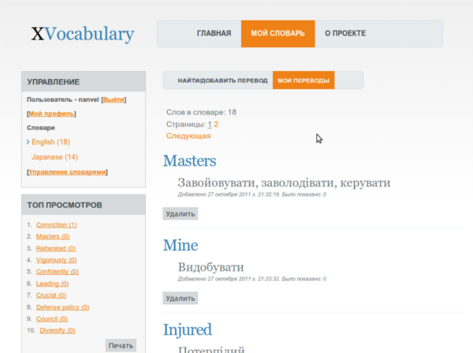
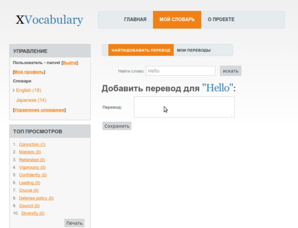

labels: Blog
        Django
        Projects
created: 2011-11-10T00:00
modified: 2013-10-26T00:00
place: Alchevs'k, Ukraine
comments: true

# XVocabulary project

Сервіс - база незнайомих слів.

Додавання нового слова (якщо слово було знайдено, то його рейтинг буде збільшено):

**UPD 2013-07-07**

Statistics:

- Launch date - autumn 2011
- Registered users - 10
- Active users - 1 (Me)
- Words added by me: 224
- Studied words - 71
- Server time cost: ~40$

**UPD 2013-10-26**

Today I had cancelled hosting subscription for xvocabulary.com.
