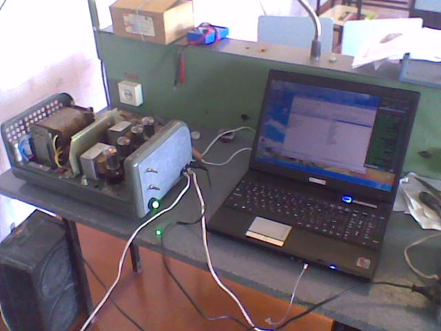
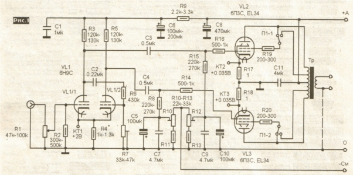
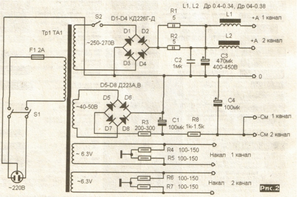
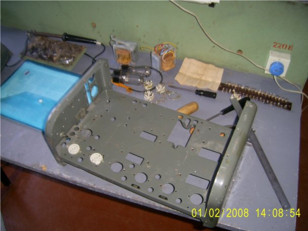
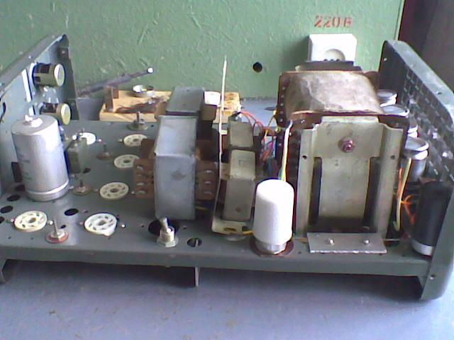
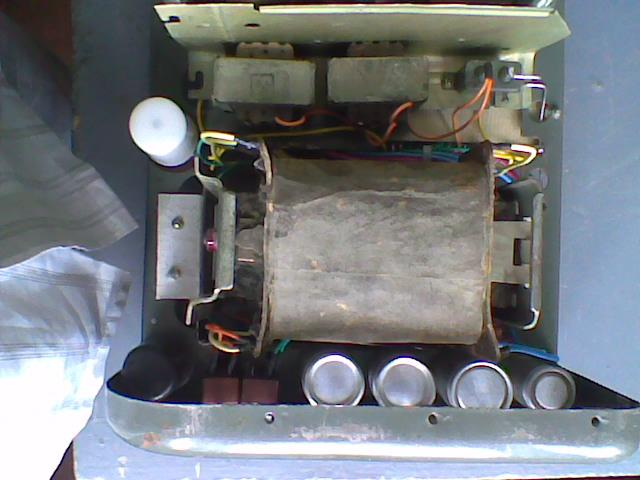
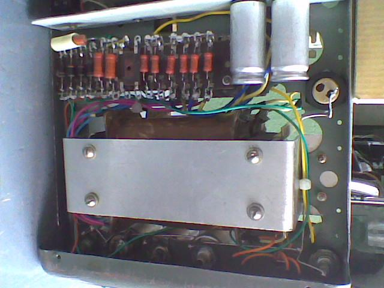
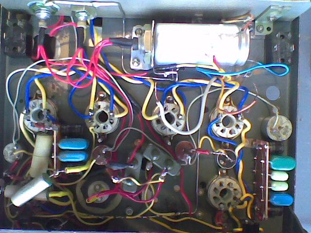

labels: Blog
        Projects
        Electronics
created: 2011-12-22T00:00
place: Starobilsk, Ukraine
comments: true

# Низькочастотний підсилювач на 6П3С

Зібраний мною у 2008-му підсилювач. Схема була взята з журналу "Радіо-хоббі" №5 за 2006 рік.

Використовувалась база гуртка радіоконструювання Старобільського будинку творчості дітей та юнацтва. За ті років 10 які я відвідував гурток було зібрано мною багато всіляких пристроїв починаючи з детекторного радіо приймача до цифрових вимірювальних пристроїв.

Схема одного каналу:

Схема блоку живленя:

Корпус:

Встановлення елементів:

Блок живлення:

Блок живлення, монтаж:

Монтаж:

<iframe width="480" height="270" src="https://www.youtube.com/embed/cgD34ellU1I" frameborder="0" allowfullscreen></iframe>
