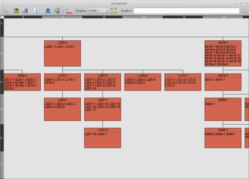
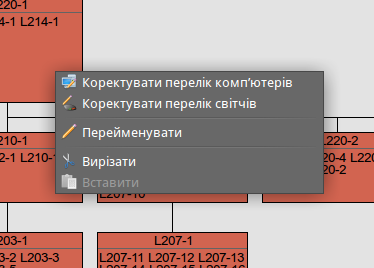
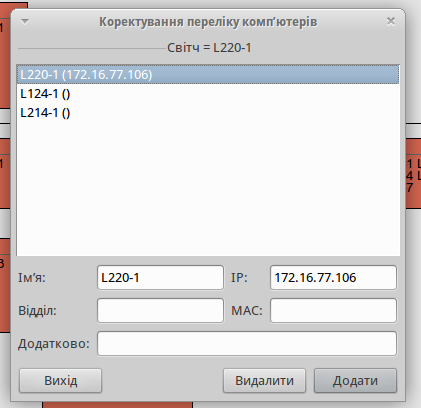
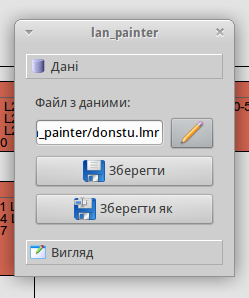
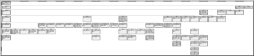
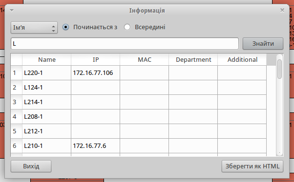
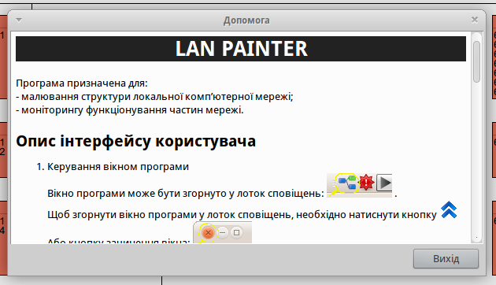
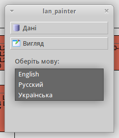

labels: Blog
        Projects
        Qt
created: 2011-12-01T00:00
place: Alchevs'k, Ukraine

# Lan Painter project

Було розроблено для обчислювального центру Донбаського Державного Технічного Університету.

Можливості:

- Малювання мережі (користувач додає вузли)
- Експорт схеми у PDF
- Збереження інформації про вузли
- Пошук вузлів на схемі
- Сканування елементів на схемі (ping вузлів) що дозволяє виявили обриви у мережі

Програма написана на C++/Qt у 2011 році.

## Додавання/видалення/редагування вузлів

Вузлами я називаю комутатори, на схемі відображаються у вигляді прямокутників. Всередині прямокутників знаходиться список комп'ютерів що під'єднані до комутатора.

Контекстне меню:

Редагування вузла:

## Пошук на схемі

І можна обрати вузол який буде вважатися коренем (вузли що знаходяться вище нього будуть сховані).

## Збереження схеми у файл

Збереження схеми у форматі PDF:

## Сканування

Сканування виконується у фоновому режимі. Вікно програми можна згорнути у панель задач.

## Пошук вузлів за шаблоном

## Вбудована довідка

## Інтерфейс перекладено на англійську, українську та російську мови

Links:

- [Програма на Qt-apps.org](http://qt-apps.org/content/show.php/Lan+painter?content=142898)
- [Source code](lan_painter.zip)
