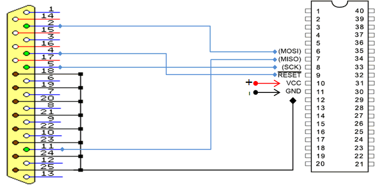
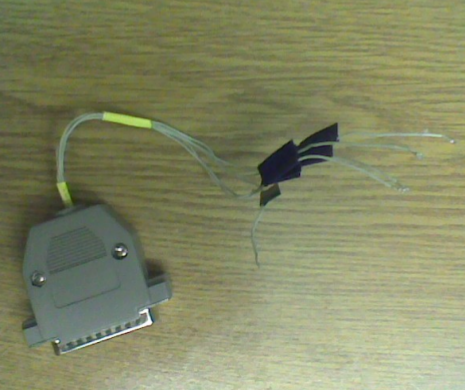
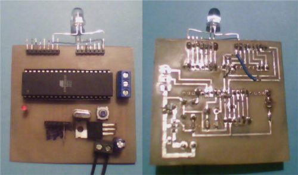

labels: Blog
        Microcontrollers
        Linux
created: 2012-01-05T00:00
place: Alchevs'k, Ukraine
comments: true

# AVR-microcontroller programming under Ubuntu

A programming device will be required for uploading firmware to uc. The easiest option is STK-200. How to assemble [read here](http://myrobot.ru/stepbystep/mc_programmer.php). It is pretty simple:



This one was assembled by me:



There is one drawback in this program loader: LPT-port required. Another option is USB-ASP. Scheme, circuit board, and how to assemble read on [http://easyelectronics.ru](http://easyelectronics.ru) or [elsewhere](https://www.google.com/search?q=usb-asp). 


I'll use a board on which ATMEGA8535, led and button are placed for demonstration.



As for software, You'll need a compiler for AVR C and a program to communicate with programming device. Look what we have in Ubuntu repositories for AVR:

```bash
apt-cache search avr
```

```
avr-evtd - AVR watchdog daemon for Linkstation/Kuroboxes
binutils-avr - Binary utilities supporting Atmel's AVR targets
flashrom - Identify, read, write, erase, and verify BIOS/ROM/flash chips
gdb-avr - The GNU Debugger for avr
libusbprog-dev - Development files for libusbprog
libusbprog0 - Library for programming the USBprog hardware
usbprog - Firmware programming tool for the USBprog hardware
usbprog-gui - GUI firmware programming tool for the USBprog hardware
avarice - Використання GDB з Atmel JTAG ICE для AVR
avr-libc - Стандартна бібліотека мови Сі для розробки на Atmel AVR
avra - Асемблер для мікроконтролерів Atmel AVR
avrdude - Утиліта для програмування мікроконтролерів Atmel AVR
avrdude-doc - documentation for avrdude
avrp - Утиліта для програмування мікроконтролерів Atmel AVR
avrprog - Утиліта для програмування мікроконтролерів Atmel AVR
gcc-avr - GNU-компілятор мови Сі (кросскомпілятор для AVR)
sdcc - Компілятор Сі для мікроконтролерів
sdcc-doc - Small Device C Compiler (documentation)
sdcc-libraries - Small Device C Compiler (libraries)
simulavr - Емулятор мікроконтролерів Atmel
uisp - Маленький внутрішньосхемний програматор для мікроконтролерів Atmel AVR
arduino - AVR development board IDE and built-in libraries
```

Install avr-gcc compiler and libraries:

```bash
sudo apt-get update
sudo apt-get install avr-libc
```

To work with USB-ASP program loader we need avrdude package:

```bash
sudo apt-get install avrdude
```

Lets write a program and load it to the device. As an example: led flashes once per second. The led is connected to microcontroller's pin 1, and I use a crystal oscillator 4 MHz.

!!! tip "locate"
    Sometimes I look into io.h (in my case iom8535.h) to find necessary register names, but first we need to find it:

    ```bash
    locate iom8535.h
    ```

    Output:
    ```
    /usr/lib/avr/include/avr/iom8535.h
    ```

    Look how interrupts and registers are called.

The program:
```c
#include "avr/io.h"
#define F_CPU 4000000UL
#include "util/delay.h"
#include "avr/interrupt.h" 

// interrupt handler (timer 1 on compare)
ISR(TIMER1_COMPA_vect)
{
    PORTB= 0;
    _delay_ms(200);
    PORTB= 1;
}

int main()
{
    // ports configuration
    DDRB=1;
    PORTB=0;

    // timer 1 configuration
    OCR1AH= 0x0f;
    OCR1AL= 0x42; // 1 second timeout
    TIMSK= 1<<OCIE1A; // Interrupt on compare enable
    TCCR1B= 1<<WGM12 | 1<<CS10 | 1<<CS12; // CTC-mode. prescaler - 1024 and start!
    sei();

    while(1);

    return 0;
}
```

Compile:
```bash
avr-gcc -mmcu=atmega8535 -Os -o main.o main.c
```

Here we specify the model of the microcontroller, level of code optimization, file input and output respectively. To view all supported microcontrollers:

```bash
avr-gcc --target-help
```

Link:
```bash
avr-objcopy -O ihex main.o main.hex
```

Here we specified the output file type - intel hex, name of the input and output files. If you have multiple source files, then you need to compile each of them and specify all the obtained object files to avr-objcopy.

Load the program into the uc:
```bash
sudo avrdude -p m8535 -c usbasp -U flash:w:main.hex
```

Note the sudo, Ubuntu, by default, will not allow avrdude to work with USB-ports without root privileges (adding rule to /etc/udev/rules.d/ can solve the issue). 

Here we have specified programming device (use stk200 for STK-200), specified target memory we want to write into (flash for flash, lfuze or hfuse for fuses), w - write, and path to file.

Entering all those commands everytime in console is tiring, I recommend to use make utility instead.

Makefile:
```makefile
main.hex: main.o
    avr-objcopy -O ihex main.o main.hex
main.o: main.c
    avr-gcc -mmcu=atmega8535 -Os -o main.o main.c
load: 
    sudo avrdude -p m8535 -c usbasp -U flash:w:main.hex
```

Now we can compile as follows:
```bash
make
```

And upload the program:
```bash
sudo make load
```

Compilling assembler (AVRA):
```bash
avra -I $(INCLUDEDIR) -fI -o $(FILE) $(FILE)
```

<iframe width="480" height="270" src="https://www.youtube.com/embed/PV276wCVX2s" frameborder="0" allowfullscreen></iframe>

<iframe width="480" height="270" src="https://www.youtube.com/embed/toY4fjLI9GQ" frameborder="0" allowfullscreen></iframe>
