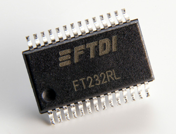

labels: Blog
        Microcontrollers
        Electronics
created: 2012-05-04T00:00

# Зв’язок з FTDI в Ubuntu



Рішення - використання відкритої бібліотеки libFTDI з сайту infra2net.com.

## Встановлення LibFTDI

1. Встановлюємо залежності:
```bash
sudo apt-get install swig # потрібен для біндінгу до Python
sudo apt-get install python-dev # потрібні для SWIG
sudo apt-get install libusb-dev # потрібні для компіляції LibFTDI
```

2. Завантажити останню версію бібліотеки можна тут: [libftdi at www.intra2net.com](http://www.intra2net.com/en/developer/libftdi/download.php).

Я завантажив архів libftdi-0.20.tar.gz.

3. Розархівовуємо:
```bash
tar -xvf libftdi-0.20.tar.gz
cd libftdi-0.20
```

4. Компіляція та встановлення бібліотеки LibFTDI

Я збираюсь писати програму на Python, тому потрібно активувати python-біндінг.
```bash
./configure --enable-python-binding
make
sudo make install
```

5. Щоб не тільки адміністратор мав доступ до пристрою:
```bash
sudo vim /etc/udev/rules.d/60-FTDIRT232R-usb.rules
```

Додаємо рядок:
```
ATTR{idVendor}=="0403", ATTR{idProduct}=="6001", MODE="0666"
```

idVendor та idProduct можна подивитись у списку пристроїв, що підключені до USB:
```bash
lsusb
```

Для FT245R у мене показало:
```
0x0403, 0x6001
```

## Приклад використання (надсилаю 1 байт до пристрою)

```python
import ftdi


if __name__ == '__main__':
    ftdic = ftdi.ftdi_new()
    res = ftdi.ftdi_usb_open(ftdic, 0x0403, 0x6001)
    print res, ftdic
    res = ftdi.ftdi_write_data(ftdic, chr(0x77), 1)
    print 'result =', res
```

[Список функцій для роботи з FTDI](<http://www.intra2net.com/en/developer/libftdi/documentation/group__libftdi.html).

**UPD 2012.08.10**

Section 5 update:

Create file ```10-ftdi.rules``` in ```/etc/udev/rules.d/``` and fill it with:
```
SUBSYSTEM=="usb_device", BUS="usb", ATTR{idVendor}=="0403", ATTR{idProduct}=="6001", MODE="0666"
```

Посилання:

- [Документація до LibFTDI з intra2net.com](http://www.intra2net.com/en/developer/libftdi/index.php)
- [libFTDI v0.18 with Ubuntu on idle-logic.com by Chris Zeh](http://idle-logic.com/2010/12/13/libftdi-v0-18-with-ubuntu-lucid-lynx/)
- [embeddedheaven.com](http://www.embeddedheaven.com/solved-error-unable-to-open-ftdi-device-inappropriate-permissions-on-device.htm)

Place: Alchevs'k, Ukraine
