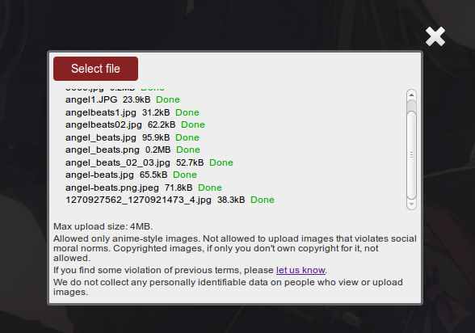

labels: Blog
        Django
        JS
created: 2012-07-30T00:00
modified: 2015-02-15T00:00
place: Starobilsk, Ukraine
comments: true

# Multiple files uploading with Django and valums file-uploader



[TOC]

## Step 1: js/html

Upload valums file-uploader:

- [http://github.com/valums/file-uploader](http://github.com/valums/file-uploader) - deprecated
- [https://github.com/Valums-File-Uploader](https://github.com/Valums-File-Uploader)

Include fileuploader.js and fileuploader.css to your page.

Place it there You want to see uploader:

```html
<div id="file-uploader">
    <noscript>
        <p>Please enable JavaScript to use file uploader.</p>
        <!-- or put a simple form for upload here -->
    </noscript>
</div>
```

Initialize file-uploader:
```js
var uploader = new qq.FileUploader({
    element: document.getElementById('file-uploader'),
    action: '/server/upload/'
});
```

My configuration for uploader shown on the image:
```js
image_uploader = new qq.FileUploader({
element: lb.find('.js-image-uploader')[0]._,
    action: '/images/upload/',
    allowedExtensions: ['jpg', 'jpeg', 'png', 'gif'],
    sizeLimit: 4194304,
    template: '<div class="qq-uploader">' +
    '<div class="qq-upload-drop-area"><span>Drop files here to upload</span></div>' +
        '<div class="qq-upload-button">Select file</div>' +
        '<div class="qq-uploads-wrap"><ul class="qq-upload-list"></ul></div>' +
        '</div>',
    fileTemplate: '<li>' +
    '<span class="qq-upload-file"></span>' +
        '<span class="qq-upload-spinner"></span>' +
        '<span class="qq-upload-size"></span>' +
        '<a class="qq-upload-cancel" href="#">Cancel</a>' +
        '<span class="qq-upload-result"></span>' +
        '<div class="qq-progress"><span>&nbsp;</span></div>' +
        '</li>',
    onComplete: function(id, fileName, responseJson){
    var el = lb.image_uploader._getItemByFileId(id);
        if(responseJson.success){
        $(el).find('.qq-upload-result')[0].html('<span style="color: #0a0">Done</span>');
        } else {
         $(el).find('.qq-upload-result')[0].html('<span style="color: #a00">Error</span>');
        };
        $(el).find('.qq-progress')[0].remove();
    },
    onProgress: function(id, fileName, loaded, total){
    var el = lb.image_uploader._getItemByFileId(id);
        $(el).find('.qq-progress span')[0].setStyle('width', (loaded/total*300).round() + 'px');
    }
});
```

## Step 2: Django

```python
import os

from django.utils.simplejson import dumps
from django.http import HttpResponse, Http404
from django.core.files import locks
from django.conf import settings


def upload_image(request):
    if request.method != 'POST' or not request.is_ajax():
        raise Http404
    caption = request.GET.get('qqfile', '')
    try:
        ext = caption.split('.')[-1]
        caption = caption.split('.')[0]
    except IndexError:
        return HttpResponse(dumps({'success': False}), mimetype='application/json')
    file_name = '%s.%s' % (caption, ext)
    dir_path = os.path.join(settings.MEDIA_ROOT, 'images')
    file_path = os.path.join(dir_path, file_name)
    if os.path.exists(file_path):
        return HttpResponse(dumps({'success': False}), mimetype='application/json')
    if not os.path.exists(dir_path) or not os.path.isdir(dir_path):
        # create a directory, including missing parents, ensuring it has group write permissions
        old_mask = os.umask(0002)
        try:
            os.makedirs(dir_path)
        finally:
            os.umask(old_mask)
    write_mode = (
            os.O_WRONLY | os.O_CREAT | os.O_EXCL | getattr(os, 'O_BINARY', 0))
    fd = os.open(file_path, write_mode)
    try:
        locks.lock(fd, locks.LOCK_EX)
        while True:
            buf = request.read(512 * 1024)
            if buf:
                os.write(fd, buf)
            else:
                break
    finally:
        locks.unlock(fd)
        os.close(fd)
    return HttpResponse(dumps({'success': True}), mimetype='application/json')
```

Test:
```python
import os

from django.conf import settings
from mock import Mock

from .views import upload_image


def test_upload_image(self):
        request = Mock()
        image_file = open(
            os.path.join(settings.MEDIA_ROOT, 'tests/123.jpg'), 'r')
        request.raw_post_data = image_file.read()
        request.method = 'POST'
        request.is_ajax = lambda : True
        request.GET = {'qqfile': '123.jpg'}
        file_path = os.path.join(settings.MEDIA_ROOT, 'images/123.jpg')
        if os.path.exists(file_path):
            os.remove(file_path)
        response = upload_image(request)
        self.assertTrue(os.path.exists(file_path))
```

Check out also these:

- [https://github.com/GoodCloud/django-ajax-uploader](https://github.com/GoodCloud/django-ajax-uploader)
- [http://stackoverflow.com/questions/4750168/fileupload-with-django](http://stackoverflow.com/questions/4750168/fileupload-with-django)

## Step 3: Use it

File-uploader advantages:

- upload multiple files
- show progress
- cancel uploads
- restrict file extensions and max/min file sizes
- write your own validator
- use your own templates for file-uploader widget
- use your own styles for file-uploader widget
- Drag&Drop feature is enabled by default

## Updates

**UPD 2013-07-02**

New link: [http://valums-file-uploader.github.io/file-uploader](http://valums-file-uploader.github.io/file-uploader/).

**UPD 2013-07-07**

Added django code example.

**UPD 2015-02-15**

Fixed language.
