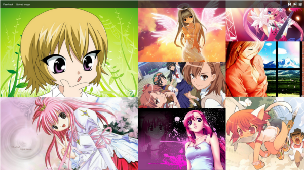
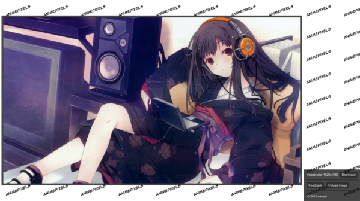
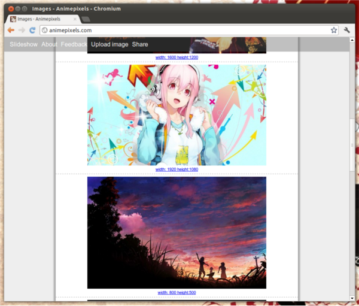
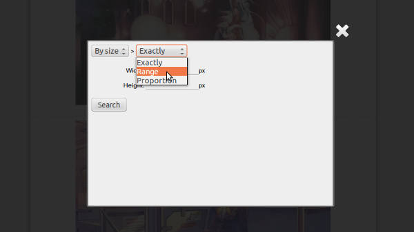
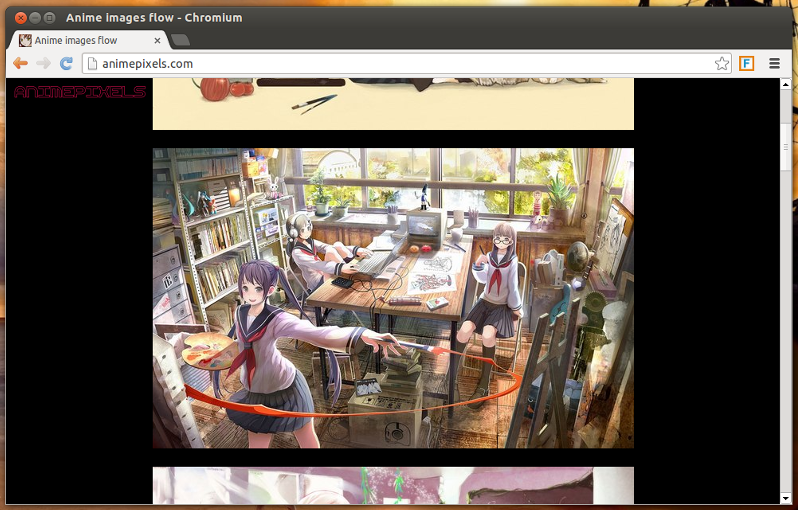
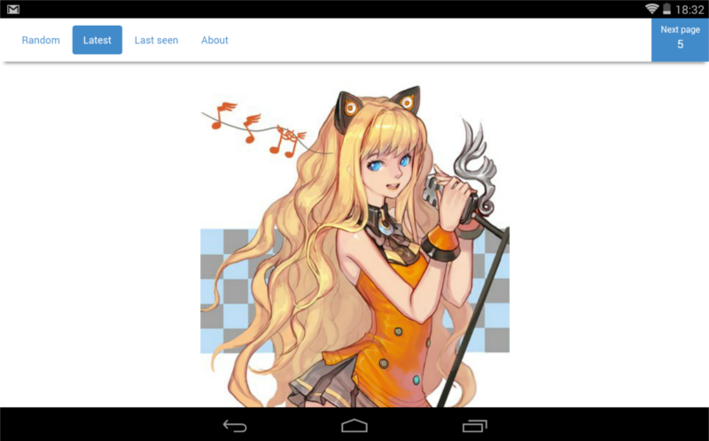

labels: Blog
        Projects
created: 2012-08-18T00:00
place: Starobilsk, Ukraine

# Animepixels project

```http://animepixels.com```

Anime style images slideshow + images sharing + images search.





**UPD 2012-08-18**

Iteration 2:

- Fix bugs from iteration 1
- Improvements in admin interface
- Store images on Amazon S3
- Add tags, extend admin tools for images moderation
- Add images search (by size, tag, date add) page

Iteration 3:

- Add ability to comment image
- Add ability to subscribe on new images with specified tags
- Thematic days for images stream

**UPD 2012-09-27**

Iteration 2 is completed. Was done:

- Fixes in html, css, js
- Show loading state
- Daily statistics notifications via email
- Share lightbox
- Celery configuration on production
- Installed SMTP server on production
- Migrated from css to less
- CSS and JS minification
- Used Amazon S3 as images storage
- SEO optimisations
- Automatic backups

Iteration 3 - Advanced search (deadline: 2012-10-10):

- by size
- by proportion
- by title
- by tags
- by main color

Iteration 4 - Art collections

Iteration 5 - Socialization

**UPD 2012-12-15**

Added images list page with endless pagination.



Next: search by size.

**UPD 2012-12-19**

Implemented search by size:



**UPD 2013-03-16**

Hosting bettervps stops, so animepixels.com now unavailable.
I am working on new version of the site.
As for new hosting, I selected digitalocean.com.

**UPD 2013-05-27**

animepixels.com is alive.



I got the idea and implemented it in one day, it was cool.
For now, I use vk api to obtain images list posted on my news feed, and then I just show them. Amazing simple!

**UPD 2013-06-01**

My first chrome extension on [Chrome Web Store](https://chrome.google.com/webstore/detail/one-click-anime-pics/lljjmjlecbdchogfphdoccehefniihia).

**UPD 2013-07-23**

Filter by image proportions.

**UPD 2013-07-28**

Feedback form.

**UPD 2013-12-10**

The project is stopped, no new images will be added because I haven't free time to moderate them.

Images in database: 46641

Moderated: 30982

File with all moderated images (csv): [ap.csv.zip](ap.csv.zip).

**UPD 2014-03-29**

I have a lot of new ideas, and now working on new version.

**UPD 2014-04-02**

New version (3) on production.
For now I have a powerful dashboard for staff, view for random, latest and last seen images.
Last seen images just start showing images from page user last seen.

**UPD 2014-04-05**

animepixels.com new pagination looks nice on my tablet:



**UPD 2014-04-07**

Today I run the migration that search for same images by size and color scheme. Result for new images: 2973 -> 3360 (-11%!).

**UPD 2014-04-12**

Search by tags/colors/size was implemented.

**UPD 2014-07-09**

```
Hey there,

We have booted your server from the recovery mode.

The guide is here: https://www.digitalocean.com/community/articles/how-to-recover-from-file-system-corruption-using-fsck-and-a-recovery-iso

It's very likely that this server is backdoored and cannot be recovered through normal means. This is a vulnerabillity that was always present with ElasticSearch but your server was recently a victim of this compromise. This issue is not isolated to DigitalOcean.

The changes made using the ElasticSearch link (http://bouk.co/blog/elasticsearch-rce/) we gave you won't be able to fix this problem, only prevent it from happening in the future.

Alternatively, you could also have the droplet simply destroyed.

Please let us know how you would like to proceed.

Thank you,
DigitalOcean Support
```
