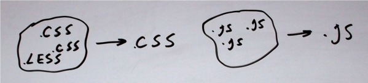

labels: Blog
        Django
        CSS
        JS
created: 2012-12-05T00:00
place: Alchevs'k, Ukraine

# CSS and JS minification with django-pipeline



Not only minification:

- pipeline creates unique names for script files like: ```/static/css/weblog.min.c79c5280748b.css```, so no need to change file ?version
- it glues files, so it reduces files count
- it makes templates simpler because of inclusions moved to settings file
- it automatically converts less/sass to css while development

5 steps to install and configure django-pipeline:

[TOC]

## Step 1 (install pipeline)

Read [the docs](http://django-pipeline.readthedocs.org/en/latest/index.html).

requirements.txt:
```text
django-pipeline
```

settings.py:
```python
INSTALLED_APPS += ('pipeline',)
STATICFILES_STORAGE = 'pipeline.storage.PipelineCachedStorage'
```

For settings I use directory based module, very usefull practice:
```
- project
    - settings
        - __init__.py
        - admins.py
        - apps.py
        - pipeline.py
        ...
    ...
```

Don't forget to include all settings files in ```__init__.py```:
```python
from .admins import *
from .pipeline import *
...
```

## Step 2 (configure pipeline)

As example, ```pipeline.py```:
```python
PIPELINE_CSS = {
    'bootstrap': {
        'source_filenames': (
            'css/bootstrap.less',
        ),
        'output_filename': 'css/bootstrap.min.css',
    },
    'weblog': {
        'source_filenames': (
            'css/common.less',
            'libs/prettify/prettify.css',
            'css/weblog.less',
        ),
        'output_filename': 'css/weblog.min.css',
    },
    'flatpages': {
        'source_filenames': (
            'css/common.less',
            'css/flatpages.less',
        ),
        'output_filename': 'css/flatpages.min.css',
    }
}

PIPELINE_JS = {
    'jquery': {
        'source_filenames': (
            'js/jquery.min.js',
        ),
        'output_filename': 'js/jquery.min.js',
    },
    'weblog': {
        'source_filenames': (
            'js/jquery.validate.js',
            'libs/prettify/prettify.js',
            'js/weblog.js',
        ),
        'output_filename': 'js/weblog.min.js',
    },
    'flatpages': {
        'source_filenames': (
            'js/flatpages.js',
        ),
        'output_filename': 'js/flatpages.min.js',
    },
}

# When PIPELINE is True, CSS and JavaScripts will be concatenated and filtered.
# When False, the source-files will be used instead.
# Default: PIPELINE = not DEBUG

PIPELINE_CSS_COMPRESSOR = 'pipeline.compressors.yui.YUICompressor'
PIPELINE_JS_COMPRESSOR = 'pipeline.compressors.yui.YUICompressor'

PIPELINE_YUI_BINARY = '/usr/bin/yui-compressor'

PIPELINE_COMPILERS = (
  'project.apps.core.compilers.RubyLesscCompiler',
)

PIPELINE_LESS_BINARY = '/usr/local/bin/lessc'

PIPELINE_DISABLE_WRAPPER = True
```

[Read more](http://django-pipeline.readthedocs.org/en/latest/configuration.html) about configuration.

## Step 3 (install lessc and yui-compressor binary)

**! See UPD beneath.**

Tested on Debian 6 and ubuntu 12.10.

Install lessc (I use lessc wrote in ruby instead if java version):
```bash
sudo apt-get install rubygems1.8 ruby1.8-dev
sudo gem install rubygems-update
sudo gem update rubygems
sudo gem install less
sudo ln -s /var/lib/gems/1.8/bin/lessc /usr/bin/
```

Additionally for Debian:
```bash
sudo gem install therubyracer
```

Install yui-compressor:
```bash
sudo apt-get install yui-compressor
```

## Step 4 (is it works?)

lessc wrote in ruby has some differences in command line parameters statement, so we have to implement compiler class for it and add this class to PIPELINE_COMPILERS:
```python
# project/apps/core/compilers.py
from os.path import dirname

from pipeline.conf import settings
from pipeline.compilers import SubProcessCompiler


class RubyLesscCompiler(SubProcessCompiler):
    output_extension = 'css'

    def match_file(self, filename):
        return filename.endswith('.less')

    def compile_file(self, infile, outfile, outdated=False, force=False):
        command = "%s %s %s > %s" % (
            settings.PIPELINE_LESS_BINARY,
            settings.PIPELINE_LESS_ARGUMENTS,
            infile,
            outfile
        )
        return self.execute_command(command, cwd=dirname(infile))
```

Check paths to binaries are right:
```python
PIPELINE_YUI_BINARY = '/usr/bin/yui-compressor'
PIPELINE_LESS_BINARY = '/usr/local/bin/lessc'
```

and fix them or create symbolic links.

To test all works fine, run:
```
manage.py collectstatic
```

On every change in .less files will generated file with same name but with .css extension, so we don't need to use less.js.
I don't think You need to have automatically generated css files under version control, so just add them to .gitignore.

## Step 5 (templates)

Load ```compressed``` template tag module and add compressed_css and compressed_js to include css/js files to page:
```django



    {{ block.super }}
    



    {{ block.super }}
    
    

```

Links:

- [https://github.com/cyberdelia/django-pipeline](https://github.com/cyberdelia/django-pipeline)
- [http://django-pipeline.readthedocs.org/en/latest/index.html](http://django-pipeline.readthedocs.org/en/latest/index.html)

**UPD 2014-04-02**

Use less from node.js packages (npm install less) instead of ruby version.
