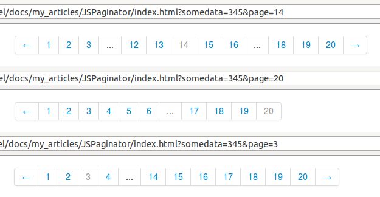

labels: Blog
        JS
created: 2012-12-29T00:00
place: Alchevs'k, Ukraine
comments: true

# Pagination widget js



[pagination.js at Bitbucket](https://bitbucket.org/nanvel/paginationjs).

Usage:

- include ```pagination.js```
- add ```<div class="pagination" data-pages="10"></div>``` where you want to see paginator
- specify pages count by data-pages attribute

```diff
+    'js/pagination.js',

-    <div class="pagination">
-        <ul>
-            
-                <li><a href="?page={{ page.previous_page_number }}{{ q|urlget:'q' }}">Prev</a></li>
-            
-            
-                
-                    <li class="disabled"><a href="?page={{ p }}{{ q|urlget:'q' }}">{{ p }}</a></li>
-                
-                    <li><a href="?page={{ p }}{{ q|urlget:'q' }}">{{ p }}</a></li>
-                
-            
-            
-                <li><a href="?page={{ page.next_page_number }}{{ q|urlget:'q' }}">Next</a></li>
-            
-        </ul>
-    </div>
+    <div class="pagination" data-pages="{{ page.paginator.num_pages }}"></div>
```
