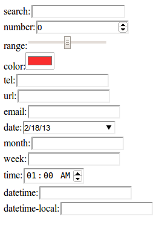

labels: Blog
        HTML
        JS
created: 2013-02-18T00:00
place: Starobilsk, Ukraine
comments: true

# HTML5 input types

HTML5 defines over a dozen new input types!

But not all of them works even in modern browsers.
In Firefox they all look like they have type == "text".

In chromium I got following result:



```html
<!DOCTYPE html>
<html>
    <head>
        <title>Inputs</title>
    </head>
    <body>
        <script>
            var types = ['search', 'number', 'range', 'color', 'tel', 'url', 'email', 'date', 'month', 'week', 'time', 'datetime', 'datetime-local']
            var body = document.getElementsByTagName('body')[0]
            for(var input, i=0; i<types.length; i++) {
                input = document.createElement('INPUT');
                input.setAttribute('type', types[i]);
                body.appendChild(document.createTextNode(types[i] + ':'))
                body.appendChild(input);
                body.appendChild(document.createElement('BR'))
            }
        </script>
    </body>
</html>
```

Links:

- [HTML5: Up and Running by Mark Pilgrim](http://shop.oreilly.com/product/9780596806033.do)
