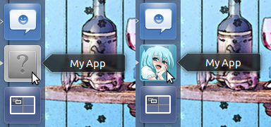

labels: Blog
        Python
        Ubuntu
created: 2013-02-24T00:00
place: Starobilsk, Ukraine

# Launcher icon for python script on Ubuntu



Create ```~/.local/share/applications/myapp.desktop```:

```conf
[Desktop Entry]
Type=Application
Name=[Name of your app, for example My App. This can be free text.]
Exec=[full path to your executable and executable name, for example /usr/local/bin/myapp.py]
Icon=[full path to your executable's icon and icon name, for example /usr/local/share/icons/apps/myapp.png]
Terminal=false
StartupNotify=true
```

Links:

- [http://askubuntu.com/questions/78730/how-do-i-add-a-custom-launcher](http://askubuntu.com/questions/78730/how-do-i-add-a-custom-launcher)
