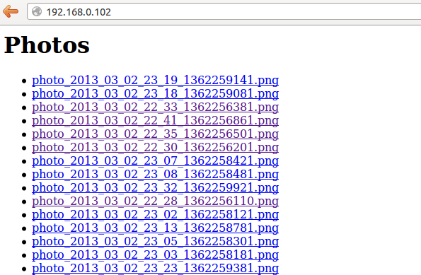

labels: Blog
        Linux
        RaspberryPi
created: 2013-03-02T00:00
place: Starobilsk, Ukraine

# Photo registrator on Raspberry Pi


This weekend I decide to do something with my raspberry.

And this something now watching me :)


I decide, that it should work immediately, I have only give it power, no other actions. I use simple web server allows me to view saved photos in browser:



What I done to make it works:

[TOC]

## 1. Script for making photos on usb webcam

```fswebcam``` utility was used. It can be installed using package manager.
```bash
#!/bin/sh

DEVICE=/dev/video0
PHOTOS_DIR=/home/cameraman/photos

[ -c $DEVICE ] && fswebcam --device $DEVICE --no-banner --png --save ${PHOTOS_DIR}/photo_`eval date +%Y_%m_%d_%H_%M_%s`.png
```

## 2. Web server

Using nginx.

```nginx.conf```:
```nginx
user cameraman;
worker_processes 1;
pid /var/run/nginx.pid;

events {
    worker_connections 100;
}

http {
    sendfile on;
    tcp_nopush on;
    tcp_nodelay on;
    keepalive_timeout 10;
    types_hash_max_size 2048;

    include /etc/nginx/mime.types;
    default_type application/octet-stream;

    access_log /var/log/nginx/access.log;
    error_log /var/log/nginx/error.log;

    gzip off;

    ##
    # Virtual Host Configs
    ##

    include /etc/nginx/conf.d/*.conf;
    include /etc/nginx/fastcgi_params;
    server {
        server_name cameraman.com;
        listen 80;
        location /photos {
            root /home/cameraman;
            autoindex off;
        }
        location / {
            fastcgi_pass   unix:/tmp/fastcgi.sock;
        }
    }
}
```

## 3. FastCGI server for files list page

```python
#!/usr/bin/env python
# -*- coding: UTF-8 -*-

import sys, os, daemon
from flup.server.fcgi import WSGIServer

from settings import PHOTOS_DIR


SOCKET = '/tmp/fastcgi.sock'


def app(environ, start_response):
    start_response('200 OK', [('Content-Type', 'text/html')])

    yield '<h1>Photos</h1>'
    yield '<ul>'
    for root, dirnames, filenames in os.walk(PHOTOS_DIR):
        for filename in filenames:
            yield '<li><a href="/photos/{fn}" target="_blank">{fn}</a>'.format(fn=filename)
    yield '</ul>'


if __name__ == '__main__':
    """
    usage: ``python fastcgi.py`` to run server in console or
    ``python fastcgi.py daemonize`` to run server as daemon.
    """
    if 'daemonize' in sys.argv:
        with daemon.DaemonContext():
            WSGIServer(app, bindAddress=SOCKET).run()
    else:
        WSGIServer(app, bindAddress=SOCKET).run()
```

System V script for the server:

```bash
#!/bin/bash

### BEGIN INIT INFO
# Provides:          cameraman_server
# Required-Start:    $all
# Required-Stop:     $all
# Default-Start:     2 3 4 5
# Default-Stop:      0 1 6
# Short-Description: starts the cameraman fastcgi server
# Description:       starts the cameraman fastcgi server
### END INIT INFO

DESC="FastCGI server for cameraman"
SCRIPT_NAME=fastcgi.py
SCRIPT_DIR=/home/cameraman/cameraman

start() {
  cd $SCRIPT_DIR && source .env/bin/activate && python $SCRIPT_NAME daemonize
}
stop() {
  kill -QUIT $(ps aux | grep $SCRIPT_NAME | awk "{print $2}")
}

case "$1" in
  start)
    echo -n "Starting $DESC: "
    start
  ;;
  stop)
    echo -n "Stopping $DESC: "
    stop
  ;;
  restart)
    echo -n "Restarting $DESC: "
    stop
    sleep 1
    start
  ;;
  *)
    echo "Usage: $SCRIPTNAME {start|stop|restart}" >&2
    exit 3
  ;;
esac
exit $?
```

## 4. Periadically remove old photos

```python
#!/usr/bin/env python
# -*- coding: UTF-8 -*-

import os
import datetime

from settings import PHOTOS_DIR, REMOVE_AFTER_HOURS


def remove_old_photos():
    print 'Removing old files ...'
    min_time = datetime.datetime.now() - datetime.timedelta(hours=REMOVE_AFTER_HOURS)
    for root, dirnames, filenames in os.walk(PHOTOS_DIR):
        print root, dirnames, filenames
        for filename in filenames:
            try:
                parts = filename.split('_')
                time = datetime.datetime(
                        year=int(parts[1]),
                        month=int(parts[2]),
                        day=int(parts[3]),
                        hour=int(parts[4]),
                        minute=int(parts[5]))
                if time < min_time:
                    print 'Removing %s' % filename
                    os.remove('%s/%s' % (PHOTOS_DIR, filename,))
            except:
                print '%s ommited' % filename
    print 'Done'


if __name__ == '__main__':
    remove_old_photos()
```

Code and instructions how to install scripts available at [bitbucket](https://bitbucket.org/nanvel/cameraman/overview).

Links:

- [http://www.raspberrypi.org/](http://www.raspberrypi.org/)
- [http://docs.python.org/2/howto/webservers.html](http://docs.python.org/2/howto/webservers.html)
- [http://pc-freak.net/blog/linux-webcam-pictures-tty-console-terminal-pictures-plain-console-webcamera/](http://pc-freak.net/blog/linux-webcam-pictures-tty-console-terminal-pictures-plain-console-webcamera/)
