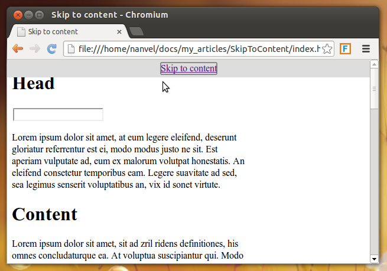

labels: Blog
        JS
created: 2013-04-30T00:00
place: Starobilsk, Ukraine
comments: true

# Crossbrowser skip to content link



This js solves problem happens while implementing 'skip to content' feature in webkit (Issue 37721).

```js
(function($, undefined) {
    $(function() {
        var $skipToContentBlock = $('.js-skip-link');
        var hideSkipLinksTimeout = undefined;
        if(!$skipToContentBlock.length) return;
        /* fix webkit bug 17450 */
        if(navigator.userAgent.toLowerCase().indexOf('webkit') != -1) {
            if(window.location.hash) {
                var anchor = $(window.location.hash);
                if(anchor.length) {
                    setTimeout(function() {
                        anchor.attr('tabindex', 0);
                        $(window).scrollTop(anchor.offset().top);
                        anchor.focus();
                    }, 0)
                }
            }
            $skipToContentBlock.find('a').on('click', function() {
                var anchor = $($(this).attr('href'));
                if(anchor.length) {
                    anchor.attr('tabindex', 0);
                    $(window).scrollTop(anchor.offset().top);
                    anchor.focus();
                }
            });
        }
        $skipToContentBlock.on('focusin', function(){
            if(hideSkipLinksTimeout) {
                clearTimeout(hideSkipLinksTimeout);
            }
            $(this).css({height: 'auto'});
        }).on('focusout', function(e) {
            var $this = $(this);
            hideSkipLinksTimeout = setTimeout(function() {
                $this.css({height: 0});
            }, 200);
        });
    });
})(jQuery)
```

Links:

- [http://www.netmagazine.com/news/webkit-scuppers-skip-content-links-121741](http://www.netmagazine.com/news/webkit-scuppers-skip-content-links-121741)
- [http://stackoverflow.com/questions/2074347/focus-not-working-in-safari-or-chrome](http://stackoverflow.com/questions/2074347/focus-not-working-in-safari-or-chrome)
- [http://www.refinedpractice.com/examples/skiplink-redux.html](http://www.refinedpractice.com/examples/skiplink-redux.html)
