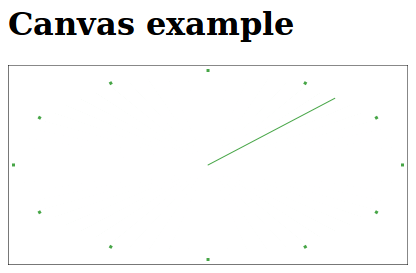

labels: Blog
        HTML
        JS
created: 2013-05-01T00:01

# [HTML5] Canvas, first steps

Simple example: display second arrow.



```html
<!DOCTYPE html>
<html lang="en">
    <head>
        <meta charset="utf-8">
        <title>Canvas</title>
    </head>
    <body>
        <h1>Canvas example</h1>
        <canvas width="400" height="200" id="canvas"></canvas>
        <script>
            var canvas = document.getElementById('canvas');
            var width = canvas.width;
            var height = canvas.height;
            var context = canvas.getContext('2d');
            var backgroundColor = '#fff';
            var penColor = '#46a546'

            /* draw 10 sec lines */
            context.strokeRect(0, 0, width, height);
            for(var i=0; i<360; i+=30) {
                var rad = i / 180. * Math.PI;
                context.moveTo(width / 2 + (width / 2 - 7) * Math.cos(rad), height / 2 + (height / 2 - 7) * Math.sin(rad));
                context.lineTo(width / 2 + (width / 2 - 4) * Math.cos(rad), height / 2 + (height / 2 - 4) * Math.sin(rad));
            }
            context.strokeStyle = penColor;
            context.lineWidth = 3;
            context.stroke();

            var lastPos = 0
            function updateArrows() {
                var date = new Date();
                /* remove previous arrow */
                context.beginPath();
                var rad = lastPos / 30. * Math.PI - Math.PI / 2;
                context.moveTo(width / 2, height / 2);
                context.lineTo(width / 2 + (width / 2 - 9) * Math.cos(rad), height / 2 + (height / 2 - 9) * Math.sin(rad));
                context.strokeStyle = backgroundColor;
                context.lineWidth = 3;
                context.stroke();
                /* draw new */
                lastPos = date.getSeconds();
                context.beginPath();
                rad = lastPos / 30. * Math.PI - Math.PI / 2;
                context.moveTo(width / 2, height / 2);
                context.lineTo(width / 2 + (width / 2 - 10) * Math.cos(rad), height / 2 + (height / 2 - 10) * Math.sin(rad));
                context.strokeStyle = penColor;
                context.lineWidth = 1;
                context.stroke();
                setTimeout(updateArrows, 1000);
            }

            updateArrows();
        </script>
    </body>
</html>
```

Place: Starobilsk, Ukraine
