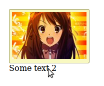

labels: Blog
        JS
created: 2013-05-31T00:00
place: Starobilsk, Ukraine
comments: true

# jQuery tooltip plugin

Usage:

Include source and styles files
```html
<link rel="stylesheet" type="text/css" href="tooltip.css" media="all">
<script src="tooltip.js"></script>
```

Initialize
```html
$('.some-target').tooltip('.content-container');
```

Example:



[Plugin code on BitBucket](https://bitbucket.org/nanvel/jquery-tooltip-plugin/).
