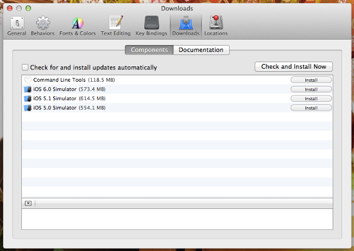

labels: Blog
        Python
        OSX
created: 2013-06-30T00:00
place: Starobilsk, Ukraine
comments: true

# Python virtualenv on Mac OS X

Installation (version 10.8):

**1. Install XCode from apple store**
**2. Additionally install Xcode Command Line Tools (see screenshot)**



**3. Update ```~/.bash_profile```**

```bash
export ARCHFLAGS="-arch x86_64"
export PATH=/usr/local/share/python:/usr/local/bin:/usr/bin:/bin:/usr/sbin:/sbin
test -f ~/.bashrc && source ~/.bashrc
```

**4. Install homebrew (the missing package manager for OS X)**

```bash
ruby -e "$(curl -fsSL https://raw.github.com/mxcl/homebrew/go)"
```

Homebrew is a package management system that simplifies software installation on the Mac OS X operating system. It is a free/open source software project with goal to simplify installation of other free/open source software.
Homebrew installs packages to his own directory and then symlinks their files into ```/usr/local```.
Run to ensure that installation passed without errors:
```bash
brew doctor
```

**5. Install latest python**
```bash
brew install python --with-brewed-openssl
brew install python3 --with-brewed-openssl
```

**6. Update ```~/.bashrc```**

```bash
# virtualenv should use distribute instead of legacy setuptools
export VIRTUALENV_DISTRIBUTE=true
# pip should only run if there is a virtualenv currently activated
export PIP_REQUIRE_VIRTUALENV=true
# cache pip-installed packages to avoid re-downloading
export PIP_DOWNLOAD_CACHE=$HOME/.pip/cache
```

**7. Install virtualenv and other packages You need**

```bash
pip install virtualenv
```

Links:

- [http://hackercodex.com/guide/mac-osx-mountain-lion-10.8-configuration/](http://hackercodex.com/guide/mac-osx-mountain-lion-10.8-configuration/)
- [http://hackercodex.com/guide/python-virtualenv-on-mac-osx-mountain-lion-10.8/](http://hackercodex.com/guide/python-virtualenv-on-mac-osx-mountain-lion-10.8/)
- [http://mxcl.github.io/homebrew/](http://mxcl.github.io/homebrew/)
- [http://en.wikipedia.org/wiki/Homebrew_%28package_management_software%29](http://en.wikipedia.org/wiki/Homebrew_%28package_management_software%29)
- [https://github.com/mxcl/homebrew/wiki/Homebrew-and-Python](https://github.com/mxcl/homebrew/wiki/Homebrew-and-Python)
