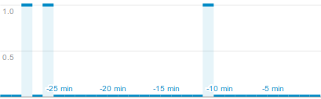

labels: Blog
        Django
        API
created: 2013-06-13T00:00

# [Django] Trigger GA event on server side



**1. install requirements**
```bash
pip install django-google-analytics
pip install pyga==2.4.2
pip install mock==1.0.1
```

**2. utility code**
```python
    from django.contrib.sites.models import Site
    from pyga.requests import Tracker, Visitor, Session, Event


    def ga_event(category, action):
        visitor = Visitor()
        session = Session()
        event = Event(category=category, action=action)
        site = Site.objects.get_current()
        code_set = site.googleanalytics_set.all()
        if code_set:
            analytics_code = code_set[0].web_property_id
            tracker = Tracker(analytics_code.replace('UA', 'MO'), site.domain)
            tracker.track_event(event, session, visitor)
```

**3. test for utility**
```python
from django.contrib.sites.models import Site
from django.test import TestCase
from google_analytics.models import GoogleAnalytics
from mock import patch
from pyga import requests

from .utils import ga_event


class UtilsTestCase(TestCase):

    @patch('pyga.requests.Tracker')
    def test_ga_event(self, TrackerMock):
        """
        Check that pyga.requests.Track cals with right arguments
        """
        analytics_code = 'UA-77777777-7'
        mobile_analytics_code = analytics_code.replace('UA', 'MO')
        sites = Site.objects.all()
        self.assertEqual(sites.count(), 1)
        site = sites[0]
        analytics = GoogleAnalytics.objects.create(
            site=site, web_property_id=analytics_code)
        tracker_value = requests.Tracker(mobile_analytics_code, site.domain)
        ga_event('a', 'b')
        TrackerMock.assert_called_once_with(mobile_analytics_code, site.domain)
```

The beautiful thing here is that while no Google Analytics objects added, tracking will be disabled. So, events shouldn't trigger while testing app.

**4. add google analytics id to ```/admin/sites/site/1/``` (web property id, starts from ```UA-```)**

**5. call ```ga_event('somecategory', 'someaction')``` when You need to trigger an event**

Place: Starobilsk, Ukraine
