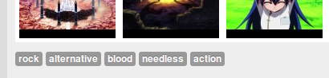

labels: Blog
        Projects
created: 2013-07-07T00:00

# AMV HUB project

Anime Music Videos database.

Published 2013-07-07 at ```http://amvhub.com```.


**UPD 2013-07-14**

Implemented sorting by score.

For now score calculates as:
```python
score = 100 * views / period * ((likes - 2 * dislikes) / period)
score = score if score > 0 else 0
```

**UPD 2013-07-16**

Implemented tags feature (thanks to [tags manager](http://welldonethings.com/tags/manager) plugin).



Edit:


**UPD 2013-07-18**

Implemented search feature. Used haystack and elasticsearch.
Used caching (redis as cache backend).

**UPD 2014-07-09**

```text
Hey there,

We have booted your server from the recovery mode.

The guide is here: https://www.digitalocean.com/community/articles/how-to-recover-from-file-system-corruption-using-fsck-and-a-recovery-iso

It's very likely that this server is backdoored and cannot be recovered through normal means. This is a vulnerabillity that was always present with ElasticSearch but your server was recently a victim of this compromise. This issue is not isolated to DigitalOcean.

The changes made using the ElasticSearch link (http://bouk.co/blog/elasticsearch-rce/) we gave you won't be able to fix this problem, only prevent it from happening in the future.

Alternatively, you could also have the droplet simply destroyed.

Please let us know how you would like to proceed.

Thank you,
DigitalOcean Support
```

Place: Starobilsk, Ukraine
