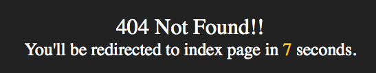

labels: Blog
        Django
created: 2013-07-20T00:00
place: Starobilsk, Ukraine
comments: true

# Django project error pages



Snippets error pages implementation for django project: ```404.html``` and ```500.html``` templates, custom error views, urls configs, test.

```project/apps/core/tests/test_views.py```:
```python
from django.test import TestCase
from django.test.client import RequestFactory

from project import urls

from ..views import handler404, handler500


class TestErrorPages(TestCase):

    def test_error_handlers(self):
        self.assertTrue(urls.handler404.endswith('.handler404'))
        self.assertTrue(urls.handler500.endswith('.handler500'))
        factory = RequestFactory()
        request = factory.get('/')
        response = handler404(request)
        self.assertEqual(response.status_code, 404)
        self.assertIn('404 Not Found!!', unicode(response))
        response = handler500(request)
        self.assertEqual(response.status_code, 500)
        self.assertIn('500 Internal Server Error', unicode(response))
```

```project/apps/core/views.py```:
```python
from django.http import HttpResponseServerError, HttpResponseNotFound
from django.template import Context
from django.template.loader import get_template


def handler500(request, template_name='500.html'):
    t = get_template(template_name)
    ctx = Context({})
    return HttpResponseServerError(t.render(ctx))


def handler404(request, template_name='404.html'):
    t = get_template(template_name)
    ctx = Context({})
    return HttpResponseNotFound(t.render(ctx))
```

Add to ```project/urls.py```:
```python
handler500 = 'project.apps.core.views.handler500'
handler404 = 'project.apps.core.views.handler404'
```

```project/templates/404.html```:
```html
<!DOCTYPE html>
<html lang="en">
    <head>
        <meta charset="utf-8">
        <title>404 Not Found!!</title>
        <style>
            body {
                margin: 0;
                padding: 0;
                background-color: #222;
            }
            .content {
                position: absolute;
                top: 50%;
                color: #fff;
                text-align: center;
                height: 4em;
                margin-top: -2em;
                width: 100%;
                font-size: 2em;
            }
            #redirect-message {
                display: none;
                font-size: .8em;
            }
            #redirect-message > span {
                color: #ffc40d;
            }
        </style>
    </head>
    <body>
        <div class="content">
            404 Not Found!!
            <div id="redirect-message">You'll be redirected to index page in <span id="redirect-seconds">10</span> seconds.</div>
        </div>
        <script>
            var page = {
                index_url: '/',
                seconds: 11,
                redirect_message: document.getElementById('redirect-message'),
                redirect_seconds: document.getElementById('redirect-seconds'),
                dec_seconds: function() {
                    page.seconds-=1;
                    page.redirect_seconds.innerHTML=page.seconds;
                    if(page.seconds>0) {
                        setTimeout(page.dec_seconds, 1000);
                    } else {
                        window.location.href=page.index_url;
                    }
                },
                init: function() {
                    if(window.location.pathname!=page.index_url) {
                        page.redirect_message.style.display='block';
                        page.dec_seconds();
                    }
                }
            };
            page.init();
        </script>
    </body>
</html>
```
