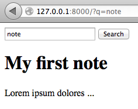

labels: Blog
        Django
created: 2013-07-17T00:00
modified: 2016-03-26T15:56
place: Starobilsk, Ukraine
comments: true

# Django + haystack + elasticsearch simple example project



This article was entitled 'Django + haystack + whoosh simple example project' yesterday. But after I tried to use whoosh on amvhub.com, it turned out that it has few nasty sides:

- SpellChecker class was removed from latest version of whoosh but haystack still needs it. Switching to ```whoosh==2.4``` solves the problem.
- ```update_index``` causes adding repeating entries to SearchQuerySet. And I didn't found a way how to it. There is ticket in whoosh issues tracker: [https://bitbucket.org/mchaput/whoosh/issue/97/search-index-contains-a-lot-of-duplicates](https://bitbucket.org/mchaput/whoosh/issue/97/search-index-contains-a-lot-of-duplicates).

So I decide to give a try for elasticsearch.

Here is a spike project that I created to experiment with haystack before using it in other projects: [https://bitbucket.org/nanvel/hstest/](https://bitbucket.org/nanvel/hstest/).

My Note model class:
```python
class Note(models.Model):
    title = models.CharField(max_length=1000)
    body = models.TextField()
    timestamp = models.DateTimeField(auto_now=True)

    def __unicode__(self):
        return self.title
```

Next I put few steps that lead to search feature implementation.

**1. Requirements**

```text
pip install django-haystack==2.0.0
pip install pyelasticsearch==0.5
```

Install elasticsearch on OS X:
```bash
brew install elasticsearch
# and launch:
elasticsearch -f -D es.config=/usr/local/Cellar/elasticsearch/0.90.2/config/elasticsearch.yml
```

Install elasticsearch on Ubuntu 12.04:
```bash
sudo apt-get update
sudo apt-get install openjdk-7-jre-headless -y
wget https://download.elasticsearch.org/elasticsearch/elasticsearch/elasticsearch-0.90.0.deb
sudo dpkg -i elasticsearch-0.90.0.deb
```

**2. Update django settings**

```python
INSTALLED_APPS = (
    'django.contrib.auth',
    'django.contrib.contenttypes',
    'django.contrib.sessions',
    'django.contrib.sites',
    'django.contrib.messages',
    'django.contrib.staticfiles',
    'django.contrib.admin',

    'south',
    'haystack',

    'hstest.apps.notes',
)

HAYSTACK_CONNECTIONS = {
    'default': {
        'ENGINE': 'haystack.backends.elasticsearch_backend.ElasticsearchSearchEngine',
        'URL': 'http://127.0.0.1:9200/',
        'INDEX_NAME': 'haystack',
    },
}

HAYSTACK_SIGNAL_PROCESSOR = 'haystack.signals.RealtimeSignalProcessor'
```

The last line will enable signal processor that for every change in the models will run ```update_index```: [https://django-haystack.readthedocs.org/en/latest/signal_processors.html#realtime-realtimesignalprocessor](https://django-haystack.readthedocs.org/en/latest/signal_processors.html#realtime-realtimesignalprocessor).

**3. Create search_indexes.py**

```python
from django.utils import timezone
from haystack import indexes

from .models import Note


class NoteIndex(indexes.SearchIndex, indexes.Indexable):
    text = indexes.CharField(document=True, use_template=True)
    title = indexes.CharField(model_attr='title')
    body = indexes.CharField(model_attr='body')

    def get_model(self):
        return Note

    def index_queryset(self, using=None):
        """Used when the entire index for model is updated."""
        return self.get_model().objects.filter(timestamp__lte=timezone.now())
```

This was a little bit confusing for me. 
The text field here is the most important. All You want to be available for search should be here.
I want to search by Note.title and Note.body. To add them to the text field, I need to edit notes_text.txt.
Let's create it.

```django
{# templates/search/indexes/notes/note_text.txt #}
{{ object.title }}
{{ object.body }}
```

Then why we need the rest of fields? They will be present in search results. If the title field will be missing here, ```results[n].title``` will cause an exception.

**4. Use haystack forms or views**

[http://django-haystack.readthedocs.org/en/latest/views_and_forms.html](http://django-haystack.readthedocs.org/en/latest/views_and_forms.html)

I think that forms is more flexible, so this example will use SearchForm.
This form accepts query from ```request.GET['q']```.

SearchForm returns no results if query was not specified, this behavior is not satisfied me, so I overrided the form:
```python
# forms.py
from haystack.forms import SearchForm


class NotesSearchForm(SearchForm):

    def no_query_found(self):
        return self.searchqueryset.all()
```

```python
# views.py
from django.shortcuts import render_to_response

from .forms import NotesSearchForm


def notes(request):
    form = NotesSearchForm(request.GET)
    notes = form.search()
    return render_to_response('notes.html', {'notes': notes})
```

**5. Add the form to search page template**

```django



<form type="get" action=".">
    <input type="text" name="q">
    <button type="submit">Search</button>
</form>


<h1>{{ note.title }}</h1>
<p>
    {{ note.body }}
</p>


```

**6. Before using search we need to create index**

```bash
python manage.py rebuild_index
```

After every data update should be launched:
```bash
python manage.py update_index
```

But it is not necessary if we use RealtimeSignalProcessor.

Links:

- [http://django-haystack.readthedocs.org/en/latest/tutorial.html](http://django-haystack.readthedocs.org/en/latest/tutorial.html)

**UPD 2014-07-13**

!!! attension "Elasticsearch has a flaw in its default configuration"
    [Elasticsearch has a flaw in its default configuration which makes it possible for any webpage to execute arbitrary code on visitors with Elasticsearch installed](http://bouk.co/blog/elasticsearch-rce/).

Add
```text
script.disable_dynamic: true
```

to ```/etc/elasticsearch/elasticsearch.yml```

**UPD 2016-03-26**

Elsticsearch has a beautiful http rest api. I don't see any benefits in using haystack, just talk to elasticsearch directly using your favourite http client.
Read [Elasticsearch: The Definitive Guide](https://www.elastic.co/guide/en/elasticsearch/guide/current/index.html) first.
