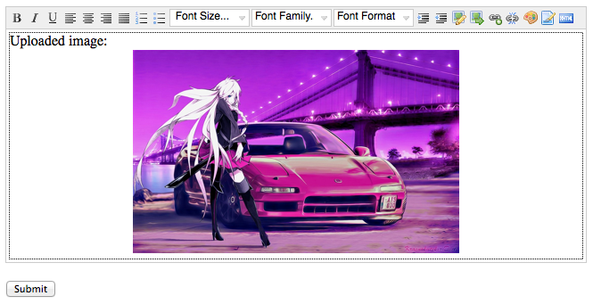

labels: Blog
        Django
        Projects
created: 2013-08-25T00:00
place: Starobilsk, Ukraine
comments: true

# NicEdit widget for Django



NicEdit widget for django with image upload feature.

NicEdit home: [http://nicedit.com/](http://nicedit.com/)
django-nicedit on PyPI: [https://pypi.python.org/pypi/django-nicedit/](https://pypi.python.org/pypi/django-nicedit/)
django-nicedit on GitHub: [https://github.com/nanvel/django-nicedit](https://github.com/nanvel/django-nicedit)

## Installation

To get the latest stable release from PyPi:
```bash
pip install django-nicedit
```

To get the latest commit from GitHub:
```bash
pip install -e git+git://github.com/nanvel/django-nicedit.git#egg=nicedit
```

Add nicedit to ```INSTALLED_APPS```:
```python
INSTALLED_APPS = (
    ...,
    'south',
    'nicedit',
)
```

Add nicedit URLs to ```urls.py```:
```python
urlpatterns = patterns('',
    ...
    url(r'^nicedit/', include('nicedit.urls')),
)
```

Migrate database:
```bash
python manage.py migrate nicedit
```

```MEDIA_ROOT``` should be specified, example:
```python
MEDIA_ROOT = os.path.join(os.path.dirname('__file__'), '../media')
MEDIA_URL = '/media/'
```

Add to urls configuration:
```python
from django.conf.urls.static import static
from django.conf import settings


if settings.DEBUG:
    urlpatterns += static(settings.MEDIA_URL, document_root=settings.MEDIA_ROOT)
```

## Usage

```forms.py```:
```python
from django import forms

from nicedit.widgets import NicEditWidget


class MessageForm(forms.Form):
    message = forms.CharField(
        widget=NicEditWidget(attrs={'style': 'width: 800px;'}))
```

```views.py```:
```python
from django.shortcuts import render

from .forms import MessageForm


def home(request):
    form = MessageForm()
    return render(request, 'home.html', {'form': form})
```

template:
```django
<!DOCTYPE html>
<html lang="en">
    <head>
        <meta charset="utf-8">
        <title>NicEdit widget</title>
        {{ form.media }}
    </head>
    <body>
        <form action='.' method='post'>
            
            {{ form.message }}
            <button type="submit">Submit</button>
        </form>
    </body>
</html>
```

Usage in admin:
```python
# -*- coding: utf-8 -*-
from django import forms
from django.contrib import admin

from nicedit.widgets import NicEditAdminWidget

from .models import Item

class ItemAdminForm(forms.ModelForm):

    class Meta:
        model = Item
        widgets = {
            'text': NicEditAdminWidget(
                attrs={'style': 'width: 610px;'},
                js_options={"buttonList": [
                    'save', 'bold', 'italic', 'underline', 'left', 'center',
                    'right', 'justify', 'ol', 'ul', 'fontSize',  # 'fontFamily',
                    'fontFormat', 'indent', 'outdent', 'image', 'upload', 'link',
                    'unlink', 'forecolor', 'bgcolor', 'xhtml']}
            ),
        }


class ItemAdmin(admin.ModelAdmin):

    form = ItemAdminForm
```

See [testproject](https://github.com/nanvel/django-nicedit/tree/master/testproject) for example.
