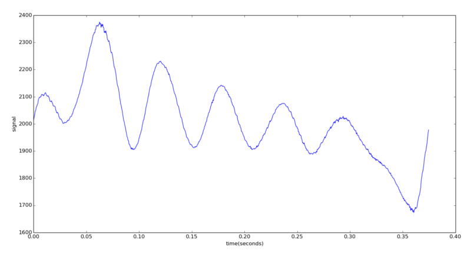
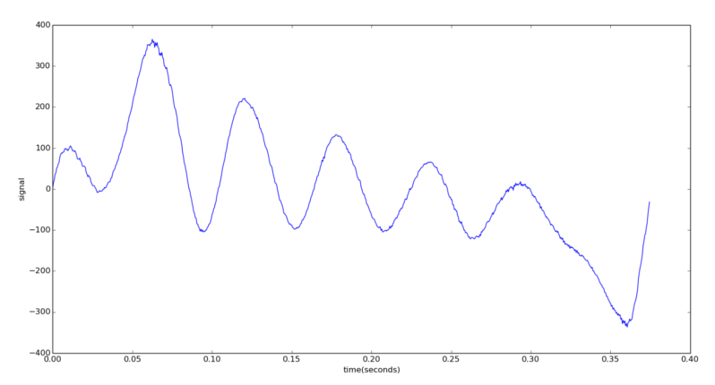
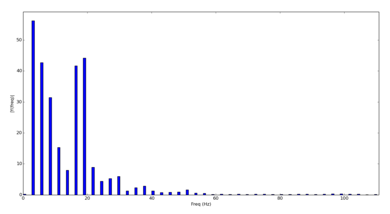

labels: Blog
        SignalProcessing
created: 2013-09-27T00:00
place: Starobilsk, Ukraine

# Signal spectrum using NumPy

I have a signal with ```dt=0.0005``` seconds. One period of the signal looks like:
```python
SIGNAL = [2014, 2025, 2033, 2046, 2049, ...]

import numpy as np

from matplotlib import pyplot as plt

if __name__ == '__main__':

    dt = 0.0005
    t = np.arange(0, len(SIGNAL) * dt, dt)
    plt.plot(t, SIGNAL)
    plt.xlabel('time(seconds)')
    plt.ylabel('signal')
    plt.show()
```



It is necessary to remove constant component (upper area of the function equal to bottom area):

```python
min_val = max_val = SIGNAL[0]
for i in SIGNAL:
    if i < min_val:
        min_val = i
    if i > max_val:
        max_val = i
mid_val = 1. * (max_val + min_val) / 2
for i in range(10):
    s = 0
    for i in SIGNAL:
        s += i - mid_val
    if s > 0:
        min_val = mid_val
        mid_val = (max_val + mid_val) / 2
    elif s < 0:
        max_val = mid_val
        mid_val = (min_val + mid_val) / 2
    else:
        break
SIGNAL = [i - mid_val for i in SIGNAL]

dt = 0.0005
t = np.arange(0, len(SIGNAL) * dt, dt)
plt.plot(t, SIGNAL)
plt.xlabel('time(seconds)')
plt.ylabel('signal')
plt.show()
```



FFT:
```python
n = len(SIGNAL)
y = np.fft.fft(SIGNAL) / n # normalize
frq = np.fft.fftfreq(n=n, d=dt)
# only positive frequencies
y = y[:n/2]
frq = frq[:n/2]

plt.bar(frq, abs(y))
plt.xlabel('Freq (Hz)')
plt.ylabel('|Y(freq)|')
plt.show()
```



```frq_resolution = samples_per_second / n_samples = 2.67 Hz```

Links:

- [http://docs.scipy.org/doc/numpy/reference/routines.fft.html](http://docs.scipy.org/doc/numpy/reference/routines.fft.html)
