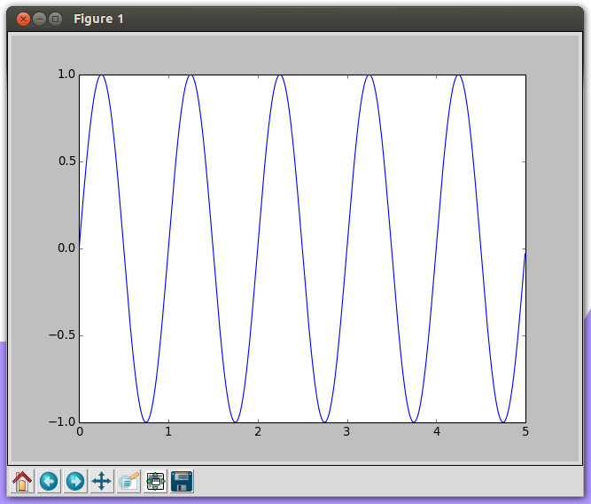

labels: Blog
        SignalProcessing
created: 2013-10-05T00:00

# Displaying charts with Matplotlib

For beginning:
```python
from matplotlib import pyplot as plt
from numpy import sin, arange, pi


if __name__ == '__main__':
    T = 5.
    t = arange(0, T, T / 1000)
    x = [sin(2 * pi / T * 5 * i) for i in t] # 5 sin periods
    plt.plot(t, x)
    plt.show()
```



Let's prettify charts:
```python
if __name__ == '__main__':
    T = 5.
    t = arange(0, T, T / 1000)
    x = [sin(2 * pi / T * 5 * i) for i in t] # 5 sin periods
    fig = plt.figure(1)
    fig.canvas.set_window_title('sin chart example')
    plt.plot(t, x)
    plt.title('sin(t)')
    plt.xlabel('t')
    plt.ylabel('sin')
    plt.show()
```


More charts:
```python
if __name__ == '__main__':
    T = 5.
    t = arange(0, T, T / 1000)
    x1 = [sin(2 * pi / T * 5 * i) for i in t] # 5 sin periods
    x2 = [sin(2 * pi / T * 1 * i) for i in t] # 1 sin periods
    fig = plt.figure(1)
    fig.canvas.set_window_title('sin chart example')
    plt.plot(t, x1, 'r-', t, x2, 'g-')
    plt.title('sin(t)')
    plt.xlabel('t')
    plt.ylabel('sin')
    plt.show()
```


```python
if __name__ == '__main__':
    T = 5.
    t = arange(0, T, T / 1000)
    x1 = [sin(2 * pi / T * 5 * i) for i in t] # 5 sin periods
    x2 = [sin(2 * pi / T * 1 * i) for i in t] # 1 sin periods
    fig = plt.figure(1)
    fig.canvas.set_window_title('sin chart example')
    plt.subplot(121)
    plt.plot(t, x1, 'r-')
    plt.title('sin(t)')
    plt.xlabel('t')
    plt.ylabel('sin')
    plt.subplot(122)
    plt.plot(t, x2, 'g-')
    plt.show()
```


```python
if __name__ == '__main__':
    T = 5.
    t = arange(0, T, T / 1000)
    x1 = [sin(2 * pi / T * 5 * i) for i in t] # 5 sin periods
    x2 = [sin(2 * pi / T * 1 * i) for i in t] # 1 sin periods
    fig1 = plt.figure(1)
    fig1.canvas.set_window_title('sin chart example 1')
    plt.plot(t, x1)
    plt.title('sin(t)')
    plt.xlabel('t')
    plt.ylabel('sin')
    fig2 = plt.figure(2)
    fig2.canvas.set_window_title('sin chart example 2')
    plt.plot(t, x2)
    plt.show()
```


Legend:
```python
if __name__ == '__main__':
    T = 5.
    t = arange(0, T, T / 1000)
    x1 = [sin(2 * pi / T * 5 * i) for i in t] # 5 sin periods
    x2 = [sin(2 * pi / T * 1 * i) for i in t] # 1 sin periods
    fig = plt.figure(1)
    fig.canvas.set_window_title('sin chart example')
    p1, p2 = plt.plot(t, x1, 'r-', t, x2, 'g-')
    plt.title('sin(t)')
    plt.xlabel('t')
    plt.ylabel('sin')
    plt.legend([p1, p2], ['5 periods', '1 period'])
    plt.show()
```


Links:

- [http://matplotlib.org/users/pyplot_tutorial.html](http://matplotlib.org/users/pyplot_tutorial.html)

Place: Starobilsk, Ukraine
