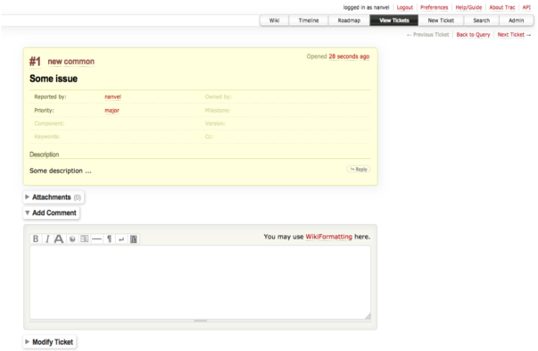

labels: Blog
        API
created: 2013-10-26T00:00
place: Starobilsk, Ukraine
comments: true

# Trac api

There are many ways to install trac, I use next one:

```bash
# apt-get install apache2-utils # for ubuntu

virtualenv .env --no-site-packages
source .env/bin/activate
easy_install Trac==1.0
easy_install -Z -U http://trac-hacks.org/svn/xmlrpcplugin/trunk
mkdir /PATH_TO_TRAC/mytrac
trac-admin /PATH_TO_TRAC/mytrac initenv # set trac name and database
vim /PATH_TO_TRAC/mytrac/conf/trac.ini
# add to trac.ini:
# [components]
# tracrpc.* = enabled

# create htpasswd file
/usr/sbin/htpasswd -b /PATH_TO_TRAC/mytrac/.htpasswd <username> <pass> # use -c option for first time

# add admin user
trac-admin /PATH_TO_TRAC/mytrac permission add <username> TRAC_ADMIN

# test it
tracd -p 8020 -s --basic-auth="*,/PATH_TO_TRAC/mytrac/.htpasswd,realm" /PATH_TO_TRAC/mytrac
# navigate to http://127.0.0.1:8020
```

Using trac api to create new ticket:
```python
import xmlrpclib


API_URL = 'http://<username>:<pass>@127.0.0.1:8020/login/xmlrpc'


if __name__ == '__main__':
    attributes = {
        'status': 'new',
        'priority': 'major',
        'type': 'common'}
    subject = 'Some issue'
    description = 'Some description ...'
    server = xmlrpclib.ServerProxy(API_URL)
    ticket_id = server.ticket.create(
        subject, description, attributes)
    print 'Ticket #{ticket_id} was created'.format(ticket_id=ticket_id)
```

Result (navigate to http://127.0.0.1:8020/ticket/1):



Links:

- [http://trac.edgewall.org/](http://trac.edgewall.org/)
- [http://www.hossainkhan.info/content/trac-xml-rpc-api-reference](http://www.hossainkhan.info/content/trac-xml-rpc-api-reference)
