labels: Blog
        Workspace
        Life
        GTD
created: 2014-01-19T00:00
modified: 2024-01-01T20:05
place: Phuket, Thailand
comments: true

# Workspaces

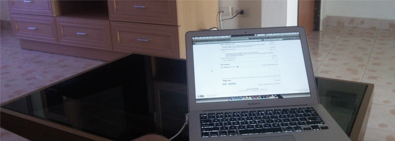

I worked from a lot of different places: home, hostels, student dorms, coffee houses, airports, trains, coworkings, rented houses. Some workspaces included armchair and table, sometimes I worked on the floor (about 1 month). Sometimes it was hot and sometimes I worked in shoes and hat. I used a big screens and few laptops, gprs and high speed internet connections. Sometimes it was quiet places and sometimes was a lot of noise.

The conclusion I made:

- developer performance mainly related on ability to focus on his work
- headphones and ambient music (try sky.fm) sometimes help a lot
- macbook air 13 is not worse than laptop 15' + HD1080 display
- battery capacity is valued
- work at table (armchair is plus) is more comfortable than on floor
- get up early allows to work in quiet and have more time to rest in daytime and evening
- don't plan to do programming on road
- the view outside table doesn't matter, wallpaper even more valued
- surrounding people, maybe the most important

How to focus on work:

- Прибери з робочого столу все
- Скажи "ні" безцільному інтернет-серфінгу
- Оштрафуй себе сам
- Хвалити себе тупо, але ефективно
- Вихваляйся успіхами
- Встряхнись - гарненько відпочинь на вихідних
- Склади список справ
- Признач час для спілкування
- Не зациклюйся на одній справі
- Розберися з поштою
- Забудь про особисте на роботі
- Слухай музику
- Велика чашка - запорука ефективної роботи
- Робота - гра
- Зміни своє ставлення до роботи

> Location, location, location is overrated.

About work in travel:

- [http://blogerator.ru/page/programmist-intervju-sergei-kishhenko-puteshestvija-daunshifting-tilarids-backpacker](http://blogerator.ru/page/programmist-intervju-sergei-kishhenko-puteshestvija-daunshifting-tilarids-backpacker)
- [http://putevoedelo.podster.fm/1](http://putevoedelo.podster.fm/1)

**UPD: 2015-06-28**

A house on Panwa, Phuket

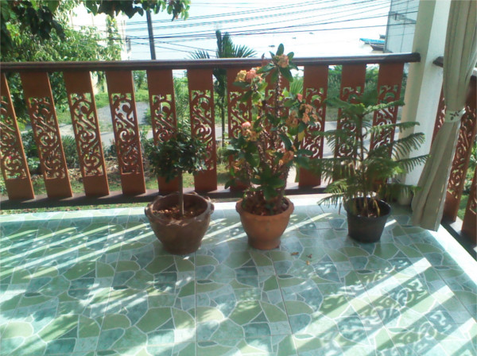

A sea view house, Phuket

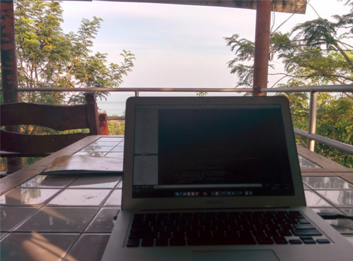

Siri homestay, Lamphun

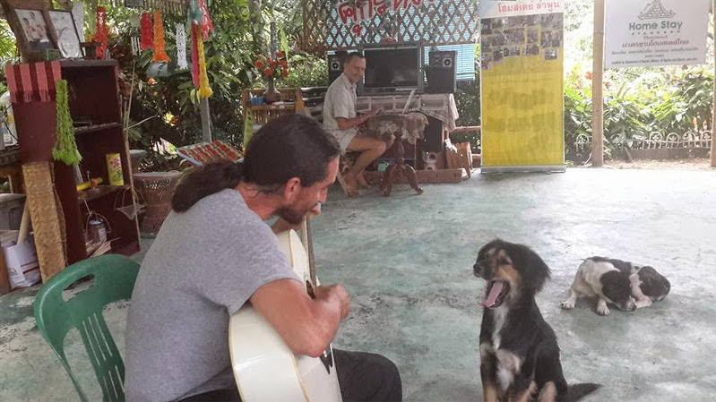

**UPD: 2015-10-22**

Coworking in Batumi, Georgia.

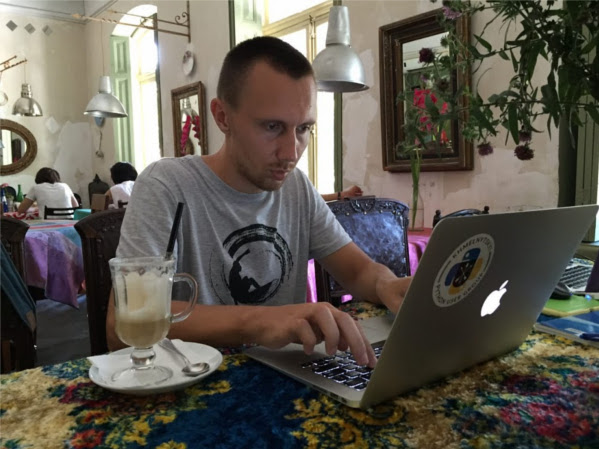

[Pomodoro technique](http://pomodorotechnique.com/).

**UPD: 2017-06-15**

Bkstg.

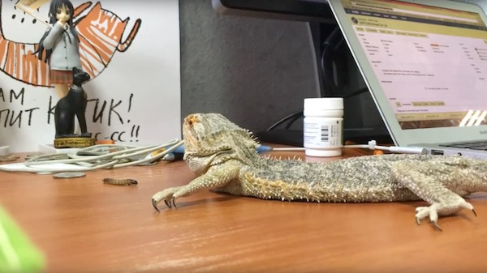

Thailand 2017.

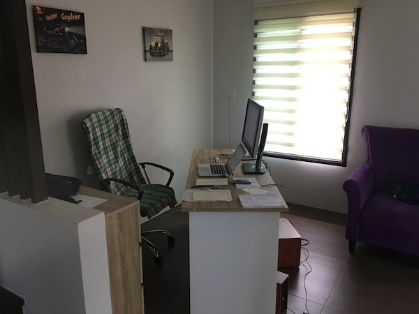

**UPD: 2017-08-05**

Hatch coworking, Phuket.

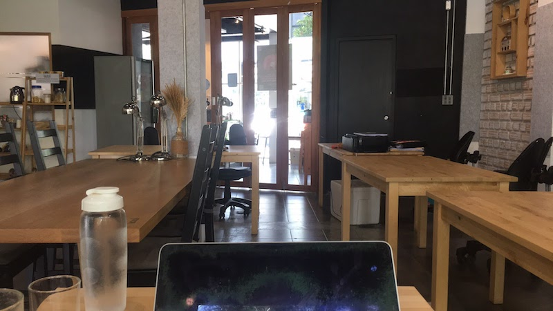

**UPD: 2021-10-12**

WFH (Covid 2019)

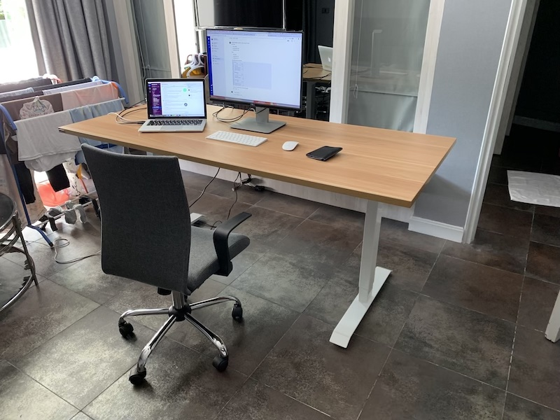

[KoHub](https://kohub.org/)

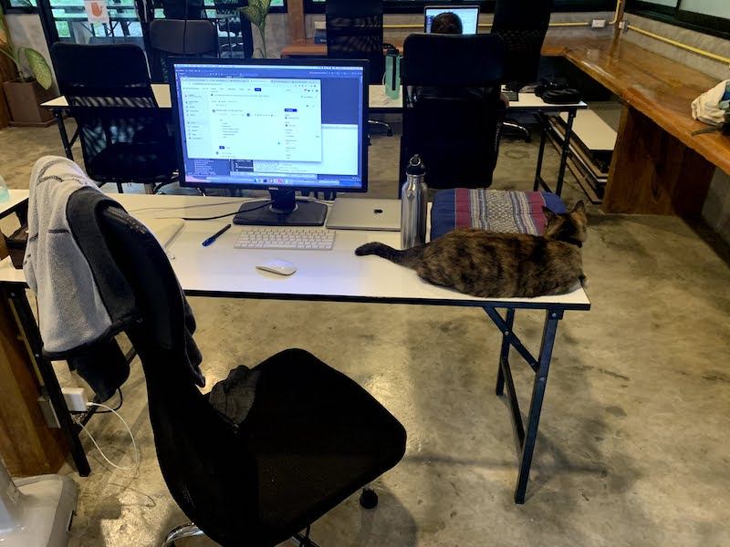

Bayaco

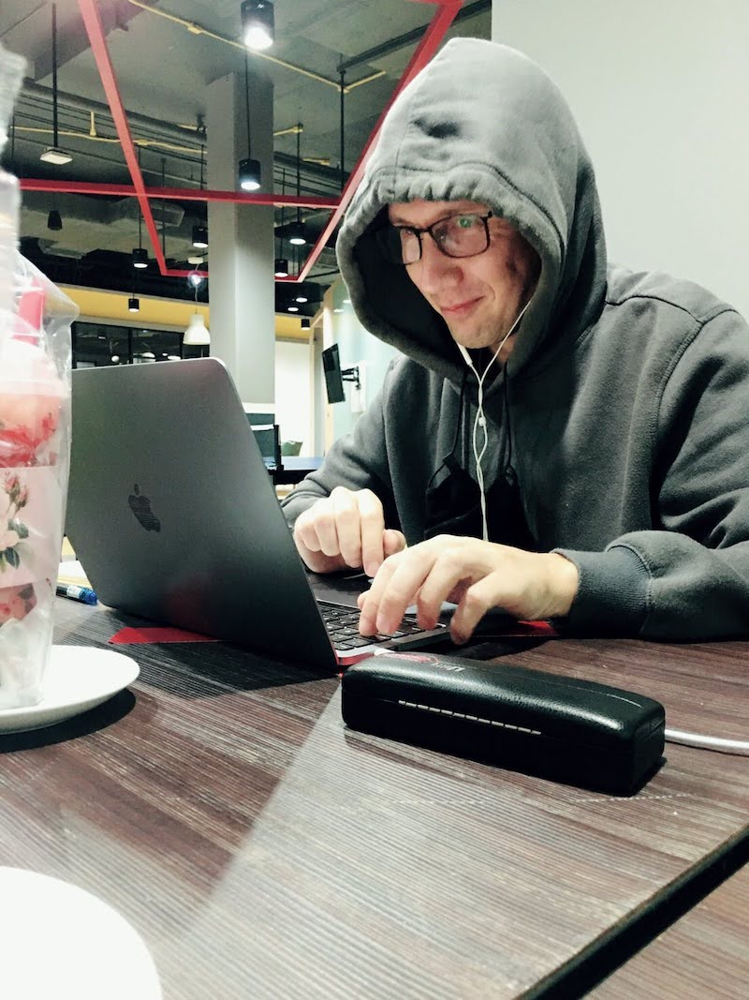

**UPD: 2023**

Iglu office

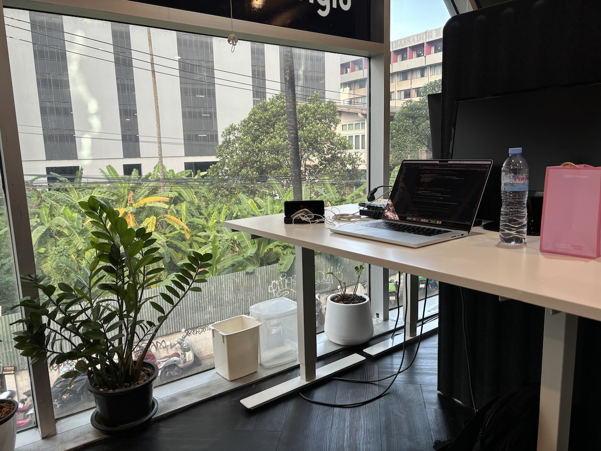

BKK Condo

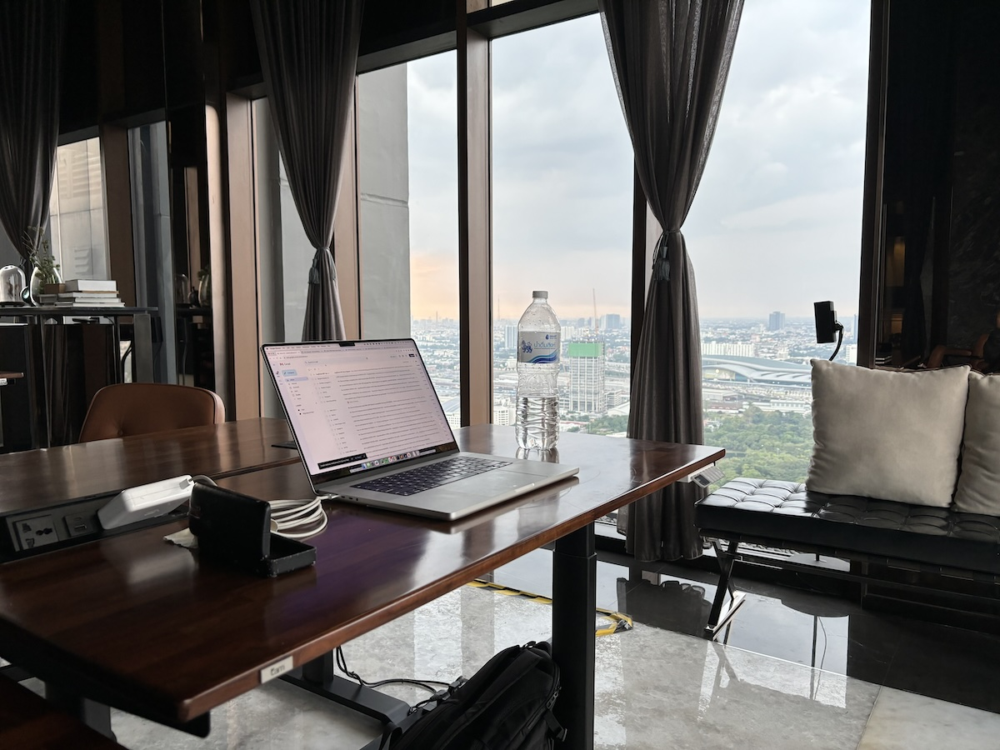
