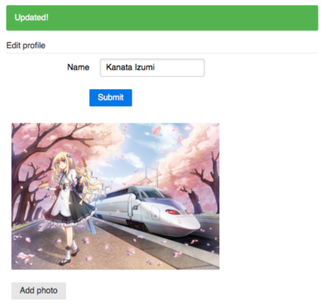
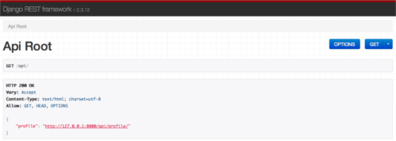

labels: Blog
        Django
        AngularJS
created: 2014-02-28T00:00
place: Starobilsk, Ukraine
comments: true

# Django, Django Rest Framework, AngularJS example project



The task is to edit user profile without page reload using REST api and AngularJS. I am a newbie in AngularJS, so my js code may have some wrong and unpopular decisions. I'll be appreciate for comments about how to make it better.

[TOC]

## 1. Init django project

```bash
source somemyotherproject/.env/bin/activate
django-admin.py startproject --template https://github.com/nanvel/django-project-template/archive/master.zip profileedit
deactivate
cd profileedit
virtualenv .env --no-site-packages
source .env/bin/activate
pip install -r requirements.txt
make syncdb
make migrate
```

## 2. Install Django Rest Framework

```bash
pip install djangorestframework
```

```python
INSTALLED_APPS += ('rest_framework',)
```

## 3. Create accounts app and models

```python
# models.py

class Profile(models.Model):

    user = models.OneToOneField(User, editable=False, related_name='profile')
    name = models.CharField(max_length=100)

    def __unicode__(self):
        return self.user.username


class ProfilePhoto(models.Model):

    profile = models.ForeignKey(Profile, related_name='photos')
    title = models.CharField(max_length=1000, null=True, blank=True)
    image = models.ImageField(upload_to='images/%Y/%m/%d', null=True, blank=True)

    def __unicode__(self):
        return self.title or 'noname'
```

## 4. Profile api resource

```python
# api.py

from rest_framework import viewsets, routers
from rest_framework.permissions import IsAuthenticated, BasePermission

from .models import Profile


class IsOwner(BasePermission):
    """
    Custom permission to only allow owners of profile to view or edit it.
    """
    def has_object_permission(self, request, view, obj):
        return (obj.user == request.user and
            request.method in ['GET', 'PATCH'])


class ProfileViewSet(viewsets.ModelViewSet):

    model = Profile
    permission_classes = (IsAuthenticated, IsOwner)


router = routers.DefaultRouter()

router.register(r'profile', ProfileViewSet)
```

```python
# urls.py

from django.conf import settings
from django.conf.urls import patterns, include, url
from django.conf.urls.static import static
from django.contrib import admin

from profileedit.apps.accounts.api import router as accounts_router


admin.autodiscover()


urlpatterns = patterns('',
    url(r'^$', 'profileedit.apps.accounts.views.profile'),
    url(r'^api/', include(accounts_router.urls)),
    url(r'^admin/', include(admin.site.urls)),
)

if settings.DEBUG:
    urlpatterns += static(
            settings.MEDIA_URL,
            document_root=settings.MEDIA_ROOT)


handler500 = 'profileedit.apps.core.views.handler500'
handler404 = 'profileedit.apps.core.views.handler404'
```

Check it:
```bash
make run
firefox http://127.0.0.1:8000/api/
```



## 5. Profile edit page

```html
<!-- profile.html -->





    {{ block.super }}
    <link rel="stylesheet" href="http://yui.yahooapis.com/pure/0.4.2/pure-min.css">
    <link rel="stylesheet" href="">



    {{ block.super }}
    <script>
    vars = {
        profileUrl: '',
    }
    </script>
    <script type="text/javascript" src="https://ajax.googleapis.com/ajax/libs/angularjs/1.2.13/angular.min.js" charset="utf-8"></script>
    <script type="text/javascript" src="" charset="utf-8"></script>



<div class="content" ng-controller="profileEditCtrl">
    <div class="pure-alert pure-alert-success" ng-show="data.success">
        Updated!
    </div>
    <form class="pure-form pure-form-aligned" ng-submit="updateProfile()">
        <fieldset>
            <legend>Edit profile</legend>
            <div class="pure-control-group">
                <label for="name">Name</label>
                <input id="name" type="text" placeholder="Name" ng-model="data.name" ng-init="data.name='{{ profile.name }}'">
            </div>
            <div class="pure-controls">
                <button type="submit" class="pure-button pure-button-primary">Submit</button>
            </div>
        </fieldset>
    </form>
</div>

```

## 6. AngularJS code

```js
/* core.js */

var profileEditApp = angular.module('profileEditApp', []);


profileEditApp.config(['$httpProvider', '$interpolateProvider',
    function($httpProvider, $interpolateProvider) {
    /* for compatibility with django teplate engine */
    $interpolateProvider.startSymbol('{$');
    $interpolateProvider.endSymbol('$}');
    /* csrf */
    $httpProvider.defaults.xsrfHeaderName = 'X-CSRFToken';
    $httpProvider.defaults.xsrfCookieName = 'csrftoken';
}]);


profileEditApp.controller('profileEditCtrl', function ($scope, $http) {
    $scope.data = {success: false};
    $scope.updateProfile = function() {
        $http({method: 'PATCH', url: vars.profileUrl, data: {
            name: $scope.data['name']}}).
        success(function(data, status, headers, config) {
            $scope.data['success'] = true;
        }).
        error(function(data, status, headers, config) {
            $scope.data['success'] = false;
        });
    }
});
```

## 7. Show profile photos

```python
# api.py:

from rest_framework import viewsets, routers, serializers
from rest_framework.permissions import IsAuthenticated, BasePermission

from .models import Profile, ProfilePhoto


class IsProfileOwner(BasePermission):
    """
    Custom permission to only allow owners of profile to view or edit it.
    """
    def has_object_permission(self, request, view, obj):
        return (obj.user == request.user and
            request.method in ['GET', 'PATCH'])


class IsProfilePhotoOwner(BasePermission):
    """
    Custom permission to only allow owners of profile to view or edit it.
    """
    def has_object_permission(self, request, view, obj):
        return obj.profile.user == request.user


class ProfilePhotoSerializer(serializers.ModelSerializer):

    url = serializers.CharField(source='get_absolute_url', read_only=True)

    class Meta:
        model = ProfilePhoto
        fields = ('title', 'url')


class ProfileSerializer(serializers.ModelSerializer):

    photos = ProfilePhotoSerializer(many=True)

    class Meta:
        model = Profile
        fields = ('name', 'photos')


class ProfileViewSet(viewsets.ModelViewSet):

    model = Profile
    serializer_class = ProfileSerializer
    permission_classes = (IsAuthenticated, IsProfileOwner)


class ProfilePhotoViewSet(viewsets.ModelViewSet):

    model = ProfilePhoto
    serializer_class = ProfilePhotoSerializer
    permission_classes = (IsAuthenticated, IsProfilePhotoOwner)


router = routers.DefaultRouter()

router.register(r'profile', ProfileViewSet)
router.register(r'photo', ProfilePhotoViewSet)
```

```js
/* core.js */

profileEditApp.controller('profileEditCtrl', function ($scope, $http) {
    $scope.data = {success: false};

    /* get profile data list */
    $http({method: 'GET', url: vars.profileUrl}).
    success(function(data, status, headers, config) {
        $scope.data.name = data['name'];
        $scope.data.photos = data['photos']
    })

    $scope.updateProfile = function() {
        $http({method: 'PATCH', url: vars.profileUrl, data: {
            name: $scope.data['name']}}).
        success(function(data, status, headers, config) {
            $scope.data['success'] = true;
        }).
        error(function(data, status, headers, config) {
            $scope.data['success'] = false;
        });
    }
});
```

## 8. Upload new photo

```html
<!-- profile.html -->





    {{ block.super }}
    <link rel="stylesheet" href="http://yui.yahooapis.com/pure/0.4.2/pure-min.css">
    <link rel="stylesheet" href="http://github.com/Valums-File-Uploader/file-uploader/blob/master/client/fileuploader.css">
    <link rel="stylesheet" href="">



    {{ block.super }}
    <script>
    vars = {
        profileUrl: '',
        photoUploadUrl: '',
    }
    </script>
    <script type="text/javascript" src="https://ajax.googleapis.com/ajax/libs/angularjs/1.2.13/angular.min.js" charset="utf-8"></script>
    <script type="text/javascript" src="http://raw.github.com/Valums-File-Uploader/file-uploader/master/client/fileuploader.js" charset="utf-8"></script>
    <script type="text/javascript" src="" charset="utf-8"></script>



<div class="content" ng-controller="profileEditCtrl">
    <div class="pure-alert pure-alert-success" ng-show="data.success">
        Updated!
    </div>
    <form class="pure-form pure-form-aligned" ng-submit="updateProfile()">
        <fieldset>
            <legend>Edit profile</legend>
            <div class="pure-control-group">
                <label for="name">Name</label>
                <input id="name" type="text" placeholder="Name" ng-model="data.name">
            </div>
            <div class="pure-controls">
                <button type="submit" class="pure-button pure-button-primary">Submit</button>
            </div>
        </fieldset>
    </form>
    <div class="photos">
        <div class="photo" ng-repeat="photo in data.photos">
            
        </div>
    </div>
    <div id="file-uploader" class="uploader">
        <noscript>
            <p>Please enable JavaScript to use file uploader.</p>
        </noscript>
    </div>
</div>

```

```js
/* core.js */

var uploader = new qq.FileUploader({
    element: document.getElementById('file-uploader'),
    action: vars.photoUploadUrl,
    allowedExtensions: ['jpg', 'jpeg', 'png', 'gif'],
    sizeLimit: 4194304,
    multiple: false,
    template: '<div class="qq-uploader">' +
        '<div class="qq-upload-drop-area"><span>Drop files here to upload</span></div>' +
        '<div class="qq-upload-button pure-button">Add photo</div>' +
        '<div class="qq-uploads-wrap"><ul class="qq-upload-list"></ul></div>' +
    '</div>',

    onComplete: function(id, fileName, responseJson) {
        var scope = angular.element(document.getElementById('file-uploader')).scope();
        scope.$apply(function(){
            scope.data.photos.push({url: responseJson.url});
        });
    },
});
```

The project on Bitbucket: [https://bitbucket.org/nanvel/profileedit](https://bitbucket.org/nanvel/profileedit).

Links:

- [https://github.com/nanvel/django-project-template](https://github.com/nanvel/django-project-template)
- [http://angularjs.org/](http://angularjs.org/)
- [http://www.django-rest-framework.org/](http://www.django-rest-framework.org/)
- [http://blog.kevinastone.com/getting-started-with-django-rest-framework-and-angularjs.html](http://blog.kevinastone.com/getting-started-with-django-rest-framework-and-angularjs.html)
