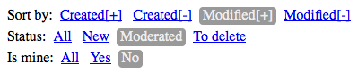

labels: Blog
        JS
created: 2014-03-31T00:00
place: Starobilsk, Ukraine
comments: true

# Easy filters bar, pure js



I have a view available at ```/instances/```. I can specify status of items to view, order by, some flags, etc. as GET params:

```text
/instances/?order=created
/instances/?order=-created&status=moderated
/instances/?status=modified&ismine=true
...
```

Let's create filter buttons allow to apply filters.

Sort by:

- created
- -created
- modified
- -modified

Status:

- new
- moderated
- todelete

Is mine:

- true
- false

Only URI.js is required, no jQuery and similar libraries.

```html
<!DOCTYPE html>
<html lang="en">
<head>
    <meta charset="utf-8">
    <title>Easy filters</title>
    <style>
        .filter a {
            line-height: 1.5;
            padding: 2px 4px;
        }
        .filter a.selected {
            background-color: #999;
            border-radius: 4px;
            text-decoration: none;
            color: #eee;
        }
    </style>
</head>
<body>
    <div class="filter" data-key="order">
        Sort by:
        <a href="#" data-value="created">Created[+]</a>
        <a href="#" data-value="-created">Created[-]</a>
        <a href="#" data-value="modified">Modified[+]</a>
        <a href="#" data-value="-modified">Modified[-]</a>
    </div>

    <div class="filter" data-key="status">
        Status:
        <a href="#" data-value="">All</a>
        <a href="#" data-value="new">New</a>
        <a href="#" data-value="moderated">Moderated</a>
        <a href="#" data-value="todelete">To delete</a>
    </div>

    <div class="filter" data-key="ismine">
        Is mine:
        <a href="#" data-value="">All</a>
        <a href="#" data-value="true">Yes</a>
        <a href="#" data-value="false">No</a>
    </div>

    <script type="text/javascript" src="URI.min.js" charset="utf-8"></script>
    <script type="text/javascript">
        (function() {
            function isEmpty(obj) {
                for(var prop in obj) {
                    if(obj.hasOwnProperty(prop))
                        return false;
                }
                return true;
            }
            var filters = document.querySelectorAll('.filter');
            var parts = URI.parseQuery(window.location.search);
            for (var i=0, filter; i<filters.length; i++) {
                filter = filters[i];
                var filterKey = filter.getAttribute('data-key');
                var links = filter.getElementsByTagName('a');
                for (var j=0, link; j<links.length; j++) {
                    link = links[j];
                    var filterValue = link.getAttribute('data-value').toString();
                    if(parts[filterKey] == filterValue) {
                        link.className += ' selected';
                    };
                    link.onclick = function() {
                        var filterKey = this.parentNode.getAttribute('data-key');
                        var filterValue = this.getAttribute('data-value').toString();
                        if(filterValue.length) {
                            parts[filterKey] = filterValue;
                        } else {
                            delete parts[filterKey];
                        }
                        var href = URI(window.location.href);
                        if(isEmpty(parts)) {
                            window.location.href = window.location.protocol + '//' + window.location.host + window.location.pathname;
                        } else {
                            window.location.href = href.search(parts);
                        }
                        return false;
                    }
                }
            }
        })();
    </script>
</body>
</html>
```
