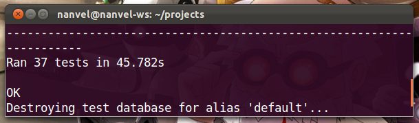
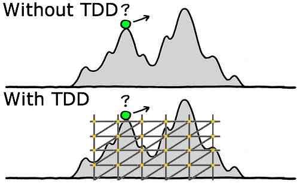

labels: Blog
        Django
        Testing
created: 2014-04-03T00:00
place: Starobilsk, Ukraine

# Testing Django applications



> Code without tests is broken by design.
>
> [Jacob Kaplan-Moss](http://jacobian.org/)

[TOC]

## TDD (Test Driven Development)?



The most efficient way is to write tests and feature in parallel, part by part. For example: create url entry, add view and then write test that checks access rights, fix view, extend test to check what view returns, extend view, ...

## Place for tests code

Split tests into files by entity type:
```text
myapp
- __init__.py
- models.py
- forms.py
- views.py
- tests
-- __init__.py
-- test_models.py
-- test_forms.py
-- test_views.py
```

Prefix ```test_``` is useful when I try to find files with tests in sublime text using mutual search. And this splits tests from tests utils and factories files.

```tests/__init__.py``` have to looks like:
```python
from .test_models import *
from .test_forms import *
from .test_views import *
```

From here I want to strongly recommend to use relative imports to refer to files from current app:
```diff
+ from ..models import MyModel
- from myproject.myapp.models import MyModel
```

This one simple thing may make your app reusable.

## Names for tests and TestCases

I like to use names like this:
```python
from django.test import TestCase


class MyAppModelsTestCase(TestCase):

    def test_unicode(self):
        ...

    def test_some_method(self):
        ...

class MyAppTagsTestCase(TestCase):

    def test_my_templatetag(self):
        ...
```

So, if I want to run test for certain app models, I enter in shell:
```bash
python manage.py test myapp.MyAppModelsTestCase
```

I should not remember complex names or open tests file and see name of TestCase, I just remember the rule how to build names.

## Inside TestCase

A single test have to assert behavior of a single view, model, form, middlewar, templatetag or function.
If particular code migrates from one test case to another, then we have to use base ```TestCase``` class or ```factories/utils```.
For example, create user and login using his credentials. We can place this code into helper function:

```python
from django.contrib.auth.models import User
from django.test import TestCase


class MyAppBaseTestCase(TestCase):

    def create_user(self):
        return User.objects.create_user(
            username='kanata', email='kanata@mail.com',
            password='kanata')
```

Bad thing here is that we hard coded username and password. But, a trick is to use password == username, so password are always available:
```python
class MyViewTestCase(BaseTestCase):

    def test_my_view(self):
        user = self.create_user()
        self.client.login(
            username=user.username,
            password=user.username)
```

## Factories

Factories allows to fill models with automatically generated data.

factory_boy is a good choice for large projects.
Another one - dajngo-any.

Example of test without and with django-any:

```python
# example models

class Genre(models.Model):
    caption = models.CharField(max_length=50)
    description = models.TextField()

class Anime(models.Model):
    caption = models.CharField(max_length=50)
    slag = models.CharField(max_length=50)
    genre = models.ForeignKey(Genre)
    year = model.PositiveIntegerField()
    studio = models.CharField(max_length=50)
    last_update = models.DateTimeField(auto_now=True)
    added_by = models.ForeignKey(User)

def __unicode__(self):
    return u'{captions} ({year})'.format(
        captions=self.caption, year=self.year)

# without django-any

class AnimeModelsTest(TestCase):

    def test_anime_save(self):
        user = User.objects.create(username='user', password='password')
        user.save()
        genre = Genre(caption='new_genre', description='description')
        ganre.save()
        anime = Anime(
            caption='new_anime', slag='anime', genre=genre,
            year='2012', studio='Sunrise', added_by=user)
        anime.save()
        self.assertEqual(Anime.objects.count(), 1)
        self.assertEqual(
            unicode(Anime.objects.last()), 'anime (2012)')

# using django-any

class AnimeModelsTest(TestCase):

    def test_anime_save(self):
        anime = any_model(Anime, year=2012, caption='anime')
        self.assertEqual(Anime.objects.count(), 1)
        self.assertEqual(Anime.objects.count(), 1)
        self.assertEqual(
            unicode(Anime.objects.last()), 'anime (2012)')
```

django-any fills fields with valid data automatically:
```text
slag = ltqltDNuEhBOEiFMmPCsdFTIhQOCiocoOykr
ganre.caption = hbgZlPrrXMCQjYhxJZqKAoZCSwbboh
ganre.description = ['Lorem ipsum dolor sit amet,
...
, natus iste explicabo aperiam laudantium?']
studio = JNVXNYwSVpuQiAyQl
image = images/anime_1.jpg
last_update = 2012-04-28 14:03:31.859193
added_by = XGiY
```

Or create your own factory:
```python
from django.contrib.auth.models import User


class UserFactory(object):

    counter = 0

    @classmethod
    def create(self):
        """
        Returns new user.
        """
        self.counter += 1
        return User.objects.create_user(
            username='kanata%d' % self.counter,
            password='kanata%d' % self.counter,
            email='kanata%d@mail.com' % self.counter,
            first_name='Kanata', last_name='Izumi')
```

Usage:
```python
user = UserFactory.create()
```

I store factories code inside ```tests/factories.py``` file.

One more way to fill models with necessary data is fixtures. But using fixtures is a bad practice. You'll need to edit/regenerate fixture after every schema migration, this is annoying.

## Using Client

Use it only if no other alternatives. Client executes a lot of code we don't want to test in this particular test. Tempate tags and filters, context processors, middlewares are examples of things to test where Client absolutely redundant.

Don't do like this:
```python
from django.test import TestCase
from django.test.client import Client


class MyTestCase(TestCase):

    def setUp(self):
        self.c = Client()
```

```self.client``` already available in django TestCase!

Sometimes Client can't be used and we have to find alternative ways to test our code, for example, my test for error pages:
```python
# urls.py

handler500 = 'project.apps.core.views.handler500'
handler404 = 'project.apps.core.views.handler404'

# views.py

from django.template.loader import get_template
from django.template import Context
from django.http import HttpResponseServerError, HttpResponseNotFound


def handler500(request, template_name='500.html'):
    t = get_template(template_name)
    ctx = Context({})
    return HttpResponseServerError(t.render(ctx))


def handler404(request, template_name='404.html'):
    t = get_template(template_name)
    ctx = Context({})
    return HttpResponseNotFound(t.render(ctx))

# tests.py

from django.test import TestCase
from django.test.client import RequestFactory

from project import urls

from ..views import handler404, handler500


class TestErrorPages(TestCase):

    def test_error_handlers(self):
        self.assertTrue(urls.handler404.endswith('.handler404'))
        self.assertTrue(urls.handler500.endswith('.handler500'))
        factory = RequestFactory()
        request = factory.get('/')
        response = handler404(request)
        self.assertEqual(response.status_code, 404)
        self.assertIn('404 Not Found!!', unicode(response))
        response = handler500(request)
        self.assertEqual(response.status_code, 500)
        self.assertIn('500 Internal Server Error', unicode(response))
```

## ImageField with null == False in tests

A lot of times I seen when developers save an image inside project folder, opens it and passes to form. But better way is to generate image.

This is a factory for images I use:
```python
import Image

from StringIO import StringIO


class ImageFactory(object):

    counter = 0

    @classmethod
    def create(self, width=200, height=200):
        """
        Returns image file with specified size.
        """
        self.counter += 1
        image = Image.new(
            'RGBA', size=(width, height), color=(256, 0, 0))
        f = StringIO()
        image.save(f, 'png')
        f.name = 'testimage%d.png' % self.counter
        f.seek(0)
        return f
```

Or even easier way:
```python
imgfile = StringIO('GIF87a\x01\x00\x01\x00\x80\x01\x00\x00\x00\x00ccc,\x00'
    '\x00\x00\x00\x01\x00\x01\x00\x00\x02\x02D\x01\x00;')
imgfile.name = 'img.gif'
```

Don't forget to remove saved files from media folder:
```python
path = my_mode_instance.image.path
os.remove(path)
```

## Patch/Mock

If briefly:

- to Patch == replace some code with some another code
- to Mock == replace some code with mock object

Mock is a black box that have every (roughly) methods and every properties we ask for. If method does not exists, mock just returns another mock instance instead this method/property. Another feature in mock is memory, it remember all interactions with it. Example:

```python
>>> from mock import Mock
>>> mock = Mock()
>>> mock.some_method()
<Mock name='mock.some_method()' id='4367510224'>
>>> mock.some_propery
<Mock name='mock.some_propery' id='4367565008'>
>>> mock.some_method.call_count
1
>>> mock.some_another_method.call_count
0
>>> mock.my_method.return_value = 'Hello!'
>>> mock.my_method()
'Hello!'
# type help(Mock) to see all available features
```

In some tests there is not necessary to run particular parts of code (because their were already tested by another tests), we just need:

- method/property returns value we expected and not actually executes
- to know that method was executed specified number of times
- to know that method was executed with specified args

```mock.patch``` allows to do patching with easy, there are two ways to use it, as decorator and as context manager:
```python
import datetime

from mock import patch

from django.utils import timezone

def test_some_feature(self):
    with patch.object(timezone, 'now', return_value=datetime.datetime(2013, 2, 27)) as mock_now:
        # do something
```

```python
@patch.object(timezone, 'now', return_value=datetime.datetime(2013, 2, 27)):
def test_some_feature(self, mock_now):
    # do something
```

Another example:
```python
from mock import patch

from google_analytics.models import GoogleAnalytics
from pyga import requests

from django.test import TestCase
from django.contrib.sites.models import Site

from .utils import ga_event


@patch('pyga.requests.Tracker')
def test_ga_event(self, TrackerMock):
    """
    Check that pyga.requests.Track cals with right arguments
    """
    analytics_code = 'UA-12345678-9'
    mobile_analytics_code = analytics_code.replace('UA', 'MO')
    sites = Site.objects.all()
    self.assertEqual(sites.count(), 1)
    site = sites[0]
    analytics = GoogleAnalytics.objects.create(
                            site=site, web_property_id=analytics_code)
    tracker_value = requests.Tracker(mobile_analytics_code, site.domain)
    # this function should call pyga.requests.Tracker once
    ga_event('a', 'b')
    TrackerMock.assert_called_once_with(mobile_analytics_code, site.domain)
```

Not necessary to use ```mock.patch``` for patching, you can write your own context manager to patch your code:
```python
from contextlib import contextmanager

from mymodule import MyClass


@contextmanager
def my_patch(value=1):
    def f(*args, **kwargs):
        return value
    old_f = MyClass.my_method
    MyClass.my_method = f
    yield
    MyClass.my_method = old_f

# usage:
# with my_patch(value=10):
#     ...
```

<iframe width="480" height="270" src="https://www.youtube.com/embed/7XiArCSZc3g" frameborder="0" allowfullscreen></iframe>

## Testing models

First I test ```__unicode__``` method (just to create initial test case for model), and then add test for every new method.
Don't save data to database when testing model methods:

```python
# Bad
mymodel = MyModel.objects.create(
    required_field1=value1, required_field2=valued2, field3=value3)
self.assertEqual(mymodel.some_method_uses_only_field3(), ...)

# Good
mymodel = MyModel(field3=value3)
self.assertEqual(mymodel.some_method_uses_only_field3(), ...)
```

## Testing forms

Form is a place where mistakes frequently appears, and find them with test cost much less then if user find them on production.
Form test example:
```python
from django.test import TestCase

from ..forms import ProfileForm


class ProfileFormTest(TestCase):

    bad_test_data = [{
        'phone': '+377777777777',
        'skype': 'tsukasa',
        'is_valid': True,
    }, {
        'phone': '+077777777777',
        'skype': 'tsukasa',
        'is_valid': False,
    }, {
        'phone': '+077777aaaa77',
        'skype': 'tsukasa',
        'is_valid': False,
    }, {
        'phone': '+077777aaaa77',
        'skype': 'tsukasa',
        'is_valid': False,
    }, {
        'phone': '+377777777777',
        'skype': 'ui',
        'is_valid': False,
    }, {
        'phone': '+377777777777',
        'skype': '1tsukasa',
        'is_valid': False,
    }, {
        'phone': '+377777777777',
        'skype': 'tsukasa!',
        'is_valid': False,
    }, {
        'phone': '+377777777777',
        'skype': 'tsukasa   ' * 6,
        'is_valid': False,
    }]

    def test_profile_form(self):
        """Phone number have to start from +3...
        Skype name must contains 6 to 32 characters,
        start from letter and contains only letters and numbers"""
        for data in self.bad_test_data:
            profile_form = ProfileForm(data)
            self.assertEqual(profile_form.is_valid(), data['is_valid'])
```

## Testing context processors

Use RequestContext:
```python
from django.template import RequestContext
from django.test.client import RequestFactory


factory = RequestFactory()
request = factory.get('/')
context = RequestContext(request)

self.assertIn('MyVar', context)
```

## Testing middlewares

Create request using RequestFactory and pass it to middleware.
Or create mock and pass it to middleware instead request.

```python
from django.test.client import RequestFactory

from .middlewares import MyMiddleware


factory = RequestFactory()
request = factory.get('/')
middleware = MyMiddleware()
middleware.process_request(request)
```

Also you can check that middleware was included to ```MIDDLEWARE_CLASSES``` settings variable.

## Testing template tags

```python
from django.template import Template, Context


template = Template('')
context = Context({})
result = template.render(context)
self.assertEqual(result, ...)
```

## Testing template filters

Think about it like about function:
```python
from .templatetags.myapp_tags import myfilter


result = myfilter(somearg)
self.assertEqual(result, ...)
```

## Testing management commands

Use call_command to execute command.
Use StringIO to obtain stdout/stderr.

```python
from StringIO import StringIO

from django.core.management import call_command


out = StringIO()
err = StringIO()
call_command('somecommandname', stdout=out, stderr=err)
...
```

Have fun writing tests!

> Tests are the Programmer's stone,
> transmuting fear into boredom.
>
> [Kent Beck](http://en.wikipedia.org/wiki/Kent_Beck)
