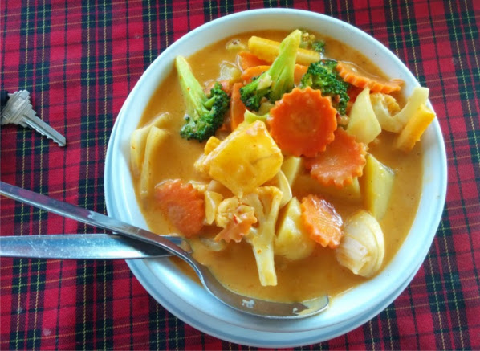

labels: Blog
        Places
created: 2014-11-22T19:24
place: Kyiv, Ukraine
comments: true

# Good place to have a dinner on Chalong, Phuket


Advantages:

- european cuisine
- the best curry I ate ever
- staff speaks english and understand 'no meat' (try carbonara, no meat, vegetable)
- always a lot of people from different parts of the world here
- cheep

What to try:

- vegetable salad
- fried rice
- curry (massaman, green, red)
- vegetable carbonara

Vegetable curry:



Coordinates: ```7.852532,98.347867``` (Tony's restaurant on Chalong, Phuket)
