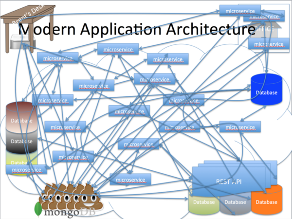

labels: Blog
        Microservices
        SoftwareDevelopment
        Distributed
created: 2015-08-09T14:28
modified: 2016-03-05T16:34
place: Kyiv, Ukraine
comments: true

# Notes on microservices

[TOC]

Notes on microservices pattern made after reading [Building Microservices](http://www.amazon.com/Building-Microservices-Sam-Newman-ebook/dp/B00T3N7XB4/) by Sam Newman.

> The need to change our system to deal with scale isn't a sign of failure. It is a sign of success.
>
> Building Microservices by [Sam Newman](http://samnewman.io)

## What is microservice

Microservice can be rewrote in 2 weeks or less (Jon Eaves).

Every microservice inside application infrastructure may be wrote in language that most suitable for the problem the microservice solving, use libraries and instruments it needs even if other microservices use another.

Small team (see Two-pizza teams) can own one small microservice. Small teams works with small codebase are more efficient and can be easily distributed across the globe.

Microservices allows us to deliver new features faster. Although deploy and infrastructure may be a bit more sophisticated comparatively to solid application.
Microservices allows us to use resources more efficiently, manage them more agile.

How to share code between microservices:

1. Create packages (add them to requirements and install using pip, npm, etc.)
2. Copy/paste sometimes also acceptable (be relaxed about violating DRY across all services)

Microservices is for organizations where developers have a lot of freedom.

It's possible that to start from monolithic application is better idea than to use microservices, and if we will need it in future: see quote in the beginning.

## Other

Single Responsibility Principle (Robert C. Martin): Gather together those things that change for the same reason, and separate those things that change for different reasons.

[The Twelve Factors](http://12factor.net/) by Heroku.

Orchestration vs Choreography:

- Orchestration: Something in center drives the process
- Choreography: Each part of the system knows its role and trying to do their work well

Postel's Law (robustness principle): Be conservative in what you do, be liberal in what you accept from others (about communication between services).

Semantic versioning (major.minor.patch):

- Next major version is backward incompatible.
- Next minor version means that some functionality was added or optimized. Interface is still backward compatible.
- Patch version increment means that new version contains bug fixes, no changes in interface.

Two-pizza teams by Amazon: no team should be so big that it could not be fed with two pizzas.

Google goes beyond simple tests to mimic server failure (include DiRT - Disaster Recovery Test, annually).
Netflix runs programs that cause failures on daily basis (Chaos Monkey, Chaos Gorilla).

Nice idea is to temporary disconnect service if it start producing enormous number of errors.

## What's else in [the book](http://www.amazon.com/Building-Microservices-Sam-Newman-ebook/dp/B00T3N7XB4/)

- CI
- Security
- Deployment
- Docs
- Testing
- Logging
- Human factor
- Monitoring
- How to split monolithic application into microservices
- Scaling databases (very clearly, in simple words)
- ...

## Related

See [AWS Lambda](https://aws.amazon.com/documentation/lambda/).
