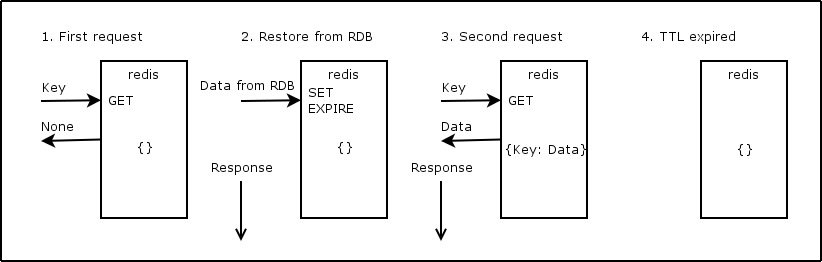
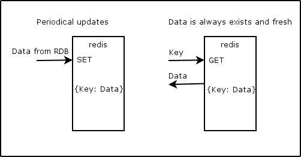
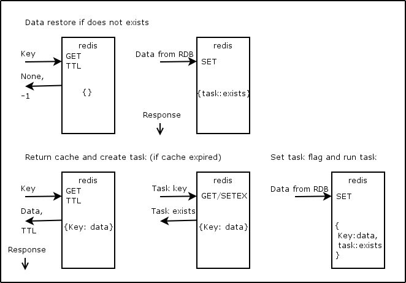

labels: Blog
        Databases
        Redis
created: 2015-08-15T10:15
modified: 2016-02-03T23:29
place: Kyiv, Ukraine
comments: true

# Redis, usage examples

[TOC]

## Cache for reads

Lets imagine that we have some heavy task that returns a number that we need to show to our customer. Instead of to run this task on every request (with same parameters), we save result to memory and return it next time without task execution. Periodically, when we need to refresh data, we run task again.

### 1. Using setex/get



```python
import logging
import time

from redis import StrictRedis


logging.basicConfig(format='%(asctime)-15s %(message)s')


KEY = 'test:key'


redis = StrictRedis(host='localhost')


def hard_task():
    count = 0
    for i in range(10):
        count += 1
        time.sleep(0.1)
    return count


def hard_task_cache():
    result = redis.get(KEY)
    if result is None:
        result = hard_task()
        redis.setex(name=KEY, time=2, value=result)
    return int(result)


if __name__ == '__main__':
    logging.warning("Start.")
    logging.warning(hard_task_cache())
    logging.warning(hard_task_cache())
    time.sleep(3)
    logging.warning("Sleep 3s.")
    logging.warning(hard_task_cache())
    # 2015-08-24 15:53:47,110 Start.
    # 2015-08-24 15:53:48,157 10
    # 2015-08-24 15:53:48,158 10
    # 2015-08-24 15:53:51,162 Sleep 3s.
    # 2015-08-24 15:53:52,188 10
    # ~10ms vs >1s.
```

Pros:

- simple

Cons:

- user needs to wait for cache restore
- a lot of instances of workers may start restore procedure

### 2. Reload cache in background periodically



```python
import datetime
import logging

from redis import StrictRedis
from tornado import gen
from tornado.ioloop import IOLoop


logging.basicConfig(format='%(asctime)-15s %(message)s')


KEY = 'test:key'
EXPIRE = 2


ioloop = IOLoop.current()
redis = StrictRedis(host='localhost')


@gen.coroutine
def async_sleep(time=1):
    yield gen.Task(
        IOLoop.current().add_timeout,
        deadline=datetime.timedelta(seconds=time))


@gen.coroutine
def hard_task():
    logging.warning("Run hard task.")
    yield async_sleep()
    raise gen.Return(10)


@gen.coroutine
def update_hard_task_cache():
    logging.warning("Update cache.")
    result = yield hard_task()
    redis.setex(name=KEY, time=EXPIRE * 2, value=result)
    ioloop.add_timeout(deadline=EXPIRE, callback=update_hard_task_cache)


def hard_task_cache():
    cache = int(redis.get(KEY))
    logging.warning('Get cache: {cache}.'.format(cache=cache))
    return cache


if __name__ == '__main__':
    ioloop.run_sync(update_hard_task_cache)
    ioloop.add_timeout(deadline=datetime.timedelta(seconds=1), callback=hard_task_cache)
    ioloop.add_timeout(deadline=datetime.timedelta(seconds=2), callback=hard_task_cache)
    ioloop.add_timeout(deadline=datetime.timedelta(seconds=4), callback=hard_task_cache)
    ioloop.start()
    # 2015-08-24 17:30:34,461 Update cache.
    # 2015-08-24 17:30:34,462 Run hard task.
    # 2015-08-24 17:30:35,480 Update cache.
    # 2015-08-24 17:30:35,480 Run hard task.
    # 2015-08-24 17:30:36,484 Get cache: 10.
    # 2015-08-24 17:30:36,485 Update cache.
    # 2015-08-24 17:30:36,486 Run hard task.
    # 2015-08-24 17:30:37,483 Get cache: 10.
    # 2015-08-24 17:30:37,487 Update cache.
    # 2015-08-24 17:30:37,487 Run hard task.
    # 2015-08-24 17:30:38,491 Update cache.
    # 2015-08-24 17:30:38,492 Run hard task.
    # 2015-08-24 17:30:39,483 Get cache: 10.
```

```update_hard_task_cache``` executes every 2 seconds.

Pros:

- user doesn't wait for cache restore

Cons:

- we run periodical task all the time, even if no one requests the data
- number of updates multiplies on number of application instances running

The second issue is easy to fix: use flag in redis that shows that one of instances already took this task.

### 3. Combining 1 and 2



```python
import datetime
import logging

from redis import StrictRedis
from tornado import gen
from tornado.ioloop import IOLoop


logging.basicConfig(format='%(asctime)-15s %(message)s')


KEY = 'test:key'
TASK_KEY = 'test:key:task'
EXPIRE = 2


ioloop = IOLoop.current()
redis = StrictRedis(host='localhost')


@gen.coroutine
def async_sleep(time=1):
    yield gen.Task(
        IOLoop.current().add_timeout,
        deadline=datetime.timedelta(seconds=time))


@gen.coroutine
def hard_task():
    logging.warning("Run hard task.")
    yield async_sleep()
    raise gen.Return(10)


@gen.coroutine
def update_hard_task_cache():
    logging.warning("Update cache.")
    result = yield hard_task()
    redis.setex(name=KEY, time=EXPIRE * 10, value=result)
    raise gen.Return(result)


@gen.coroutine
def hard_task_cache():
    pipe = redis.pipeline()
    pipe.get(KEY)
    pipe.ttl(KEY)
    cache, ttl = pipe.execute()
    if cache is None:
        # if cache doesn't exists: wait
        pipe = redis.pipeline()
        pipe.get(name=TASK_KEY)
        pipe.setex(name=TASK_KEY, time=EXPIRE, value=1)
        exists, _ = pipe.execute()
        if not exists:
            cache = yield update_hard_task_cache()
        else:
            yield async_sleep(time=EXPIRE / 2)
            cache = redis.get(name=KEY)
    elif ttl < EXPIRE * 9:
        pipe = redis.pipeline()
        pipe.get(name=TASK_KEY)
        pipe.setex(name=TASK_KEY, time=EXPIRE, value=1)
        exists, _ = pipe.execute()
        if not exists:
            ioloop.add_timeout(deadline=0, callback=update_hard_task_cache)
    cache = int(cache)
    logging.warning('Get cache: {cache}.'.format(cache=cache))
    raise gen.Return(cache)


if __name__ == '__main__':
    ioloop.add_timeout(deadline=datetime.timedelta(seconds=0), callback=hard_task_cache)
    ioloop.add_timeout(deadline=datetime.timedelta(seconds=4), callback=hard_task_cache)
    ioloop.add_timeout(deadline=datetime.timedelta(seconds=5), callback=hard_task_cache)
    ioloop.start()
    # 2015-08-24 18:28:21,710 Update cache.
    # 2015-08-24 18:28:21,711 Run hard task.
    # 2015-08-24 18:28:22,715 Get cache: 10.
    # 2015-08-24 18:28:25,700 Get cache: 10.
    # 2015-08-24 18:28:25,700 Update cache.
    # 2015-08-24 18:28:25,701 Run hard task.
    # 2015-08-24 18:28:26,703 Get cache: 10.
```

The idea that we check for time expiration manually and run update task if required while returning expired cache to user.

Cons:

- we need to select timings depends on task execution duration and cache renew rate
- we need to set task flag only if it doesn't exists (otherwise we will be in loop if task fails)

### 4. Scripting

```python
import datetime
import logging

from redis import StrictRedis
from tornado import gen
from tornado.ioloop import IOLoop


logging.basicConfig(format='%(asctime)-15s %(message)s')


KEY = 'test:key'
EXPIRE = 2


ioloop = IOLoop.current()
redis = StrictRedis(host='localhost')


TASK_SCRIPT = """
    local item = redis.call("GET", ARGV[1] .. ":task")
    if item then
        return 1
    else
        redis.call("SETEX", ARGV[1] .. ":task", tonumber(ARGV[2]), 1)
        return 0
    end
"""

task_script = redis.register_script(script=TASK_SCRIPT)


@gen.coroutine
def async_sleep(time=1):
    yield gen.Task(
        IOLoop.current().add_timeout,
        deadline=datetime.timedelta(seconds=time))


@gen.coroutine
def hard_task():
    logging.warning("Run hard task.")
    yield async_sleep()
    raise gen.Return(10)


@gen.coroutine
def hard_task_cache():
    pipe = redis.pipeline()
    pipe.get(KEY)
    pipe.ttl(KEY)
    cache, ttl = pipe.execute()
    if cache is None:
        # if cache doesn't exists: wait
        exists = task_script(args=[KEY, EXPIRE])
        if not exists:
            cache = yield hard_task()
            redis.setex(name=key, time=timeout * 10, value=cache)
        else:
            yield async_sleep(time=EXPIRE / 2)
            cache = redis.get(name=KEY)
    elif ttl < EXPIRE * 9:
        exists = task_script(args=[KEY, EXPIRE])
        if not exists:
            ioloop.add_timeout(deadline=0, callback=update_hard_task_cache)
    cache = int(cache)
    logging.warning('Get cache: {cache}.'.format(cache=cache))
    raise gen.Return(cache)


if __name__ == '__main__':
    ioloop.add_timeout(deadline=datetime.timedelta(seconds=0), callback=hard_task_cache)
    ioloop.add_timeout(deadline=datetime.timedelta(seconds=4), callback=hard_task_cache)
    ioloop.add_timeout(deadline=datetime.timedelta(seconds=5), callback=hard_task_cache)
    ioloop.start()
    # 2015-08-24 18:48:42,284 Run hard task.
    # 2015-08-24 18:48:43,289 Get cache: 10.
    # 2015-08-24 18:48:46,277 Get cache: 10.
    # 2015-08-24 18:48:46,277 Run hard task.
    # 2015-08-24 18:48:47,274 Get cache: 10.
```

### 5. Cache functions and decorators

```python
import datetime
import logging

from functools import partial
from functools import wraps

from redis import StrictRedis
from tornado import gen
from tornado.ioloop import IOLoop


logging.basicConfig(format='%(asctime)-15s %(message)s')


KEY = 'test:key'
EXPIRE = 2


ioloop = IOLoop.current()
redis = StrictRedis(host='localhost')


TASK_SCRIPT = """
    local item = redis.call("GET", ARGV[1] .. ":task")
    if item then
        return 1
    else
        redis.call("SETEX", ARGV[1] .. ":task", tonumber(ARGV[2]), 1)
        return 0
    end
"""

task_script = redis.register_script(script=TASK_SCRIPT)


@gen.coroutine
def async_sleep(time=1):
    yield gen.Task(
        IOLoop.current().add_timeout,
        deadline=datetime.timedelta(seconds=time))


@gen.coroutine
def hard_task():
    logging.warning("Run hard task.")
    yield async_sleep()
    raise gen.Return(10)


@gen.coroutine
def from_cache(key, timeout, f):
    pipe = redis.pipeline()
    pipe.get(key)
    pipe.ttl(key)
    cache, ttl = pipe.execute()
    if cache is None:
        # if cache doesn't exists: wait
        exists = task_script(args=[key, timeout])
        if not exists:
            cache = yield f()
            redis.setex(name=key, time=timeout * 10, value=cache)
        else:
            yield async_sleep(time=timeout / 2)
            cache = redis.get(name=key)
    elif ttl < timeout * 9:
        exists = task_script(args=[key, timeout])
        if not exists:
            ioloop.add_timeout(deadline=0, callback=f)
    cache = int(cache)
    logging.warning('Get cache: {cache}.'.format(cache=cache))
    raise gen.Return(cache)


def from_cache_decorator(key, timeout):
    def from_cache_decorator_inner(func):
        @wraps(func)
        def func_wrapper(**kwargs):
            return from_cache(key=key, timeout=timeout, f=partial(func, **kwargs))
        return func_wrapper
    return tags_decorator


@from_cache_decorator(key=KEY, timeout=EXPIRE)
def cached_hard_task():
    return hard_task()


if __name__ == '__main__':
    ioloop.add_timeout(deadline=datetime.timedelta(seconds=0), callback=partial(
        from_cache, key=KEY, timeout=EXPIRE, f=hard_task))
    ioloop.add_timeout(deadline=datetime.timedelta(seconds=4), callback=partial(
        from_cache, key=KEY, timeout=EXPIRE, f=hard_task))
    ioloop.add_timeout(deadline=datetime.timedelta(seconds=5), callback=partial(
        from_cache, key=KEY, timeout=EXPIRE, f=hard_task))
    ioloop.add_timeout(deadline=datetime.timedelta(seconds=6), callback=cached_hard_task)
    ioloop.start()
    # 2015-08-24 19:30:15,547 Run hard task.
    # 2015-08-24 19:30:16,550 Get cache: 10.
    # 2015-08-24 19:30:19,542 Get cache: 10.
    # 2015-08-24 19:30:19,542 Run hard task.
    # 2015-08-24 19:30:20,542 Get cache: 10.
    # 2015-08-24 19:30:21,541 Get cache: 10.
```

## Cache for writes

If some data updates a lot, it may be more efficient to keep the most recent data in redis and push it to RDB periodically.

### 1. Password reset

In this example we will allow to user to send password reset request only once per 5s.

```python
import logging
import time

from redis import StrictRedis


logging.basicConfig(format='%(asctime)-15s %(message)s')


KEY = 'password:{user_id}'
EXPIRE = 5


redis = StrictRedis(host='localhost')


def email_reset(user_id):
    key = KEY.format(user_id=user_id)
    exists = redis.exists(name=key)
    if not exists:
        # create a request
        # send an email
        redis.setex(name=key, time=EXPIRE, value=1)
        logging.warning("Email was sent.")
        return
    logging.warning("Please try later.")


if __name__ == '__main__':
    email_reset(user_id=1)
    email_reset(user_id=1)
    time.sleep(5)
    email_reset(user_id=1)
    # 2015-08-24 20:03:15,705 Email was sent.
    # 2015-08-24 20:03:15,706 Please try later.
    # 2015-08-24 20:03:20,712 Email was sent.
```

### 2. Counters

Let's count views of job posting. We will store relations (job_id/user_id) in RDB to be sure that views are unique.
The problem here is that we need to run count query against particular job_id to get job views count. Imagine if we have page with dozens of jobs where we need to show views counts ...
We can solve this problem keeping counters in redis.

```python
import logging

from redis import StrictRedis


logging.basicConfig(format='%(asctime)-15s %(message)s')


KEY = 'jobs:{job_id}:views'
EXPIRE = 100


redis = StrictRedis(host='localhost')


def job_view(job_id, user_id):
    # check job_id / user_id is uniques
    # if not unique: return
    key = KEY.format(job_id=job_id)
    pipe = redis.pipeline()
    pipe.incr(key)
    pipe.expire(key, EXPIRE)
    result, _ = pipe.execute()
    return result


def counts(job_ids):
    pipe = redis.pipeline()
    for job_id in job_ids:
        key = KEY.format(job_id=job_id)
        pipe.get(key)
    return dict(zip(job_ids, pipe.execute()))


if __name__ == '__main__':
    logging.warning(job_view(1, 1))
    logging.warning(job_view(1, 2))
    logging.warning(job_view(2, 1))
    logging.warning(counts(job_ids=[1, 2, 3]))
    # 2015-08-24 21:15:43,978 1
    # 2015-08-24 21:15:43,979 2
    # 2015-08-24 21:15:43,980 1
    # 2015-08-24 21:15:43,980 {1: b'2', 2: b'1', 3: None}
```

What if counter expire or someone will flush redis db?

In this case we can easily restore count from RDB. If we haven't ability to restore counters easily, we need to backup counters values to RDB periodically.

```python
import logging

from redis import StrictRedis


logging.basicConfig(format='%(asctime)-15s %(message)s')


KEY = 'jobs:{job_id}:views'
EXPIRE = 100


redis = StrictRedis(host='localhost')


def restore(job_id):
    # get count from RDB
    return 10


def job_view(job_id, user_id):
    # check job_id / user_id is uniques
    # if not unique: return
    key = KEY.format(job_id=job_id)
    pipe = redis.pipeline()
    pipe.incr(key)
    pipe.expire(key, EXPIRE)
    result, _ = pipe.execute()
    if result == 1:
        result = restore(job_id=job_id)
        if result != 1:
            redis.set(key, result)
    return result


def counts(job_ids):
    pipe = redis.pipeline()
    for job_id in job_ids:
        key = KEY.format(job_id=job_id)
        pipe.get(key)
    counts = {}
    for job_id, count in zip(job_ids, pipe.execute()):
        if count is None:
            count = restore(job_id=job_id)
            key = KEY.format(job_id=job_id)
            redis.set(key, count)
        else:
            count = int(count)
        counts[job_id] = count
    return counts


if __name__ == '__main__':
    logging.warning(job_view(1, 1))
    logging.warning(job_view(1, 2))
    logging.warning(job_view(2, 1))
    logging.warning(counts(job_ids=[1, 2, 3]))
    # 2015-08-24 21:22:08,447 16
    # 2015-08-24 21:22:08,448 17
    # 2015-08-24 21:22:08,448 13
    # 2015-08-24 21:22:08,449 {1: 17, 2: 13, 3: 10}
```

Another key point about restore function is that we don't want to keep all data from RDB in redis, we need only one that our customers ask for. So, if no one asks particular data, we can remove it from cache. In case if someone will ask it again, our restore function will put the data back to redis.

### 3. Combine counters and simple cache

What if we keep user session in redis and we need to show these jobs with views counts. Will we do two requests to redis?

```python
import logging

from redis import StrictRedis


logging.basicConfig(format='%(asctime)-15s %(message)s')


redis = StrictRedis(host='localhost')


class Cache(object):

    KEY = 'cache'
    EXPIRE = 100

    @classmethod
    def key(cls, **kwargs):
        return cls.KEY.format(**kwargs)

    def set(self, value, **kwargs):
        redis.setex(
            name=self.key(**kwargs), time=self.EXPIRE,
            value=self.encode(value))

    def get(self, **kwargs):
        key = self.key(**kwargs)
        value = redis.get(name=key)
        if value is None:
            value = self.up(kwargs)
            self.set(value, **kwargs)
        return self.decode(value)

    def up(self, **kwargs):
        """ Restore cache. """
        pass

    def down(self, value, **kwargs):
        """ Save to RDB. """
        pass

    @classmethod
    def decode(cls, value):
        return value

    @classmethod
    def encode(cls, value):
        return value


class Counter(Cache):

    def inc(self, **kwargs):
        pipe = redis.pipeline()
        key = self.key(**kwargs)
        pipe.incr(name=key)
        pipe.expire(name=key, time=self.EXPIRE)
        count, _ = pipe.execute()
        if count == 1:
            count = self.up(**kwargs)
            if count != 1:
                self.set(value=count, **kwargs)
        return count

    @classmethod
    def decode(cls, value):
        if value is None:
            return 0
        return int(value)


class SessionCache(Cache):

    KEY = 'sessions:{user_id}'


class JobViewsCounter(Counter):

    KEY = 'jobs:{job_id}:views'

    def up(self, **kwargs):
        # Restore from job views RDB table
        return 10


def get_cache(user_id, job_ids):
    pipe = redis.pipeline()
    result_map = [('user', SessionCache)]
    pipe.get(SessionCache.key(user_id=user_id))
    for job_id in job_ids:
        result_map.append(('job:{job_id}'.format(job_id=job_id), JobViewsCounter))
        pipe.get(JobViewsCounter.key(job_id=job_id))
    results = {}
    for result, value in zip(result_map, pipe.execute()):
        key, cache_cls = result
        results[key] = cache_cls.decode(value=value)
    return results


if __name__ == '__main__':
    views_counter = JobViewsCounter()
    logging.warning(views_counter.inc(job_id=1))
    logging.warning(views_counter.inc(job_id=2))
    logging.warning(views_counter.inc(job_id=1))
    SessionCache().set(value='session...', user_id=1)
    logging.warning(get_cache(user_id=1, job_ids=[1, 2, 3]))
    # 2015-08-24 21:55:17,617 4
    # 2015-08-24 21:55:17,617 11
    # 2015-08-24 21:55:17,618 5
    # 2015-08-24 21:55:17,619 {'user': b'session...', 'job:1': 5, 'job:3': 10, 'job:2': 11}
```

## Lists, Sets, Sorted sets

### 1. Let's use lists to show latest 3 job views.

```python
import logging

from redis import StrictRedis


KEY = 'job:views:latest'


logging.basicConfig(format='%(asctime)-15s %(message)s')


redis = StrictRedis(host='localhost')


def view(job_id):
    pipe = redis.pipeline()
    pipe.lpush(KEY, job_id)
    pipe.ltrim(KEY, 0, 2)
    pipe.execute()


def latest_views():
    return redis.lrange(KEY, 0, -1)

if __name__ == '__main__':
    [view(i) for i in range(10)]
    logging.warning(latest_views())
    # 2015-08-24 22:26:12,127 [b'9', b'8', b'7']
```

### 2. Use sorted set to show top 3 jobs by views

```python
import logging

from redis import StrictRedis


JOBS_TOP_KEY = 'jobs:top'
JOBS_VIEWS_KEY = 'jobs:{job_id}:views'


logging.basicConfig(format='%(asctime)-15s %(message)s')


redis = StrictRedis(host='localhost')


def view(job_id):
    # TODO: use lua scripting here
    count = redis.incr(JOBS_VIEWS_KEY.format(job_id=job_id))
    redis.zadd(JOBS_TOP_KEY, count, job_id)


def top_jobs():
    return redis.zrevrange(JOBS_TOP_KEY, 0, 3)


if __name__ == '__main__':
    [view(i) for i in range(10)]
    [view(i) for i in range(2, 5)]
    [view(i) for i in range(4, 6)]
    logging.warning(top_jobs())
    # 2015-08-24 22:37:07,161 [b'3', b'4', b'5', b'2']
```

See also [how twitter uses redis to store user feeds](http://highscalability.com/blog/2013/7/8/the-architecture-twitter-uses-to-deal-with-150m-active-users.html).

## Other

### 1. In some cases redis/cache may be more efficient then replication for RDB.

### 2. Tornado-redis vs redis-py

See: [Tornado-Redis vs Redis-py](https://github.com/leporo/tornado-redis#tornado-redis-vs-redis-py).

"I recommend using both tornado-redis and redis-py clients for your Tornado Web Application. Use tornado-redis to subscribe to Pub/Sub notifications and for blocking commands such as BLPOP, BRPOP, BRPOPLPUSH. You may safely use redis-py for most of other cases."

### 3. If redis works slow

```bash
redis-cli
> info
> # check number of connections, memory, etc.
> monitor
> # see which commands executes (use grep to filter output)
```

### 4. Don't use KEYS command in your code

```python
keys = redis.keys('jobs:{job_id}:*')
for key in keys:
    redis.delete(key)
# DON'T DO LIKE THIS!
```

Time complexity for keys is O(N) with N being the number of keys in the database!

### 5. Use expire to be sure that database contains only data that actively in use

### 6. Use HGET, HSET to decrease number of keys

### 7. Twemproxy

[https://github.com/twitter/twemproxy](https://github.com/twitter/twemproxy)

Allows to scale horizontally.
