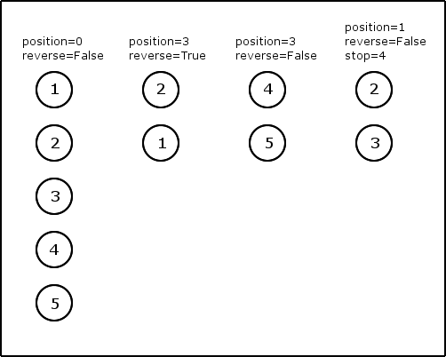

labels: Blog
        SoftwareDevelopment
created: 2015-09-05T22:26
place: Batumi, Georgia

# Position/reverse/stop pagination

The problem:

- offset/limit pagination is inefficient for non relational databases
- in cursor pagination we unable to specify range of positions
- we wanna use same pagination across whole project

The idea:

- we can easily replace offset/limit pagination by cursor in the most of cases
- for more complex queries we can use position/reverse/stop pagination
- on the server side we will always work with position/reverse/stop pagination (it is easy to encode/decode cursor into position/reverse)

Vocabulary:

- position - initial position (may be offset, timestamp, primary keys for DynamoDB and anything else determines database record position)
- reverse - direction relatively to position (it is **absolute**. Means that it is not depends on current ordering. For example, if we use publish date as position and reverse == True, then ordering will be newer items first)
- stop - stop position (optional. If specified - returns items up/down to stop position)
- cursor - string, combines position and reverse
- limit - max number of items in response



Example:
```python
import json
import urlparse

from base64 import b64decode, b64encode
from urllib import urlencode


def decode_cursor(cursor):
    """
    :param cursor: encoded cursor
    :return: (position, reverse)
    """
    position = None
    reverse = False

    try:
        querystring = b64decode(cursor.encode('ascii')).decode('ascii')
        tokens = urlparse.parse_qs(querystring, keep_blank_values=True)

        position = tokens.get('p', [None])[0]
        if position is not None:
            position = json.loads(position)

        reverse = tokens.get('r', ['f'])[0] == 't'
    except (TypeError, ValueError, AttributeError):
        pass

    return position, reverse


def encode_cursor(position, reverse):
    """
    :param position: last position, object
    :param reverse: reverse pagination
    :return: encoded cursor
    """
    tokens = {}
    if position is not None:
        tokens['p'] = json.dumps(position)
    if reverse:
        tokens['r'] = 't'
    else:
        tokens['r'] = 'f'

    querystring = urlencode(tokens, doseq=True)
    encoded = b64encode(querystring.encode('ascii')).decode('ascii')

    return encoded


def paginate_position(data, position, limit, reverse, stop=None):
    if reverse:
        next = position - limit - 1
        next = 0 if next < 0 else next
        if stop is not None and next < stop:
            next = stop
        page = [i for i in reversed(DATA[next:position])]
        next += 1
    else:
        next = position + limit + 1
        if stop is not None and next > stop:
            next = stop
        page = DATA[position:next]
        next -= 1
    has_more = len(page) > limit
    return page[:limit], next if has_more else None


def paginate_cursor(data, cursor, limit):
    position, reverse = decode_cursor(cursor)
    if position is None:
        position = 0
    if reverse:
        next = position - limit - 1
        next = 0 if next < 0 else next
        page = [i for i in reversed(DATA[next:position])]
        next += 1
    else:
        next = position + limit + 1
        page = DATA[position:next]
        next -= 1
    has_more = len(page) > limit
    if reverse:
        previous_cursor = encode_cursor(position=next, reverse=True) if has_more else None
        next_cursor = encode_cursor(position=next, reverse=False)
    else:
        next_cursor = encode_cursor(position=next, reverse=False) if has_more else None
        previous_cursor = encode_cursor(position=next, reverse=True)
    return page[:limit], previous_cursor, next_cursor


if __name__ == '__main__':
    DATA = ["D{n}".format(n=i) for i in range(6)]
    LIMIT = 2

    # offset / limit -> position / reverse / limit
    position = 0
    reverse = False
    while True:
        print 'Request position: {position}, limit: {limit}, reverse: {reverse}'.format(
            position=position, limit=LIMIT, reverse=reverse)
        page, position = paginate_position(
            data=DATA, position=position, reverse=reverse, limit=LIMIT)
        print page
        if position is None:
            break

    # reverse
    position = 6
    reverse = True
    while True:
        print 'Request position: {position}, limit: {limit}, reverse: {reverse}'.format(
            position=position, limit=LIMIT, reverse=reverse)
        page, position = paginate_position(
            data=DATA, position=position, reverse=reverse, limit=LIMIT)
        print page
        if position is None:
            break

    # offset / limit -> cursor / limit
    next = None
    previous = None
    while True:
        print 'Request cursor: {cursor}, limit: {limit}'.format(
            cursor=next, limit=LIMIT)
        page, previous, next = paginate_cursor(
            data=DATA, cursor=next, limit=LIMIT)
        print(page)
        if next is None:
            break

    # reverse
    while True:
        print 'Request cursor: {cursor}, limit: {limit}'.format(
            cursor=previous, limit=LIMIT)
        page, previous, next = paginate_cursor(
            data=DATA, cursor=previous, limit=LIMIT)
        print(page)
        if previous is None:
            break

    # Request position: 0, limit: 2, reverse: False
    # ['D0', 'D1']
    # Request position: 2, limit: 2, reverse: False
    # ['D2', 'D3']
    # Request position: 4, limit: 2, reverse: False
    # ['D4', 'D5']
    # Request position: 6, limit: 2, reverse: True
    # ['D5', 'D4']
    # Request position: 4, limit: 2, reverse: True
    # ['D3', 'D2']
    # Request position: 2, limit: 2, reverse: True
    # ['D1', 'D0']
    # Request cursor: None, limit: 2
    # ['D0', 'D1']
    # Request cursor: cD0yJnI9Zg==, limit: 2
    # ['D2', 'D3']
    # Request cursor: cD00JnI9Zg==, limit: 2
    # ['D4', 'D5']
    # Request cursor: cD02JnI9dA==, limit: 2
    # ['D5', 'D4']
    # Request cursor: cD00JnI9dA==, limit: 2
    # ['D3', 'D2']
    # Request cursor: cD0yJnI9dA==, limit: 2
    # ['D1', 'D0']
```
