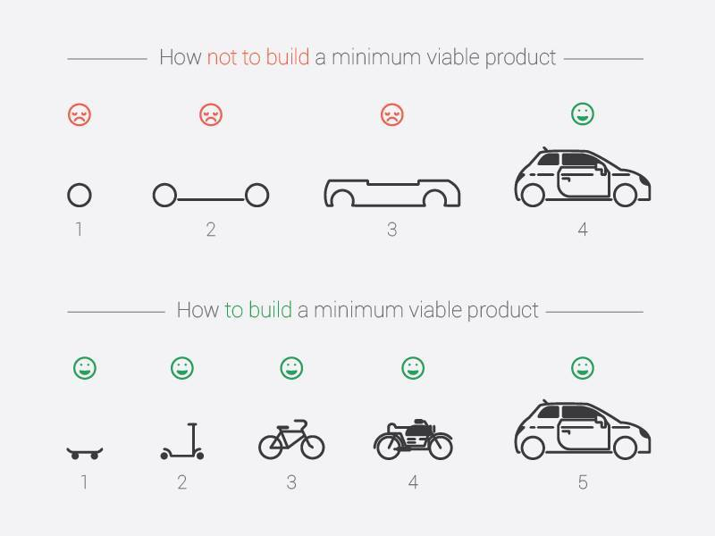

labels: Blog
		SoftwareDevelopment
created: 2015-10-24T14:41
modified: 2016-02-14T10:11
place: Kyiv, Ukraine
comments: true

# Principles from software development

[TOC]

## [5 Whys](https://en.wikipedia.org/wiki/5_Whys)

The primary goal of the technique is to determine the root cause of a defect or problem by repeating the question "Why?" Each question forms the basis of the next question. The "5" in the name derives from an empirical observation on the number of iterations typically required to resolve the problem.

The technique was formally developed by Sakichi Toyoda and was used within the Toyota Motor Corporation during the evolution of its manufacturing methodologies.

### [AAR](https://en.wikipedia.org/wiki/After-action_review)

An **A**fter **A**ction **R**eview is a structured review or de-brief process for analyzing what happened, why it happened, and how it can be done better.

To apply this tool ask yourself:

- What was supposed to happen?
- What did happen?
- What are some improvements?
- What are some sustainments?
- What can be done to improve the result?
- Summary.

## DRY

**D**on’t **r**epeat **y**ourself.

A software engineering principle stating that "Every piece of knowledge must have a single, unambiguous, authoritative representation within a system." It first appeared in the book The Pragmatic Programmer by Andy Hunt and Dave Thomas.

## Duck typing

> When I see a bird that walks like a duck and swims like a duck and quacks like a duck, I call that bird a duck.
>
> James Whitcomb Riley

A form of polymorphism where functions operate on any object that implements the appropriate methods, regardless of their classes or explicit interface declarations.

## EAFP

**E**asier to **a**sk for **f**orgiveness than **p**ermission.

```python
try:
    x = my_dict["key"]
except KeyError:
    # say sorry
```

## Fail fast

A system design approach recommending that errors should be reported as early as possible.

## Functional programming

It is a declarative programming paradigm, which means programming is done with expressions.

## Imperative vs Declarative style of programming

Declarative style of programming tells a computer what to do without specifying how, while an imperative style style of programming describes how to do it.

## KISS

Stands for "**K**eep **I**t **S**imple, **S**tupid."

This calls for seeking the simplest possible solution, with the fewest moving parts. The phrase was coined by Kelly Johnson, a highly accomplished aerospace engineer who worked in the real Area 51 designing some of the most advanced aircraft of the 20th centure.

## Lazy implementation

A lazy implementation postpones producing values to the last possible moment. This saves memory and may avoid useless processing as well.

## Minimum viable product

MVP is the product with the highest return on investment versus risk. It is the sweet spot between products without the required features that fail at sunrise and the products with too many features that cut return and increase risk. The term was coined and defined by Frank Robinson, and popularized by Steve Blank, and Eric Ries.



## OOP

A programming paradigm based on the concept of "objects", which are data structures that contain data, in the form of fields, often known as attributes; and code, in the form of procedures, often known as methods.

There are four main principles:

- Encapsulation
- Abstraction
- Inheritance

### Encapsulation

In programming languages, encapsulation is used to refer to one of two related but distinct notions, and sometimes to the combination thereof:

- A language mechanism for restricting access to some of the object's components.
- A language construct that facilitates the bundling of data with the methods (or other functions) operating on that data.

### Abstraction

Abstraction is a technique for managing complexity of computer systems. It works by establishing a level of complexity on which a person interacts with the system, suppressing the more complex details below the current level.

### Inheritance

Inheritance is when an object or class is based on another object (prototypal inheritance) or class (class-based inheritance), using the same implementation (inheriting from an object or class) specifying implementation to maintain the same behavior (realizing an interface; inheriting behavior).

## Pareto principle

For many events, roughly 80% of the effects come from 20% of the causes.

## Pastel's law

Or robustness principle.

Be conservative in what you do, be liberal in what you accept from others.

## PDD

**P**urpose-**d**riven **d**evelopment.

Links:

- [Purpose Driven Development - PDD](http://jacekratzinger.blogspot.com/2012/01/purpose-driven-development-pdd.html)

## Rubber duck debugging

Rubber duck debugging is an informal term used in software engineering for a method of debugging code. The name is a reference to a story in the book The Pragmatic Programmer in which a programmer would carry around a rubber duck and debug their code by forcing themselves to explain it, line-by-line, to the duck.

My case:


## SOLID

**S**ingle responsibility
**O**pen-closed
**L**iskov substitution
**I**nterface segregation
**D**ependency inversion

### Single responsibility (SRP)

According to [Wikipedia](https://en.wikipedia.org/wiki/Single_responsibility_principle):

In object-oriented programming, the single responsibility principle states that every class should have responsibility over a single part of the functionality provided by the software, and that responsibility should be entirely encapsulated by the class. All its services should be narrowly aligned with that responsibility.

Links:

- [SRP: The Single Responsibility Principle](http://www.objectmentor.com/resources/articles/srp.pdf)

### Open-closed (OCP)

Software entities (classes, modules, functions, etc.) should be open for extension, but closed for modification.

### Liskov substitution (LCP)

States that, in a computer program, if S is a subtype of T, then objects of type T may be replaced with objects of type S (i.e., objects of type S may substitute objects of type T) without altering any of the desirable properties of that program (correctness, task performed, etc.)

### Interface segregation (ISP)

ISP splits interfaces which are very large into smaller and more specific ones so that clients will only have to know about the methods that are of interest to them. Such shrunken interfaces are also called role interfaces.[2] ISP is intended to keep a system decoupled and thus easier to refactor, change, and redeploy.

### Dependency inversion (DIP)

A. High-level modules should not depend on low-level modules. Both should depend on abstractions.
B. Abstractions should not depend on details. Details should depend on abstractions.

## TDD

**T**est-**d**riven **d**esign (also seen test-driven development).

## [The twelve-factor app](http://12factor.net/)

The twelve-factor app is a methodology for building software-as-a-service apps.

## YAGNI

Stands for "**Y**ou **A**in't **G**onna **N**eed **I**t."

A slogan to avoid implementing functionality that is not immediately necessary based on assumptions about future needs.
