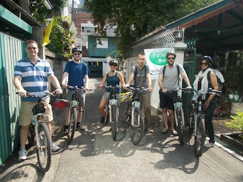

labels: Life
    	Blog
created: 2016-01-01T18:35
place: Kyiv, Ukraine
comments: true

# 2015 Summary

[TOC]

## 2015 Timeline

### Bangkok, New Year, bike tour

[Follow Me Bangkok Bike Tours](https://plus.google.com/+FollowmebiketourBangkok).

### Phuket and my cozy house in mountains

With beautiful view, snake, few big gecko and a guard:

### An accident

Vanita, thank you for helping me get hospital and delicious food.

### Motorbike purchase and driver license

It was very old Honda Wave 125.

And I got my first driver license.

### Places on Phuket

Cap Panva, Ao Yon beach, Khaokhad, Chalong sauna, the bay near Phuket Aquarium and Cafe Cantary, Nai Harn view point and Tony's restaurant. There are places I want come back again and again.

### Thai and Japanese languages

Spent some time learning Thai and Japanese languages. Realized that continuous practice is the most essential requirement for success in  mastering foreign languages.

### Chiang Mai

Chiang Mai Zoo, Waterfalls and [Illusion Art Museum](http://chiangmai-artinparadise.com):

### Rim Ping and Siri Homestay

Siri, it was pleasure for me to stop off at your place.

### Kyiv

In late May I came back to Kyiv for sake of a new project we started working on - Bkstg.

### Dream Story

A friendly place in Kyiv where I feel like at home.

### Kyiv Comiccon

Visited [Kyiv Comiccon](http://comiccon.kiev.ua).

### Sport Studio

I found [Sport Studio](http://sportstudio.com.ua) a pretty nice place for exercising. And I must say thanks to Vika, who helps me to overcome my laziness and to do exercising properly.

### Driving courses

Attended driving courses but didn't get a driver license. Nonetheless it was a good experience.

### Run Lab 5K, Kyiv Marathon and bicycling in Kyiv

Helps me to get from my place to the office:

### Coworking in Batumi, Georgia

Thanks to [@alexander.andreev](https://www.instagram.com/alexander.andreev/) for beautiful photos and [Marat](https://www.facebook.com/kiwicanfly), who organized our coworking. I was happy to be a part of it.

### Software development

Improved my knowledge in Python language, software design, databases.

[c2p2](https://github.com/nanvel/c2p2) now looks well for me.

### A shelter for the Winter Season

Moved to a quiet and warm flat, going to live here until late Spring.

### Vegetarian

I don't eat meat any more, and trying to consume less dairy and refined food.

## Plans for 2016

I want this year for myself (for rest, own projects and education).
