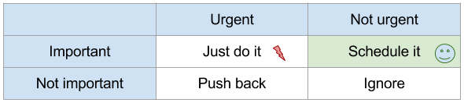

labels: Blog
  		GTD
image: /2016/08/urgency.png
description: I put here some notes I made after reading Getting Things Done book and a few other books. So some things are absent in GTD technique and a lot of things from the original technique is omitted
keywords: getting things done,gtd,external brain,project management
created: 2016-08-29T21:23
modified: 2016-12-21T16:53
place: Phuket, Thailand
comments: true

# Getting Things Done

[TOC]

I put here some notes I made after reading [Getting Things Done](#gtd) book and a few other books. So some things are absent in GTD technique and a lot of things from the original technique are omitted.

## Vertical planning

Plan your next ~90 days.

> Ninety days seems to be the range where ambition and planning actually fall reasonably close together.
> 
> The End of Jobs by Taylor Pearson

Redefine your goals periodically.

> We need to constantly define (and redefine) what we're trying to accomplish on many different levels, and consistently relocate resources toward getting these tasks complete as effectively and efficiently as possible.
>
> Getting Things Done by David Allen

## Horizontal planning

Create projects (project - any outcome requiring more than one step that you're committed to achieve within a year) for everything you are going to accomplish. Use "External brain" to store your projects.

### Reviews

Critical success factor: the weekly review.

### External brain

> Your mind is for having ideas, not for holding them.
>
> Getting Things Done by David Allen

External brain - tools that can do routine categorization and remembering for us.

#### Information

> Consider a future device for individual use, which is a sort of mechanized private file and library. It needs a name, and, to coin one at random, "memex" will do. A memex is a device in which an individual stores all his books, records, and communications, and which is mechanized so that it may be consulted with exceeding speed and flexibility. It is an enlarged intimate supplement to his memory.
>
> Vannevar Bush, As We May Think, 1945

Thoughts, ideas, links, etc. may be useful in future.

I don't need to remember, I write it all.

#### Calendar

All unfinished in any way things must be captured into a **trusted** system outside your brain.
Set up reminders and forget.

#### Lists

Lists:
- Someday/Maybe
- Books to read
- Movies to watch
- Music to listen
- Trips to go
- Web sites to surf
- Events to attend
- Ideas (general)
- To buy at ...
- ...

Someday/Maybe are not throwaway items. They may be some of the most interesting and creative things you'll ever get involved with.

## Executing plans

### How to choose an action to execute next

The Importance Vs Urgency Matrix (attributed to President Eisenhower and popularised by Stephen Covey):

**Important/Not urgent** is the place where magic happens. Executing actions from this category you moving your most exciting projects forward.

[Goldratt's framework](https://en.wikipedia.org/wiki/Theory_of_constraints) (What is your primary limit in completing the project?):

- What's the system?
- What's the current limit?
- What's the obvious way to improve the limit?

### Action execution

Execution may be one of:

- Do it now
- Schedule it
- Incubate (might need to be done later, but there is no exact date known)
- Delegate it
- Reference (potentially useful information)
- Put it into a trash bin (if an action is no more required)

#### Do it now

> If an action will take less than two minutes, it should be done at the moment it's defined.
>
> Getting Things Done by David Allen

#### Schedule it

Schedule and forget. It's a waste of time and energy (literally, a human brain consumes about 20% of energy produced by the human body) to keep thinking about something you make no progress on.

> This consistent, unproductive preoccupation with all the things we have to do is the single largest consumer of time and energy.
>
> Kerry Gleeson

Reminder must be reliable. Must be a place I know I will, without fail, look.

### Next action

Each project in progress must have a next action specified.

### Frustration

Happens because of unfilled agreements.

How to solve:

- Don't make the agreement
- Complete the agreement
- Renegotiate (a renegotiated agreement is not a broken one) the agreement

As humans, we love to work but dislike the obligation of it.

### Motivation

Small wins can keep you motivated.

> The secret of getting ahead is getting started. The secret of getting started is breaking your complex overwhelming tasks into small, manageable tasks, and then starting on the first one.
>
> Mark Twain

## Vocabulary

### GTD

[GTD](https://en.wikipedia.org/wiki/Getting_Things_Done) (**G**etting **T**hings **D**one) is a time-management method, described in a book of the same title by productivity consultant David Allen.

GTD essential: recognizes anything that has your attention (concerns, worries, problems, issues, tensions) and translates them into achievable outcomes (projects), to be executed with concrete next actions.

### Next action

Next action - the next physical, visible activity that progress something toward completion. It is specific enough so that you know where it happens, and with what tools (if any). What "doing" looks like.

> Wisdom consists not so much in knowing what to do in the ultimate as in knowing what to do next.
>
> Herbert Hoover

### Project

Project - any outcome requiring more than one step that you're committed to achieve within a year.

## Links

[Getting Things Done: The Art of Stress-free Productivity](https://www.amazon.com/Getting-Things-Done-Stress-free-Productivity-ebook/dp/B00SHL3V8M) by David Allen
[The End of Jobs](https://www.amazon.com/End-Jobs-Meaning-9-5-ebook/dp/B010L8SYRG) by Taylor Pearson
[The Monk Who Sold His Ferrari](https://www.amazon.com/Monk-Who-Sold-His-Ferrari/dp/0062515675) by Robin Sharma
[GyShiDo - the art of getting your shit done](https://gyshido.com/)
