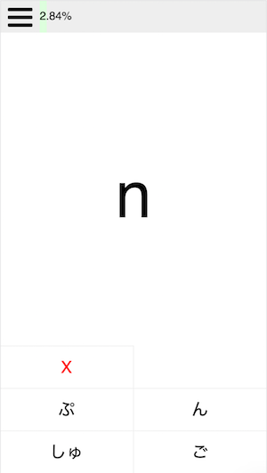

labels: Blog
		Algorithms
		Projects
created: 2016-10-11T08:31
modified: 2016-10-17T13:17
place: Phuket, Thailand
comments: true

# FlashCardsJS

[TOC]

Source code: [flashcardsjs](https://github.com/nanvel/flashcardsjs).
A template: [flashcardsjs template](https://github.com/nanvel/flashcards).
An example: [Learn Japanese kana](https://nanvel.github.io/kanalearn/).

## Links

[Spaced repetition](https://en.wikipedia.org/wiki/Spaced_repetition) on Wikipedia
[Learn languages on BubbleLanguages](https://www.bubblelanguages.com/)
