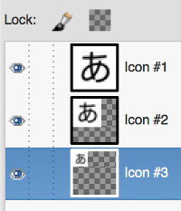

labels: Blog
        HTML
        WebDevelopment
created: 2016-12-02T09:28
modified: 2016-12-02T09:28
place: Phuket, Thailand
comments: true

# HTML header content

[TOC]

## link

### icon

**/favicon.ico**

```html
<link rel="shortcut icon" href="/favicon.ico">
```

[Favicon](https://en.wikipedia.org/wiki/Favicon) was introduced in 1999 by Internet Explorer 5. Mostly deprecated in favor of favicon.png, but still a good fallback solution.

`.ico` supports multiple versions of an image. `favicon.ico` should contain 16x16, 32x32 and 64x64 images.



**/favicon.png**

The `sizes` attribute was introduced in HTML5 to specify several different versions of the same icon, and those can be PNG files.

```html
<link rel="icon" type="image/png" href="favicon-16x16.png" sizes="16x16">
<link rel="icon" type="image/png" href="favicon-32x32.png" sizes="32x32">
<link rel="icon" type="image/png" href="favicon-96x96.png" sizes="96x96">
```

Sizes:

- 96x96: Google TV
- 128x128: Chrome Web Store
- 196x196: Android Chrome
- ...

**/apple-touch-icon.png**

Apple Touch Icon for iOS: the icon is used when your visitor adds your site to his home screen. Shouldn't be transparent (background will be set to black).

Sizes:

- 152x152 (iPad Retina)
- 180x180 (iPhone 6 Plus)
- ...

```html
<link rel="apple-touch-icon" sizes="180x180" href="apple-touch-icon.png">
```

**/mstile.png**

A tile for Windows tablets.

IE10:

```html
<meta name="msapplication-TileColor" content="#2b5797">
<meta name="msapplication-TileImage" content="https://cdn.css-tricks.com/mstile-144x144.png">
```

IE11: `/browserconfig.xml`

```xml
<?xml version="1.0" encoding="utf-8"?>
<browserconfig>
  <msapplication>
    <tile>
      <square150x150logo src="/mstile-150x150.png"/>
      <TileColor>#da532c</TileColor>
    </tile>
  </msapplication>
</browserconfig>
```

Tile size: 270x270 is recommended.

**/safari-pinned-tab.svg**

Safari got pinned tabs in OS X 10.11. Safari pinned tabs use a new type of icon: `mask-icon`. If it is not provided - the first letter of domain uses. `mask-icon` must be [a black square SVG image with no background](https://developer.apple.com/library/content/documentation/AppleApplications/Reference/SafariWebContent/pinnedTabs/pinnedTabs.html).

```html
<link rel="mask-icon" href="safari-pinned-tab.svg" color="orange">
```

`color` - hover color.

**/manifest.json**

```html
<link rel="manifest" href="/manifest.json">
```

Came with Android Chrome M39.

```json
{
	"name": "My website",
	"icons": [
		{
			"src": "\/android-chrome-192x192.png",
			"sizes": "192x192",
			"type": "image\/png"
		},
		{
			"src": "\/android-chrome-512x512.png",
			"sizes": "512x512",
			"type": "image\/png"
		}
	],
	"theme_color": "#ffffff",
	"display": "standalone"
}
```

Images from the xml must be available: `android-chrome-192x192.png`, `android-chrome-512x512.png`.

**theme-color**

```html
<meta name="theme-color" content="#ffffff">
```

`theme-color` meta tag allows to set the toolbar color in Chrome for Android starting from version 39.

## meta

### keywords

See [how to generate a list of keywords](/2016/09/marketing#ideas-for-keywords).

## Instruments

[Favicon Generator. For real.](https://realfavicongenerator.net/)

## Links

[Favicon – Why you’re doing it wrong](https://realfavicongenerator.net/blog/favicon-why-youre-doing-it-wrong/) at Favicon's blog
[Favicons, Touch Icons, Tile Icons, etc. Which Do You Need?](https://css-tricks.com/favicon-quiz/) at CSS-tricks by Philippe Bernard
[Adding a Pinned Tab icon for Safari](https://yoast.com/dev-blog/safari-pinned-tab-icon-mask-icon/) by Joost de Valk
[Support for theme-color in Chrome 39 for Android](https://developers.google.com/web/updates/2014/11/Support-for-theme-color-in-Chrome-39-for-Android) by Pete LePage
