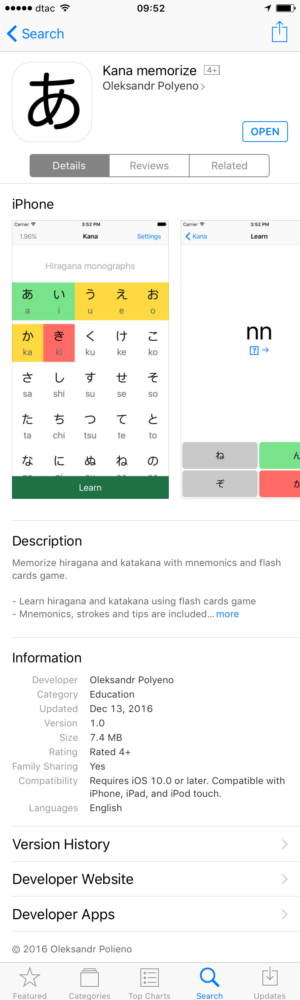

labels: Blog
        Projects
        iOS
created: 2016-12-14T09:46
modified: 2017-01-14T10:06
place: Phuket, Thailand
comments: true

# Kana memorize iOS app

Kana memorize app includes both hiragana and katakana tables with each kana containing sound, strokes, mnemonics and tips and a flash cards game.

App store: [https://itunes.apple.com/us/app/kana-memorize/id1184225723](https://itunes.apple.com/us/app/kana-memorize/id1184225723)
Landing page: [http://kana.nanvel.com](http://kana.nanvel.com)

**UPD** 2017-01-14

iTunes Connect stats:

25 downloads.
~1 download per day.

Territories: USA, Japan, Indonesia, France, Singapore, China, Saudi Arabia, Israel, Mexico, Italy.
