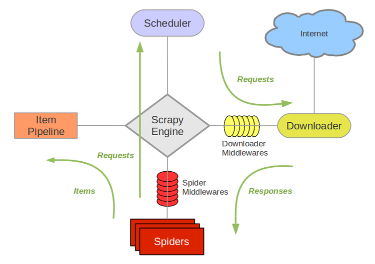

labels: Blog
        Scrapers
created: 2016-12-16T21:04
modified: 2017-05-01T23:27
place: Phuket, Thailand
comments: true

# Scrapy

[TOC]

An open source and collaborative framework for extracting the data you need from websites.



[Scrapy architecture](https://doc.scrapy.org/en/latest/topics/architecture.html)

## Spiders

Methods:

- `open_spider`
- `close_spider`

### Parse

`response.urljoin` - same `urlparse.urljoin` but with `response.url` as the first argument:
```python
def parse(self.response):
    next_page = response.urljoin('/page/2/')
    yield scrapy.Request(next_page, callback=self.parse)
```

#### Form request

aka `POST` request.

```python
def parse(self, response):
    return scrapy.FormRequest(
        url,
        formdata={'username': 'john', 'password': 'secret'},
        callback=self.after_login
    )
```

Also see [`from_response` method](https://doc.scrapy.org/en/latest/topics/request-response.html#scrapy.http.FormRequest) - returns a new `FormRequest` object with its form field values pre-populated with those found in the HTML `form` element contained in the given response.

### Selectors

Selectors are a higher level interface on top of lxml. It handles broken HTML and confusing encoding.

```bash
>>> response.css('title::text').re(r'Quotes.*')
['Quotes to Scrape']
>>> response.css('title::text').re(r'Q\w+')
['Quotes']
>>> response.css('title::text').re(r'(\w+) to (\w+)')
['Quotes', 'Scrape']
```

#### XPath

[Concise XPath](http://plasmasturm.org/log/xpath101/).
[XPath tutorial](http://www.zvon.org/comp/r/tut-XPath_1.html).
[Scrapy best practices](https://blog.scrapinghub.com/2014/07/17/xpath-tips-from-the-web-scraping-trenches/) on The scrapinghub blog.

```bash
>>> from scrapy.selector import Selector
>>> from scrapy.http import HtmlResponse


>>> body = '<html><body><span>good</span></body></html>'
>>> Selector(text=body).xpath('//span/text()').extract()
[u'good']

>>> response = HtmlResponse(url='http://example.com', body=body)
>>> response.selector.xpath('//span/text()').extract()
[u'good']

>>> response.selector.xpath('//span/text()').extract_first()
u'good'
```

Conditions separated by `/` are known as steps.
Condition inside `[]` is known as predicate.
`//` allows to get all elements of a particular type, not only those belong to the current node.
`@` allows to select attributes.

More examples:
```
.//text()  # extract all text
./table/tr[td]  # select only `tr`'s contain `td`
./li[a]/parent::ul'  # select `ul` that contains at least one `li` with `a` inside
./ul/li[@id="someid"]/following-sibling::li[1]  # following sibling
./ul/li[@id="someid"]/preceding-sibling::li[1]  # preceding siblings
./div[not(contains(@class,"somecls"))]  # not contains class
name(.)  # get current tag name
(./p | ./a)  # select `p` and `a` tags
./*[self::p or self::a]  # select `p` and `a` tags
./td/parent::tr/parent::table  # select parent element
./../../a  # a few levels upper (similar to `parent:*`)
```

XPath functions:

- `not()`
- `contains()`
- `starts-with()`
- `name()`
- `string()` - converts an object to a string (different from `.//text()`)
- and [more](http://www.w3schools.com/xml/xsl_functions.asp)

#### Extraction

Use `.extract()` or `.extract_first()`.
Using re: `.re('\d+ (.+)')` or `.re_first('\d+ (.+)')`

Parsing, sanitizing, and more: [w3lib - a Python library of web-related functions](http://w3lib.readthedocs.io/en/latest/w3lib.html).

### Asynchronous IO

We can't write asynchronous code in spiders. As parse methods can return on dicts, Request objects and None, not deferred. What if we need some extra io:

- do it outside the spider (item pipeline)
- if there are only a few requests, or connection is fast enough (e.g. redis on localhost) - use blocking client
- do requests same way we request sites when scraping

S3 example:
```
from threading import Lock

from botocore.endpoint import Endpoint
import botocore.session
from scrapy import Request
import treq


class BotocoreRequest(Exception):

    def __init__(self, request, *args, **kwargs):
        super(BotocoreRequest, self).__init__(*args, **kwargs)
        self.method = request.method
        # https://github.com/twisted/treq/issues/185
        self.url = request.url.replace('https://', 'http://')
        self.headers = dict(request.headers)
        self.body = request.body and request.body.read()


def _send_request(self, request_dict, operation_model):
    request = self.create_request(request_dict, operation_model)
    raise BotocoreRequest(request=request)


class ScrapyAWSClient(object):
    def __init__(self, service, access_key, secret_key, region, timeout=30):
        session = botocore.session.get_session()
        session.set_credentials(
            access_key=access_key,
            secret_key=secret_key
        )
        self.client = session.create_client(service, region_name=region)
        self.timeout = timeout

    def request(self, method, callback, meta, **kwargs):
        _send_request_original = Endpoint._send_request
        lock = Lock()
        try:
            lock.acquire()
            Endpoint._send_request = _send_request
            getattr(self.client, method)(**kwargs)
        except BotocoreRequest as e:
            return Request(
                method=e.method,
                url=e.url,
                body=e.body,
                headers=e.headers,
                meta=meta,
                callback=callback,
                dont_filter=True
            )
        finally:
            Endpoint._send_request = _send_request_original
            lock.release()


class MySpider(Spider):

    def __init__(self, *args, **kwargs):
        super(MySpider, self).__init__(*args, **kwargs)
        self.client = ScrapyAWSClient(
            service='s3',
            access_key='',
            secret_key='',
            region='your-region'
        )

    def parse(self, response):
        ...
        yield self.client.request(
            method='get_object',
            Bucket='my-s3-bucket',
            Key='my-key',
            callback=self.my_parser,
            meta={
                'handle_httpstatus_list': [200, 403]
            }
        )
```

[My answer on stackoverflow](http://stackoverflow.com/questions/9752539/scrapy-async-database-request-in-spider-middleware/43722144#43722144).

## Items

[Items](https://doc.scrapy.org/en/1.2/topics/items.html) provide the container of scraped data, while [Item Loaders](https://doc.scrapy.org/en/1.2/topics/loaders.html) provide the mechanism for populating that container.

### Items and ItemLoaders are sucks

IMHO.

1. Fields don't have any validation (even `is_required`)
2. Set/get values using getvalue: `item['myvalue'] = 0`
`item.myvalue = 0` is shorter. And I can't use my editor autocomplete (works with attributes)
3. ItemLoader's `in/out` methods are duplicate of `Field.input/output_processors`, and one needs to keep them in sync with Item fields
4. I can pass a dict as a first argument to ItemLoader, and it will accept it same as an Item
5. Passing an item from one parser to another through request.meta looks like:
```python
item = loader.load_item()
yield Request(meta={'item': item})

item = response.meta['item']
loader = ItemLoader(item)
loader.add_value('myfield', 1)
yield loader.load_item()
```
`load_item` (and input/output processors) was called twice.
6. I can't copy `response.xpath()` or `response.xpath().re_first()` from scrapy console (where I do debug) 1:1 into my code (must rewrite into `add_xpath(fieldname, xpath, re)`). Copying xpath and re doesn't make me sure that it will work the same way as there are input/output processors
7. `add_value(None, {})` looks weird

Solution: use [builders](/2014/11/software-design-patterns#builder) instead. And schema validation.

```python
class Builder(object):

    field1 = None
    _field2 = []

    def __init__(self, field1=None):
        self.field1 = field1
        # reset mutable attributes
        self._field2 = []

    def __setattr__(self, name, value):
        """
        Raise an exception if a field name was mistyped.
        """
        if not hasattr(self, name):
            raise AttributeError("{name} attribute does not exist.".format(name=name))
        super(OpenstatesBase, self).__setattr__(name, value)

    def add_field2(self, value):
        """
        Any validation, formatting if required.
        """
        self._field2.append(value)

    def copy(self):
        """
        Code to return the object copy. If you need it.
        """

    def load(self):
        """
        Can use ItemLoader or/and validation here.
        """
        return {
            'field1': self.field1,
            'field2': self._field2
        }
```

## Item pipelines

Use if the problem is domain specific and the pipeline can be reused across projects.

### Files pipeline

Don't like s3 storage implementation: blocking botocore + threads. But it may be a good way to do it, efficient enough, reliable and stable.

## Spider middlewares

Use if the problem is domain specific and the middleware can be reused across projects. Use to modify or drop items.

## Downloader middlewares

Use for custom login or special cookies handling.

## Extensions

Plain classes that get loaded at crawl startup and can access settings, the crawler, register callbacks to signals, and define their own signals.

### Close spider

`CLOSESPIDER_TIMEOUT`
`CLOSESPIDER_ITEMCOUNT`
`CLOSESPIDER_PAGECOUNT`
`CLOSESPIDER_ERRORCOUNT`

### Memory usage extension

Shuts down the spider when it exceeds a memory limit.

## Commands

```bash
scrapy startproject myproject [project_dir]
scrapy genspider mydomain mydomain.com
```

Global commands:

- startproject
- genspider
- settings
- runspider
- shell
- fetch
- view
- version

Project commands:

- crawl
- check
- list
- edit
- parse
- bench

Running a spider:
`scrapy crawl <spidername> -s CLOSESPIDER_ITEMCOUNT=10`

Using proxy:
```bash
export http_proxy=<ip/host>:<port>
scrapy crawl <spidername>
```

## Settings

See [https://doc.scrapy.org/en/1.2/topics/settings.html#built-in-settings-reference](https://doc.scrapy.org/en/1.2/topics/settings.html#topics-settings-ref).

Command line:
```
scrapy shell -s SOME_SETTING=VALUE
```

## Twisted

[Twisted - hello asynchronous programming](http://jessenoller.com/2009/02/11/twisted-hello-asynchronous-programming/)
[Twisted Introduction](http://krondo.com/an-introduction-to-asynchronous-programming-and-twisted/)
[Introduction to Deferreds](https://twistedmatrix.com/documents/current/core/howto/defer-intro.html)

`@defer.inlineCallback` accepts a function as an argument, that function can yield a deffered or call returnValue, essentially anywhere where you would normally block, you simply yield.

Deferred:
```
deferred = defer.Deferred()
deferred.addCallback(handler1)
deferred.addCallback(handler2)
deferred.callback('result')
reactor.callLater(60, reactor.stop)
reactor.run()
```

The reactor is the event loop mechanism for Twisted. It takes care of executing all of the various timed actions and the execution of the callback/errback stack. Timed actions can be deferreds, etc. Deferreds are simply objects executed by the Reactor.

### treq

[treq](https://github.com/twisted/treq) - an asynchronous equivalent for requests package.
Simpler than scrapy's `Request/crowler.engine.download()`.

```python
from treq import post
from twisted.internet import defer


class MyExtension(object):

    ...

    @defer.inlineCallbacks
    def spider_closed(self, spider, *args, **kwargs):

        response = yield post(
            url='http://example.com',
            data={
                'param': 'value'
            }
        )
        json_response = yield response.json()
        assert json_response['ok']
```

### Async DB clients

[txmongo](https://github.com/twisted/txmongo)

```python
from twisted.internet import defer
from txmongo.connection import ConnectionPool


class MongoDBPipeline(object):

    ...

    @defer.inlineCallbacks
    def open_spider(self, spider):
        self.connection = yield ConnectionPool(uri='mongo://...')

    @defer.inlineCallbacks
    def close_spider(self, spider):
        yield self.connection.disconnect()

    @defer.inlineCallbacks
    def process_item(self, item, spider):
        collection = self.connection['mydb']['mycollection']
        yield collection.save(dict(item))

        defer.returnValue(item)
```

[txredisapi](https://github.com/fiorix/txredisapi)

### Async MQ clients

[Pika](http://pika.readthedocs.io/en/0.10.0/index.html) (AMQP)

Use [twisted_connection adapter](http://pika.readthedocs.io/en/0.10.0/examples/twisted_example.html).

### Using threads

`reactor.CallInThread()`

Use locks: `threading.RLock()` (issues around global state).

Run executables with `reactor.spawnProcess()`.

## Performance

Use telnet console:

```bash
telnet localhost 6023
est()  # get execution engine status
```

See [Learning Scrapy by Dimitrius Kouzis-Loukas](https://www.amazon.com/Learning-Scrapy-Dimitris-Kouzis-Loukas-ebook/dp/B0166Y6Z70/), "Performance" chapter.

Pipeline: scheduller -> throttler -> downloader -> spider -> item pipelines.

### Downloader

Default downloader timeout is 3 minutes. So if some site has a lot of broken links, it may take hours instead of minutes for a spider to finish.

### Item pipeline

Blocking code slows done items processing, and it may become a bottleneck. Example: blocking db connection + slow connection.

See [How does scrapy react to a blocked Ppipeline?](http://www.leehodgkinson.com/blog/scrapy-pipelines/)

## Debug

```python
from scrapy.utils.response import open_in_browser
open_in_browser(response)

from scrapy.shell import inspect_response
inspect_response(response, self)
```

It is possible to debug xpaths in Google Chrome browser console:
```js
$x('//h1/a/text()')
```

### Scrapy shell

```bash
scrapy shell 'http://quotes.toscrape.com/page/1/'
```

```
2017-02-12 13:50:08 [scrapy] INFO: Spider opened
[s] Available Scrapy objects:
[s]   crawler    <scrapy.crawler.Crawler object at 0x1064a6ad0>
[s]   item       {}
[s]   request    <GET http://google.com>
[s]   response   <302 http://google.com>
[s]   settings   <scrapy.settings.Settings object at 0x1064a6a50>
[s]   spider     <DefaultSpider 'default' at 0x1084c5490>
[s] Useful shortcuts:
[s]   shelp()           Shell help (print this help)
[s]   fetch(req_or_url) Fetch request (or URL) and update local objects
[s]   view(response)    View response in a browser
```

`view` and `fetch` functions are very useful.

### Logging

```python
import logging

import scrapy


class MySpider(scrapy.Spider):

    # ...

    def parse(self, response):
        self.logger.info('A response from %s just arrived!', response.url)
        # or
        self.log("Log something ...")
        # or
        self.log("Log something ...", level=logging.INFO)
```

Logging levels:

- `DEBUG`
- `INFO`
- `WARNING`
- `ERROR`
- `CRITICAL`
- `SILENT` (no logging)

Use `LOG_LEVEL` setting to specify desired logging level.

Logs output tuning:

- `LOG_ENCODING`
- `LOG_DATEFORMAT`
- `LOG_FORMAT`
- `DUPEFILTER_DEBUG`
- `COOKIES_DEBUG`

Logs management:

- Splunk
- Logstash
- Kibana

### Memory usage

See [Debugging memory leaks](https://doc.scrapy.org/en/latest/topics/leaks.html).

## Deploy

### Scrapyd

Modify `scrapy.cfg`: 
```
[deploy]
url = http://localhost:6800
project = myproject
```

```bash
pip install scrapyd-client
scrapyd-deploy
curl http://localhost:6800/schedule.json -d project=myproject -d spider=myspider
```

Multiple servers:
```
[deploy:server1]
url = http://server1:6800
[deploy:server2]
url = http://server2:6800
```

```bash
scrapyd-deploy server1
```

#### Priority

Default task priority is 0.
To set another priority use `priority` setting:
```
curl http://localhost:6800/schedule.json -d project=myproject -d spider=myspider -d priority=1
```

### Scrapycloud

Use [shub](http://shub.readthedocs.io/en/stable/deploying.html) utility.

#### Performance

Autothrottle addon is enabled by default on scrapycloud.
It may cause a few times slower scraping rate, sometimes 5 times or more.
use `UTOTHROTTLE_ENABLED = false` setting to disable it.

Each spider execution requires extra ~30 seconds to start on scrapycloud. So 1 spider does 100 requests is much better than 100 spiders each sends only 1 requests.

In case if you use blocking db client, you'll, probably, see effect of it. Blocking db clients performs fine if connection is fast: db located on the same server or network.
Example, a few db requests on local network vs the Internet: 57ms vs 1.19s.

## Best practices

### Avoid denial-of-service attack

Use throttling, watch response time.

### Copyrights

Look at the copyright notice of the site.

### Proxies

Use `HttpProxyMiddleware` (enabled by default) and `http_proxy` (`https_proxy`) environment variables.

[Crawlera](https://crawlera.com) is a smart downloader designed specifically for web crawling and scraping. It allows you to crawl quickly and reliably, managing thousands of proxies internally, so you don’t have to.

### Saving to a database

Batch insert usually is more efficient way.

### Spider name

If the spider scrapes a single domain, a common practice is to name the spider after the domain, with or without the TLD. So, for example, a spider that crawls `mywebsite.com` would often be called `mywebsite`.

### User-Agent

Set `User-Agent` header to something that identifies you.

## Vocabulary

### Scraping

The main goal in scraping is to extract structured data from unstructured sources.

### UR2IM

UR2IM:

- URL
- Request
- Response
- Items
- More URLs

### JSON Line format

`.jl` files have one JSON object per line, so they can be read more efficiently.

## Links

[Learning Scrapy by Dimitrius Kouzis-Loukas](https://www.amazon.com/Learning-Scrapy-Dimitris-Kouzis-Loukas-ebook/dp/B0166Y6Z70/)
