labels: Life
created: 2016-12-31T19:58
modified: 2016-12-31T23:15
place: Phuket, Thailand

# 2016 Summary

[TOC]

## New year in Kyiv

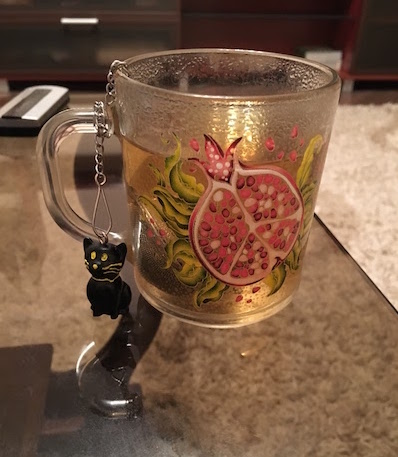

## New York

7-18 February in New York.

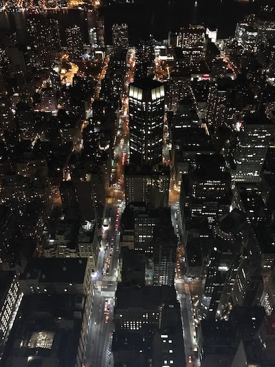

## Read some books

~[36 books](http://localhost:5000/pages/books#2016).

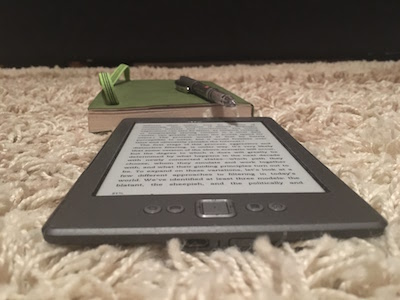

## 2 weeks vacation

May 16-29.
The first vacation in ~4+ years.
Visited Starobil's'k.

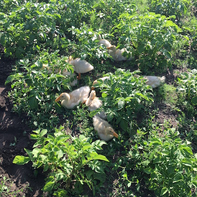

## Sport studio until July

Yoga with Troickaya Olga was awesome. And thanks to Vika I made a great progress in gym.
Miss [Sport Studio](http://sportstudio.com.ua/).

## Great time at Bkstg

Amazing 2+ years journey.

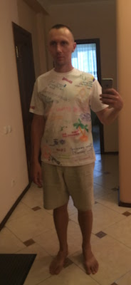

## Japan

August 2-17.

Tokyo

- Spent one night in Haneda airport
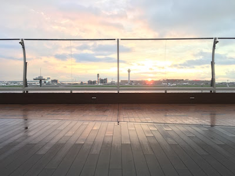
- Mt. Fuji (5th station)
- Onsens (Yamanakako onsen and an onsen in Shirahama)
- Gotenba premium outlet
- Tokyo Sky Tree
- Akihabara, Shibuya, Harajuku
- Hachiko monument
- Ueno park
- One Piece Gold movie
- Shinkansen (bullet trains)
- Comiket 90 (August 12-14)
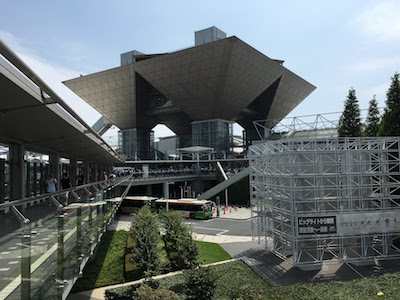

Osaka

- Capsule hotel (Capsule Hotel Cabana)

Shirahama

- [A hotel with onsens](https://www.airbnb.com/rooms/12026541)
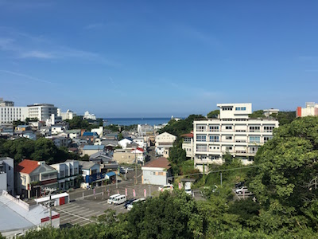
- Shirahama white sand beach

Next time:

- Running in the Imperial Palace loop
- Kyoto and Fukuoka
- Rabbit Island (Okunoshima)
- Ride a bicycle
- Disneyland
- Kuroshio sea aquarium
- Osaka science museum
- Yokohama science center
- Nissan Engine museum
- Toyota museum (Nagoya)
- Electricity museum (Nagoya)
- Maid cafe

## NEET

Since August I had a vacation.

## Phuket

3-rd time.

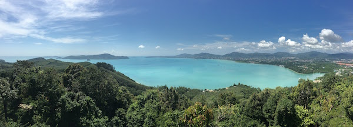

## Trash hero Phuket

A Saturday activity.

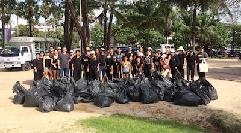

## Thai language

Phut neet noi.

## An iOS application

Published my first iOS application: [Kana memorize](https://itunes.apple.com/us/app/kana-memorize/id1184225723).

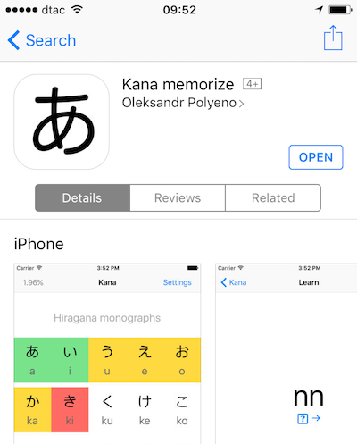

## Studied

ES6, React, Node.js, Swift, iOS.
Software development principles and patterns.
