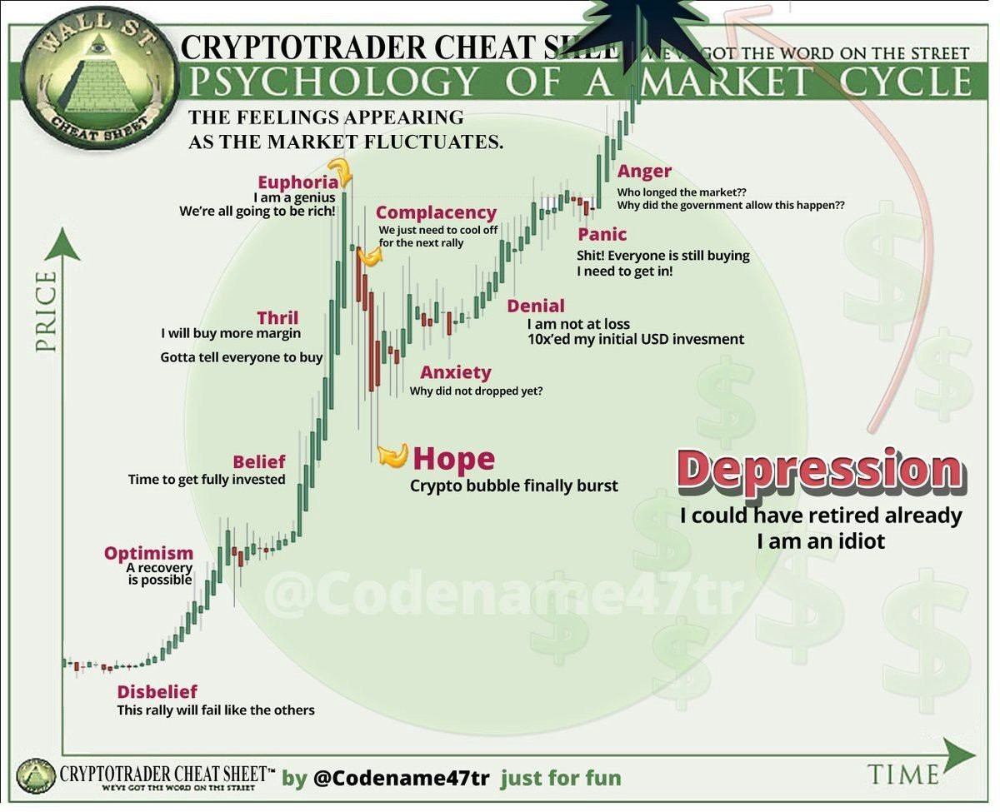

labels: Draft
        Blockchain
        Finance
created: 2017-11-05T14:19
modified: 2017-11-05T14:19
place: Phuket, Thailand
comments: true

# Crypto currencies

## To investigate

http://blog.robinhood.com/news/2017/10/31/robinhood-now-on-web

## Currencies

- Bitcoin
- [Ethereum](https://github.com/ethereum/wiki/wiki/White-Paper)
- Bitcoin Cash

## Events

- Bitcoin SegWit2x
- CME and CBOE to launch bitcoin futures exchanges by the end of 2017

## Traiding

The greatest traders make their money on 20% of their trades. The rest of our trades make only modest gains or loses.

The image is taken from [hackernoon.com](https://hackernoon.com/the-cryptocurrency-trading-bible-43d0c57e3fe6).

### Traiding platforms

[Open source traiding platforms](http://www.traderslaboratory.com/forums/tools-trade/11086-open-source-trading-platforms-master-list.html).

Bittrex and Poloniex for alts.
Quadriga for BTC.

## People

[The Wolf](https://twitter.com/WolfOfPoloniex)

## Links

- [15 Best Blogs about Cryptocurrencies of 2017](http://coinnoob.com/best-blogs-cryptocurrencies)
- https://hacked.com/
- [The Cryptocurrency Trading Bible](https://hackernoon.com/the-cryptocurrency-trading-bible-43d0c57e3fe6)

### Groups

- https://steemit.com/trending/bitcoin
- [Crypto Coin Trader](https://www.facebook.com/groups/218612071968287)

### Buy

[Buy Bitcoin Worldwide](https://www.buybitcoinworldwide.com)
