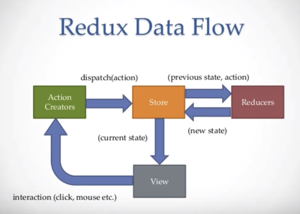

labels: Draft
        JS
        React
created: 2018-11-18T20:40
modified: 2018-11-18T20:40
place: Thailand, Phuket
comments: true

# React stack

[react notes](/2016/05/react-notes)

To learn about:
- v4 vs v5
- redux
- routers
- async (saga)
- lodash
- apis

## Redux



## material-ui

## API

```js
fetch('http://...').then(res => res.json()).then(data => console.log(data));

fetch('http://...', {
	url: 'POST',
	headers: {
		'content-type': 'application/json'
	},
	body: JSON.stringify(...)
})
```

## Links

[Redux Crash Course With React](https://www.youtube.com/watch?v=93p3LxR9xfM) on YouTube

