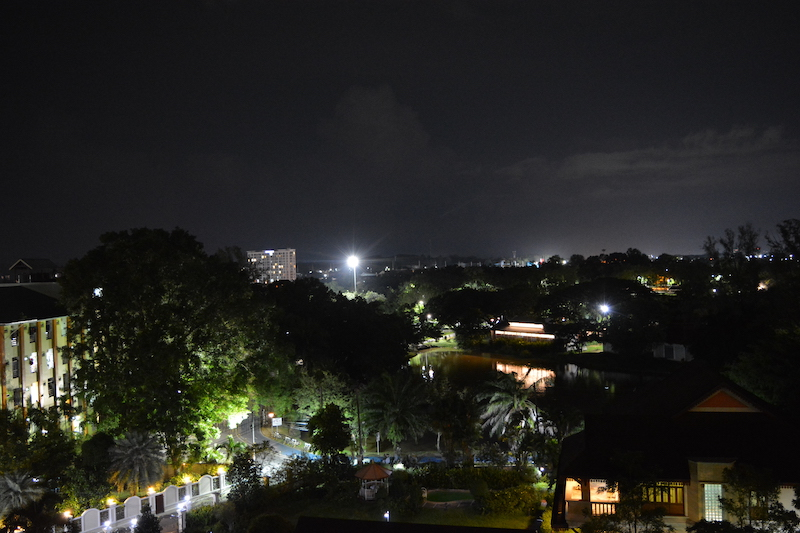
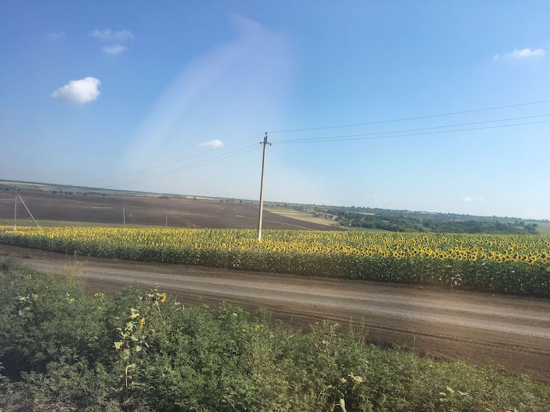
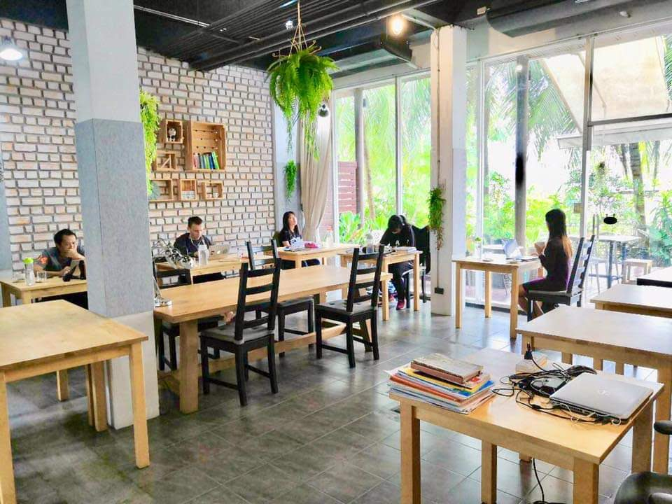
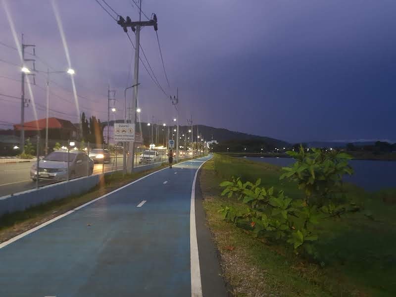

labels: Life
created: 2019-01-01T14:43
modified: 2019-01-01T14:43
place: Phuket, Thailand

# 2018 Summary

[TOC]

## A year on Phuket

Moved to a condo in Phuket town.
Sold my Ford Escape, bought a Nissan Cefiro.

## Work permit and visa

Got a work permit and 1 year visa.

## Books 2018

[2018 books](/pages/books#2018)

## Visited Ukraine

For ~3 weeks. Visited relatives, done some passport, bank, taxes paperwork.

## Work

Work for GP: full time, part time (3 days a week), team lead fool time.
Visited the team gathering in Prague, Czech republic.
Work in office or coworking, home office - for my own projects.

## Run

562km tracked in 121 activities, 6.07 avg pace.
7 mini marathons.

## Crypto

Did try many approaches in trading bots, learnt a lot, but didn't make any money.
Still into it, building tools for crypto market analysis.

## Plans for 2019

Set up my own business.
