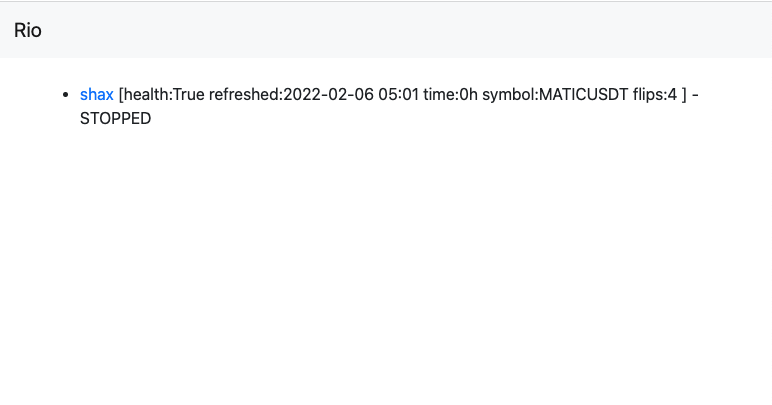
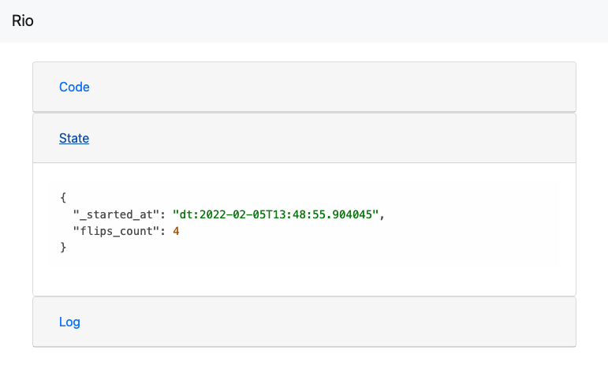

labels: Projects
created: 2022-02-13T14:35
modified: 2022-02-13T14:35
place: Phuket, Thailand
comments: false

# Jobs runner

Ansible scripts to deploy/start/stop/remove jobs using command line.
Includes library for logging/reporting status/messaging/db/persistent state.

