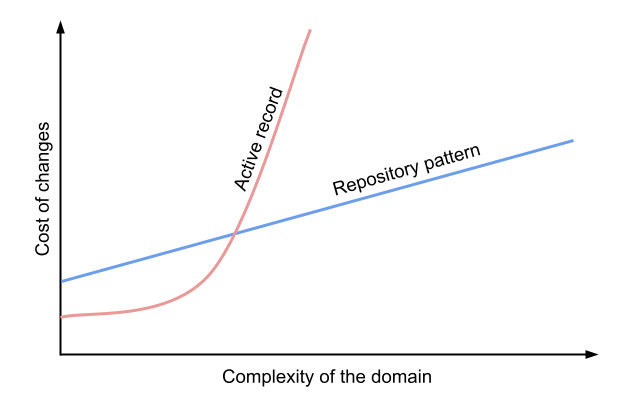
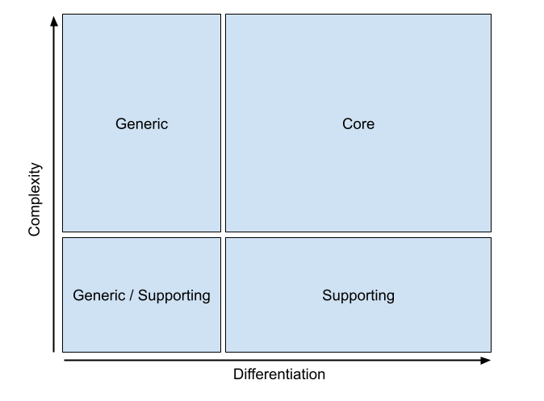

labels: Draft
        SoftwareDesign
created: 2023-01-21T13:29
modified: 2023-12-20T19:51
place: Bangkok, Thailand

# Domain Driven Design

[TOC]

Presentation:
- Eric evans, years
- books / links
- why do we need it?
- strategic design
- tactical design
- rlation to TDD (easier to test)
- alternatives to DDD
- microservices (distributed big ball of mud)

> It is not about drawing pictures of a domain; it is about how you think of it, the language you use to talk about it, and how you organize your software to reflect your improving understanding of it.
>
> Ralph Johnson

> Really powerful domain models evolve over time, and even the most experienced modelers find that they gain their best ideas after the initial releases of the system.
>
> Martin Fowler

Can be divided into two parts:

- strategic design
- tactiacal design

When complexity gets out o hand, developers can no longer understand the software well enough to change or extend it easily and safely.

Extreme Programming recognizes the importance of design decisions, but it strongly resists upfront design. Instead, it puts and admirable effort into communication and improving the project's ability to change course rapidly.

The XP process assumes that you can improve a design by refactoring, and that you will do this often and rapidly.

XP advocates using no extra design documents at all and letting the code speak for itself.
A document shouldn't try to do what the code already does well.
Documents can clarify design intent when the programming language does not support a straight-forward implementation of a concept.

The building blocks of a model-driven design condenses a core of best practices in object-oriented domain modelling into a set of basic building blocks.

Deep undestanding of the domain comes from diving in, implementing an initial design based on a probably naive model, and then transforming it again and again.

A model is a simplification. It is an interpretation of reality that abstracts the aspects relevant to solving the problem at hand and ignores extraneous detail.

A model is a selectively simplified and consciously structured form of knowledge.
It is like movie-making, loosely representing reality to a particular purpose.

Developers should watch for ambiguity ir inconsistency that will trip up design.

Using standard patterns also adds to the ubiquitous language, which all team members can use to discuss model and design decisions.

Following proven patterns for individual elements helps to produce a model that is practical to implement.

Layered achitecture: User interface (presentation latyer) -> Application -> Domain -> Infrastructure.
The essential principal is that any element of a layer dependes only on other elements in the same layer or on elements of the layers beneath it.
The domain layer is where the model lives.

Isolating the domain implementation is a prerequisite for domain-driven design.

Domain-driven design pays off best for ambitious projects, and it does require strong skills. Not all projects are ambitious.

A common, costrly mistake is to build a complex infrastructure and use industrial-strength tools for a project that doesn't need them.

Our pace of development was accelerating at a stage where most of projects are beginning to bog down in the mass and complexity of what has already been built.

To have a project accelerate as development proceeds - rather than get weighed by its own legacy - demands a design that is pleasure to work with, invting to change. A supple design:
- ubiquitous language
- intention-revealing interfaces
- side-effect-free functions
- assertions
- conceptual contours

A supple design helps limit mental oveload, primarily by reducing dependencies and side effects.

Name classes and operations to describe their effect and purpose, without reference to the means by which they do what they promise.

Operations divided into two categories:
- commands (modifiers)
- queries

No side effects: a function can call on other functions without worrying about the depth of nesting. They are easier to test.

When a function is presented through an intention-revealing interface, a developer can use it wihtout understanding the detail of its implementation.

Intention-revealing interfaces allow clients to present objects as units of meaning rather than just mechanisms.

Low coupling is a basic way to reduce conceptual overload.

Many XP practices are aimed at this specific problem of maintaining a coherent design that is being constantly changed by many people.

The facade belong in the bounded context of the other system. It just presents a friendlier face specialized for your needs.

An adapter is a wrapper that allows a client to use a different protocol than that understood by the implementer of the behavior.

Creating distinctive software comes tback to a stable team acculating specialized knowledge and crunching it into a rich model.

With the tools and technology we already have, we can build systems much more valuable than most projects do today. We can write software that is a pleasure to use and a pleasure to work on, software that doesn't box us in as it grows but creates new opportunities and continues to add value for its owners.

Domain-driven design is not about aggregates or value objects. Domain-driven design is about letting your business domain drive software design decisions.

Effective modules are deep: a simple public interface encapsulates complex logic.

Repository pattern - an abstraction over the idea of persistent storage.
Service layer pattern - clearly define where our use cases begin and end.
Unit of work pattern - provide atomic operations.
Aggregate pattern - enforce integrity of data.

Exceptions can be used to express domain concepts too.

Putting too much logic into the service layer can lead to the Anemic Domain antipattern. It's better to introduce the layer after you spot orchestration logic creeping into your controllers.

The objective with these architecture patterns is to try to have the complexity of our application grow more slowly than its size.

Aggregates, domain events, and dependency inversion are ways to control complexity in large systems.

Service layer (defines the jobs the system should perform and orchestrates different components):

- Handler: receives a command or an event and performs what needs to happen.
- Unit of work: abstraction around data integrity. Each unit of work represents an atomic update. Makes repositories available. Tracks new events on retrieved aggregates.
- Message bus (internal): handles commands and events by routing them to the appropriate handler.

### Unit of work pattern

Ties together repository and service layer.

Abstraction over the idea of atomic operations.
Abstraction around data integrity.

Think about UoW as being part of the service layer.

```python
class AbstractUnitOfWork(abc.ABC):
    my_entities: MyEntitiesRepository

    def __exit__(self, *args):
        self.rollback()

    @abc.abstractmethod
    def commit(self):
        raise NotImplementedError

    @abc.abstractmethod
    def rollback(self):
        raise NotImplementedError


class SqlAlchemyUnitOfWork(AbstractUnitOfWork):
    def __init__(self, session_factory):
        self._session_factory = session_factory

    def __enter__(self):
        self._session = self._session_factory()
        self.my_entities = MyEntitiesRepository(self._session)
        return super().__enter__()

    def __exit__(self, *args):
        super().__exit__(*args)
        self._session.close()

    def commit(self):
        self._session.commit()

    def rollback(self):
        self._session.rollback()


with uow:
    uow.my_entities.add(MyModel)
    uow.commit()
```

## Tactical

Tactical patterns (domain model buildig blocks): value objects, aggregates, domain services...

## Uniqutous language

No technical jargon!

The language should be continuously reinforced throughout the project: code, documentation, tests, etc.

Don't use prefixes, rely on the context.

Bounded context: divide the ubiquitous language into multiple smaller languages.

Ubiquitous language is ubiquitous only in the boundaries of the bounded context.

Subdomains are discovered and bounded contexts are designed.

> Architectural design is system design. System design is contextual design - it is inherently aout boundaries (what's in, what's out, what spans, what moves between), and about trade-offs. It reshapes what is outside, just as it shapes what is inside.
>
> Ruth Malan

Integrating different bounded contexts:

- Partnership
- Shared kernel
- Conformist
- Anticorruption layer
- Open-host service
- Separate ways

Relying exclusively on the language's standard library's primitive data types - such as strings, integers, or dictionaries - to represent concepts of the business domain is known as the primitive obsession code smell.

### Boundaries

When designing bounded contexts, start with wider boundaries. If required, decompose the wide boundaries into smaller ones as you gain domain knowledge.

All microservices are bounded contexts, but not all bounded contexts are necessarily microservices.

## Model

> A model is a simplified representation of a thing or phenomenon that intentionally emphasizes certain aspects while ignoring others.
> Abstraction with a specific use in mind.
>
> Rebecca Wirfs-Brock 

> All models are wrong, but some are useful.
>
> George Box

Abstractions - simplified interfaces that encapsulate behavior.

## Components

Value and Identity objects
Model
Services
Utilities
Repository
Factory

## Tactical

Model elements:
- Entities (something with continuity and identity, tracked through different states and implementations)
- Value objects
- Services (more clearly expressed as actions or operations)

### Entity

aka reference objects.

An object defined primarily by its identity is called an entity.
Identities must be defined so that they can be effectively tracked.

Distinguished by its identity, rather than its attributes.

Example: a person, a city, a car, a lottery ticket, a bank transaction.

Entity is a domain object that has long-lived identity.

Entities have identity equality.

### Value objects

Describe some characteristics of a thing.

An object that represents a descriptive aspect of the domain with conceptual identity is called a value object.
For objects that we care about only what they are, not who or which they are.

Making choices about copying, sharing, and immutability.

Share one instance and point to it many times (flyweight).

Since value objects are immutable, the value objects' behavior is free of side effects and is thread safe.

Use for the domain's elements that describe properties of other objects.

A value object is any domain object that is uniquely identified by the data it holds; we usually make them immutable.

Value object: any object that is identified only by its data and doesn't have long-lived identity.

```python
from dataclasses import dataclass
from typing import NewType

Quantity = NewType("Quantity", int)
Sku = NewType("Sku", str)


@dataclass(frozen=True)
class Order:
    order_id: int
    sku: Sku
    quantity: Quantity
```

### Domain Services

> Sometimes, it just isn't a thing.
>
> Eric Evans, Domain-Driven Design

A domain service function.

Sometimes, it is just isn't a thing.

There are important domain operations that can't find a natural home in an entity or value object.

Use "Manager" suffix?

Defined purely in terms of what it can do for a client.

A good service characteristics:
- not a natural part of an etity or value object
- the interface is defined in terms of other elements of the domain model
- the operation is stateless

Business logic that doesn't belong to any aggregate or value object, or relevant to multiple aggregates (calculation logic that requires reading data from multiple aggregates).

A domain service is a stateless object that implements the business logic.

A stateless object used to host business logic.

Not the same as services from service layer (application service). A domain service represents a business concept or process, whereas a service-layer service represents a use case for the application.

Piece of logic that belongs in the domain model but doesn't sit naturally inside a stateful entity or value object.

## Layered structure

Services into layers:
- application
- domain
- infrastructure

Layers are partitions of a system in which the members of each partition are aware of and are able to use the services of the layers below, but unaware of and independent of the layers above.

## Aggregates

A cluster of associated objects that are treated as a unit for the purpose of data changes. External references are restricted to one member of the aggregate, designated as the root. A set of consistency rules applies within the aggregate's boundaries.

Tighten up the model itself by defining clear ownership and boundaries, avoiding a chaotic, tangled web of objects.

Example: car (root entity), the aggregate includes wheels, tires, etc.

Factories and repositories operate on aggregates, encapsulating the complexity of specific life cycle transitions.

An aggregate is a consistency enforcement boundary.

Consistency is enforced by allowing only the aggregate's business logic to modify its state.
The state-modifying methods expesed as an aggregate's public interface are often referred to as commands.

It aggregates business entities and value objects that belong to the same transaction boundary.

Aggregates and value objects do: encapsulate invariants and thus reduce complexity.

An aggregate can communicate with external entities by publishing domain events.

A constraint is a rule that restricts the possible states our model can get into.

The only way to modify the objects inside the aggregate is to load the whole thing, and to call methods on the aggregate itself.

> An aggregate is a cluster of associated objects that we treat as a unit for the purpose of data changes.
>
> Eric Evans, Domain-Driven Design

Attributes needed in one context are irrelevant in another.

Aggregates are entrypoints into the domain model.

Aggregates are in charge of a consistency boundary.

Aggregates and concurrency issues go together.

## Factories

A program element whose responsbility is the creation of other objects is called a factory.

When creation of an object, or an entire aggregate, becomes complicated or reveals too much of the internal structure, factories provide encapsulation.

Problems arise from overloading a complex object with responsibility for its own creation.

Doesn't own the product once it is created.

Ways to design a factory:
- factory method
- abstract factory
- builder

## Repositories

Find an object based on its relationship to another.

Reconstitution - creation of an object from stored data.

Benefits:
- simple model for obtaining persistent objects and managing their life cycle
- decouple application and domain design from persistence technology / database strategies / data sources
- communicate design decissions about object access
- easy subsitution of a dummy implementation fro testing

The factory makes new objects; the repository finds old objects.

Pros:
- a simple interface between persistent storage and the domain model
- easy to make a fake version of the repository, or swap different storage solutions
- creating domain model before thinking about persistence
- complete control over how we map our objects to tables

Cons:
- ORM already allows swapping to another database solution
- maintainign mapping requires extra work
- adds a "WTF factor" for programmers who are not familiar with repository pattern

For simple cases, decoupled domain model is harder work than a simple active record pattern.

If the app is just a simple CRUD wrapper around a database, then you don't need a domain model or a repository.

The more complex the domain, the more an investment if freeing yourself from infrastructure concerns will pay off in terms of the ease of making changes.



Repositories should only return aggregates.

## Domain

Should not try to reduce domain modelling to a cookbook or a toolkit. Mideling and design call for creativity.

A deep model makes possible an expressive design. At the same time, a design can actually feed insight into the model discovery process.

Types of subdomains:

- core
- generic - business activities that all companies performing in the same way
- supporting - support the company's business, do not provide any competitive advantage

Core - activities the company is doing differently from its competitors, but that do not provide a competitive edge.
Supporting - things the company is doing differently from its competitors, but that do not provide a competitive edge.
Generic - things all companies do in the same way.



If software is is not useful for the business, it's nothing but an expensive technology demo.

A fancy way of saying the problem you're trying to solve.

Domain (defines the business logic):

- Entity: a domain object whose attributes may change but that has a recognizible identity over time.
- Value object - an immutable domain object whose attributes entirely define it. It is fungible with other identical objects.
- Aggregate - cluster of associated objects that we treat as a unit for the purpose of data changes. Defines and enforces a consistency boundary.
- Event - Represents something that happened.
- Command - Represents a job that system should perform.

## Specification

Can test any object to see if it satisfies the specified criteria.

## Customer-supplier

Patterns:

- conformist
- anticorruption layer
- open-host service

Open-host service pattern is reversal of the anticorruption layer: instead of the consumer, the supplier implements the translation of its internal model.

## Event storming process

[Event storming](https://en.wikipedia.org/wiki/Event_storming) on Wikipedia

## Sustem

System, composition root, bootstrap script.

## Testing

Mocking frameworks, particularly monkey-patching, are a code smell.
Tests that use mocks tend to be more coupled to the implementation details of the codebase.

Overuse of mocks leads to complicated test suites that fail to explain the code.

Designing for testability really means designing for extensibility. We trade off a little more complexity for a cleaner design that admits novel use cases.

Mocks vs fakes:
- mocks (spies) are used to verify how something gets used
- fakes (stubs) are working implementations of the things they are replacing

`unittest.mock.MagicMock` is a mock, but often used also as a stubs or dummies.

TDD as design practice first and a testing practice second.

Keep all domain dependencies in fixture functions.

Don't mock what you don't own.

Feel free to throw away tests if you think they are not going to add value longer term.

## Structure

```text
settings.py
domain
  model.py  # entities, value objects, aggregates
  exceptions.py
adapters
  orm.py
  repository.py
entrypoints  # use_cases, cli
  main.py
tests
  conftest.py
  unit
  integration
```

Adapters (concrete implementations of an interface that goes from our system to the outside world):
- Repository: abstraction around persistent storage.
- Event publisher: Pushes event onto the external message bus.

Entrypoints:
- Web: receives web requests, trnasforms into commands, sends to the internal message bus.
- Event consumer: reads events from the external messages bus and transforms them into commands and passes them to the internal message bus.

## Vocabulary

Cohesion - logical agreement and dependence.

Command (aka modifier) - an operation that effects some change to the system. An operation that intentionally creates a side effect.

Domain - a sphere of knowledge, influence, or activity.

Entity - an object fundamentally defined not by its attributes, but by a thread of continuity and identity.

Factory - a mechanism for encapsulating complex creation logic and abstracting the type of created object for the sake of a client.

Intention-revealing interface - a design in which the names of classes, methods, and other elements convey both the original developer's purpose in creating them and their value to a client developer.

Model - a system of abstractions that describes selected aspects of a domain and can be used to solve problems related to that domain.

Model-driven design - a design in which some subset of software elements corresponds closely to elements of a model. Also, a process of codeveloping a model and an implementation that stay aligned with each other.

Repository - a mechanism for encapsulating storage, retrieval, and search behavior which emulates a collection of objects.

Domain Service - an operation oferred as an interface that stands alone in the model, with no encapsulated state.
A stateless object that hosts business logic that naturally doesn't belong to any of the domain models aggregates or value objects.

Ubiquitous language - a language structured around the domain model and used by all team members to connect all the activities of the team with the software.

Value object - an object that describes some characteristic or attribute but carries no concept of identity.

Aggregate - a hierarchy of entities sharing a transactional boundary. All of the data included in an aggregate's boundary has to be strongly consistent to implement its business logic.

## Links

- [Domain-Driven Design by Eric Evans](https://www.amazon.com/Domain-Driven-Design-Tackling-Complexity-Software-ebook/dp/B00794TAUG/)
- [Learning Domain-Driven Design](https://www.amazon.com/Learning-Domain-Driven-Design-Vlad-Khononov-ebook/dp/B09J2CMJZY/) by Vlad Khononov
- [Architecture Patterns with Python](https://www.amazon.com/Architecture-Patterns-Python-Domain-Driven-Microservices-ebook/dp/B085KB31X3/) by Harry Percival, Bob Gregory
- [Implementing Domain-Driven Design](https://www.amazon.com/Implementing-Domain-Driven-Design-Vaughn-Vernon-ebook/dp/B00BCLEBN8/) by Vernon Vaughn
- [Domain-Driven Design Europe](https://www.youtube.com/@ddd_eu) on YouTube
