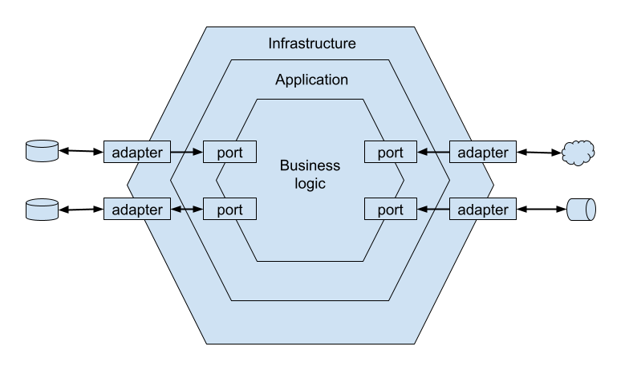

labels: Draft
        SoftwareDesign
created: 2023-12-21T09:40
modified: 2023-12-21T09:40
place: Bangkok, Thailand

# Software Design

[TOC]

Low coupling between modules and high cohesion within them.

Low coupling and high cohesion are general design principles.

There is a limit to how many things a person can think about at once (low coupling).

Projects have to make pragmatic trade-offs.

## Layered achitecture

- Data access layer (infrastructure layer) - also includes integration with the various external information providers
- Business logic layer (domain layer, model layer, core layer)
- Service layer (application layer, use case layer) - defines an application's boundary with a layer of services that establishes a set of available operations and coordinates the application's response in each operation
- Presentation layer (user interface)

## Ports and adapters architecture

Known as:

- hexagonal architecture
- onion architecture
- clean architecture

- business logic layer: entities, rules, processes
- application layer: actions
- infrastructure layer: database, ui framework, external provider, message bus

Abstract ports are resolved into concrete adapters in the infrastructure layer either through dependency injection or by bootstrapping.

## Transaction script

> Organizes business logic by procedures where each procedure handles a single request from the presentation.
>
> Martin Fowler

Each operation should either succeed or fail but can never result in an invalid state.

## Active record

> An object that wraps a row in a database table or view, encapsulates the database access, and adds domain logic on that data,
>
> Martin Fowler

There is nothing wrong using active records when the business logic is simple.

When the business logic is simple but operates on complicated data structures.

## Domain model

## Message bus

Outbox pattern for publishing messages after committing changes to another database.

The outbox pattern is a reliable way to publish aggregates' domain events. It ensures that domain events are always going to be published, even in the face of different process failure.

## Command-query responsibility segregation (CQRS)

## Event sourcing (event sourced domain model)

https://learn.microsoft.com/en-us/azure/architecture/patterns/event-sourcing

The accepted name for the database that is used for persisting events is event store.

[Versioning in an Event Sourced System](https://leanpub.com/esversioning/read) by Greg Young.

Difference between event-driven achitecture and event sourcing
- event sourcing is a method of capturing changes in state as a series of events
- event-drive architecture refers to the communication between services, event sourcing happens inside a service

## Event-driven architecture

Events, commands, and messages.

An event is a message, but a message is not necessary and event.

Types of messages:

- event: describing a change that has already happened
- command: an operation that has to be carried out

Event categories:

- event notification
- event-carried state transfer
- domain event

Event notification - something important has happened.

Event-carried state transfer - a message-based data replication mechanism.

Domain event - describing an event in the producer's business domain.

Consider these:

- the network is going to be slow
- servers will fail at the most inconvenient moment
- events will arrive out of order
- events will be duplicated

## Consistency

Only the data within an aggregate's boundaries can be considered strongly consistent. Everything outside is eventually consistent.

## Big ball of mud

> A big ball of mud is a haphazardly structured, sloppy, duct-tape-and-baling-wire, spaghetti-code jungle. These systems show unmistakable signs of unregulated growth, and repeated, expedient repair.
>
> Brian Foote and Joseph Yoder

The unregulated growth that leads to big balls of mud results from extending a software system's functionality without re-evaluating its design decisions.

The guiding principle for dealing with growth-driven complexity is to identify and eliminate accidental complexity caused by outdated design decisions.

## Other patterns

### Forgetable payload

Sensetive information is encrypted, when has to be deleted - only the encryption ckey is being deleted.

### Polyglot modeling

OLTP (online transaction processing) and OLAP (online analytical processing) may require different representation of system data.

> All databases are flawed, each in its own way.
>
> Greg Young

An alternative to finding a perfect database is the polyglot persistence model: using multiple databases to implement different data-related requirements.

### Saga

If one of the execution steps fails, the saga is in charge of issuing relevant compensating actions to ensure the system state remains consistent.

The saga pattern if often confused with process amanger pattern.
The saga patern manages simple, linear flow.
A saga is instantiated implicitly when a particular event is observed.
A process manager can not be bound to a single source event.

The saga pattern can be used to implement simple cross-component business process. More complex business process can be implemented using the process manager pattern.

## Tests

Transaction script -> reversed testing pyramid.
Active record -> testing diamond.
Domain model -> testing pyramid.
Event-sourced domain model -> testing pyramid.

Testing pyramid (top to bottom): ene-to-end, integration, unit.

## Microservices

[Notes on microservices](https://nanvel.name/2015/08/microservices).

## OLTP

Online transactional processing.

Models have to be optimized to support real-time business transactions.

## ALAP

Online analytical processing.

Fact table - business activities that already happened.

Dimention table - represents business process or action (verb), a dimention describes the fact (adjective).

Analytical data us append-only data.

Schemas:

- star (many-to-one relationship between the facts and their dimensions, each dimension record is used by many facts).
- snowflake

Analytical data architectures:

- data warehouse
- data lake
- data mesh

Data wirehouse - based primarily on the extract-transform-load (ETL) scripts.
The transformation steps may include operations such as removing sensitive data, deduplicating records, reordering events, etc.

Data lake - instead of being transformed right away into an analytical model, the data is persisted in its raw form.

Data mesh - domain-driven design for analytical data. Principles: decompose data around domains, data is aproduct, enable autonomy, build an ecosystem. Analytical data should be treated the same as any public API.

## Vocabulary

Automation policy - scnario in which an event triggers the execution of a command.

Brownfield projects - already proved their business viability and need a shake up to fight accumulated technical debt and design entropy.

## Links

- [Domain-Driven Design](https://www.amazon.com/Domain-Driven-Design-Tackling-Complexity-Software-ebook/dp/B00794TAUG/) by Eric Evans
- [Design Patterns](https://learn.microsoft.com/en-us/azure/architecture/patterns/) at Azure Architecture Center
- [Learning Domain-Driven Design](https://www.amazon.com/Learning-Domain-Driven-Design-Vlad-Khononov-ebook/dp/B09J2CMJZY/) by Vlad Khononov
