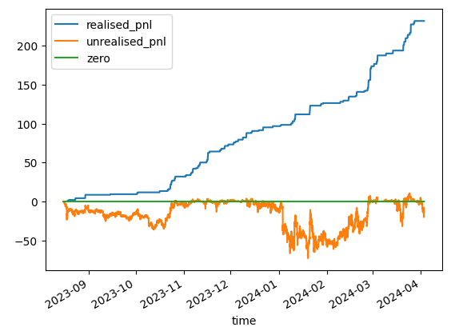
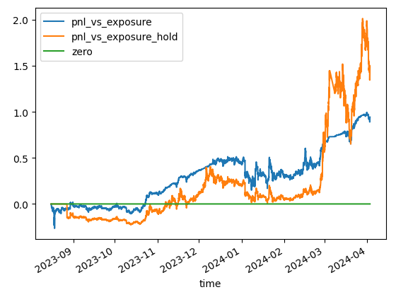
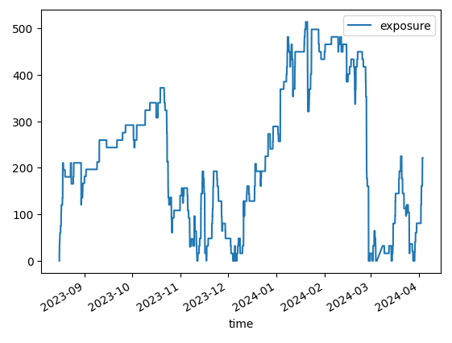

labels: Projects
        Draft
created: 2024-04-29T20:29
modified: 2024-04-29T20:29
place: Bangkok, Thailand

# Grid plus trading bot

A grid bot with improved efficiency and safety.

The bot was trading DOGEUSDT 2023-08-15 to 2024-04-03: 231 days.

Traded volume: 7k$.

Total PNL: ~231$ - 5$ commission.

Realised and unrealised PNL:

PNL vs buy and hold:
![pnl vs hold][pnl_vs_hold.png]

PNL vs buy and hold divided by average exposure:

Exposure:

