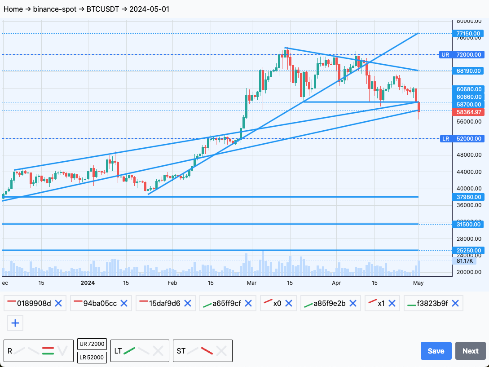

labels: Projects
        Draft
created: 2024-05-02T17:41
modified: 2024-05-02T17:41
place: Bangkok, Thailand

# Regimes tool

Record regime, trends, and trendlines daily.



Records can be retrieved using api, for the one above:
```json
{
  "exchange": "binance-spot",
  "symbol": "BTCUSDT",
  "date": "2024-05-01",
  "regime": "sideways",
  "range": {
    "upper": "72000",
    "lower": "52000"
  },
  "st_trend": "bear",
  "lt_trend": "bull",
  "trendlines": [
    {
      "t0": 1660521600,
      "p0": "2.525e+04",
      "t1": 1714521600,
      "p1": "2.525e+04",
      "s": "high",
      "w": "22.33",
      "h": "0189908d"
    },
    {
      "t0": 1687478400,
      "p0": "3.15e+04",
      "t1": 1714521600,
      "p1": "3.15e+04",
      "s": "high",
      "w": "48.13",
      "h": "94ba05cc"
    },
    {
      "t0": 1699488000,
      "p0": "3.798e+04",
      "t1": 1714521600,
      "p1": "3.798e+04",
      "s": "high",
      "w": "5.487",
      "h": "15daf9d6"
    },
    {
      "t0": 1693958400,
      "p0": "2.483e+04",
      "t1": 1714521600,
      "p1": "5.87e+04",
      "s": "low",
      "w": "124.8",
      "h": "a65ff9cf"
    },
    {
      "t0": 1701734400,
      "p0": "44398.3831919815",
      "t1": 1714521600,
      "p1": "6.068e+04",
      "s": "high",
      "w": "0",
      "h": "x0"
    },
    {
      "t0": 1705968000,
      "p0": "3.856e+04",
      "t1": 1714521600,
      "p1": "7.715e+04",
      "s": "low",
      "w": "26.44",
      "h": "a85f9e2b"
    },
    {
      "t0": 1710288000,
      "p0": "73663.94834232845",
      "t1": 1714521600,
      "p1": "6.819e+04",
      "s": "high",
      "w": "0",
      "h": "x1"
    },
    {
      "t0": 1710892800,
      "p0": "6.066e+04",
      "t1": 1714521600,
      "p1": "6.066e+04",
      "s": "low",
      "w": "80.91",
      "h": "f3823b9f"
    }
  ],
  "created_at": "2024-05-02T10:33:00",
  "updated_at": "2024-05-02T10:37:00",
  "is_template": false
}
```
