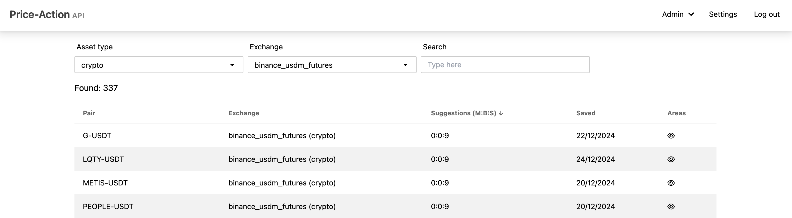
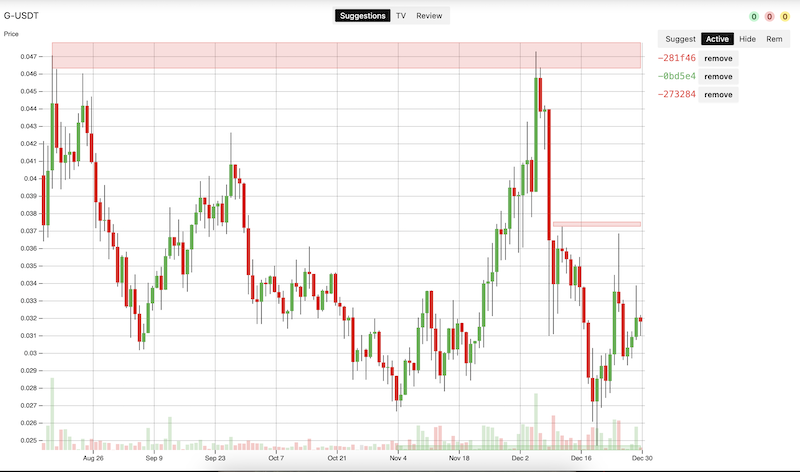
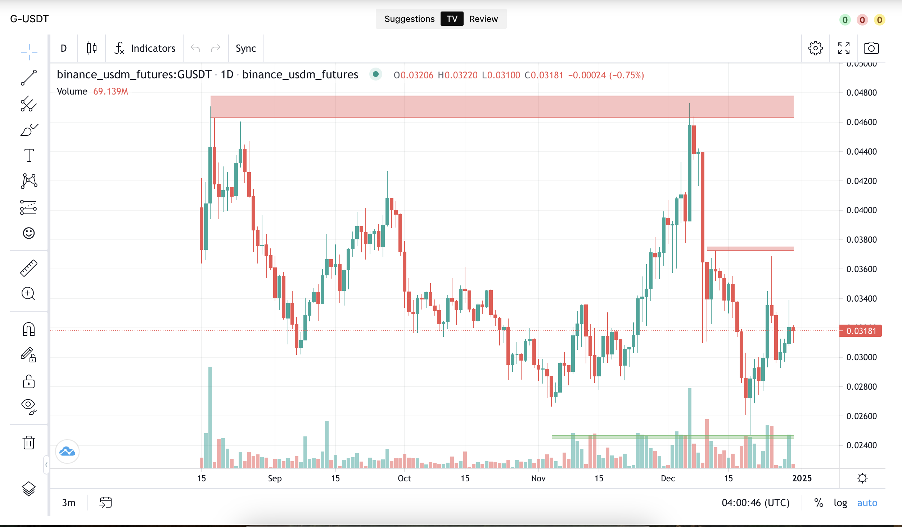
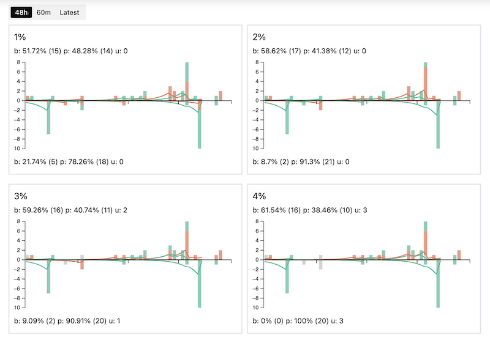
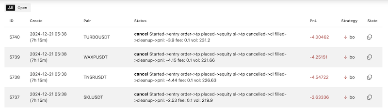
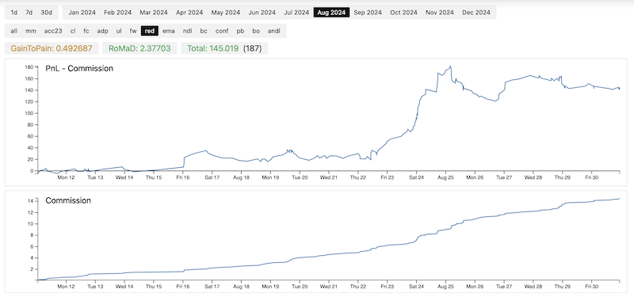
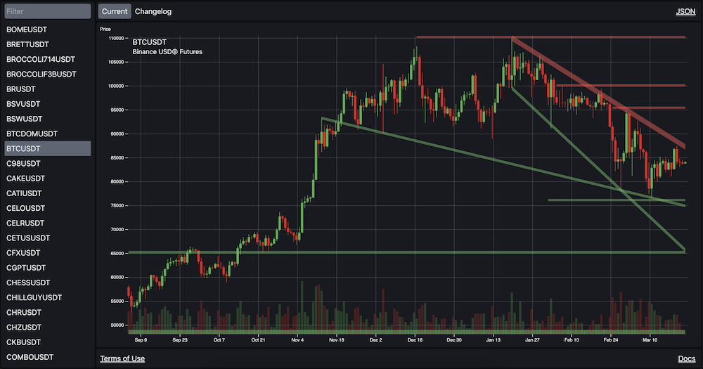
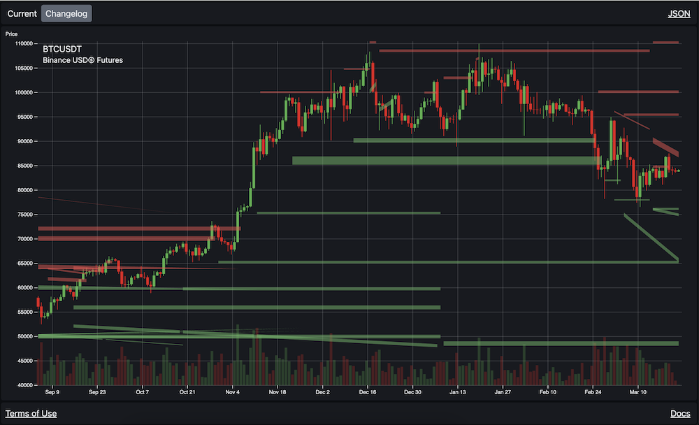

labels: Projects
        Draft
created: 2024-12-30T10:53
modified: 2025-03-23T10:41
place: Bangkok, Thailand

# Price-Action trader

A tool for:

- Recording supports/resistances
- Trading based on support/resistance
- Account and trades analytics

Pairs:

Suggestions:

TV editor:

Touches:

Trades:

Strategy stats:

[Price action API](https://paapi.io):

Changelog:

